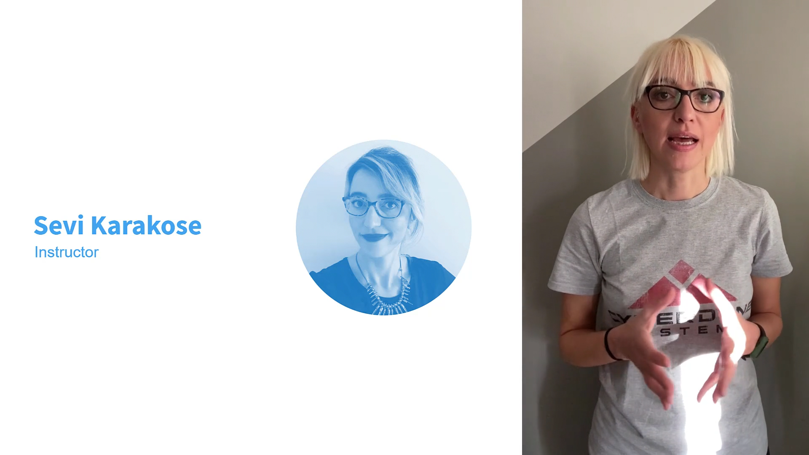
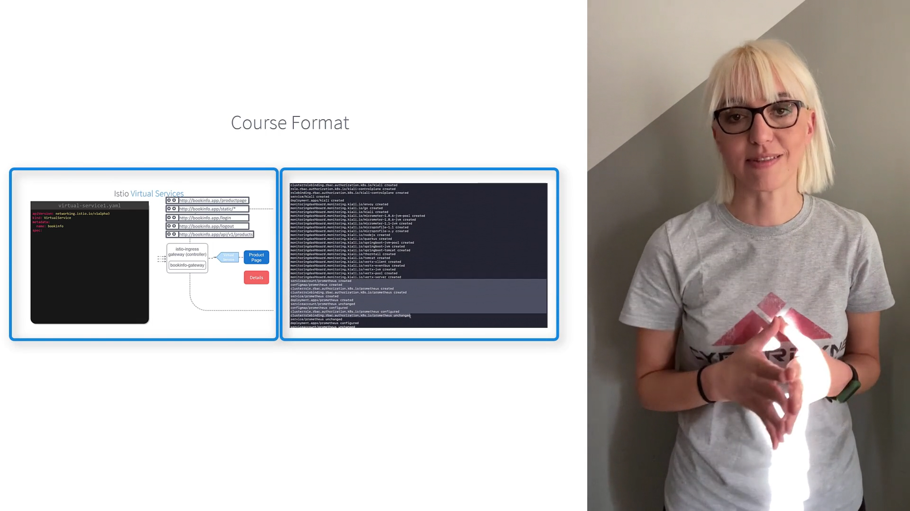
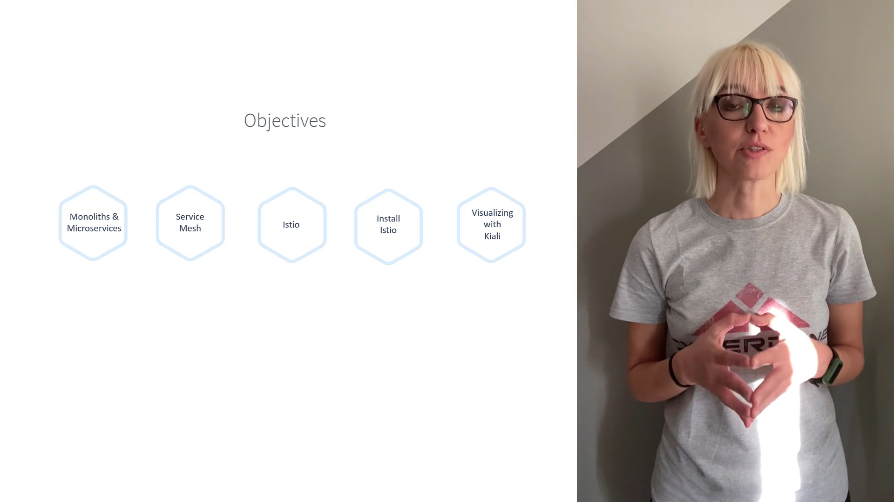
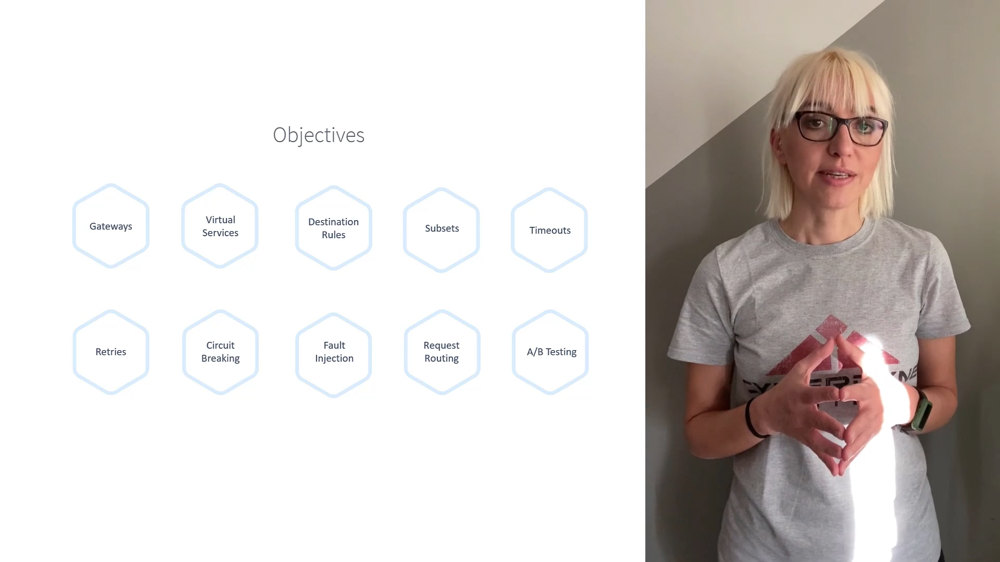
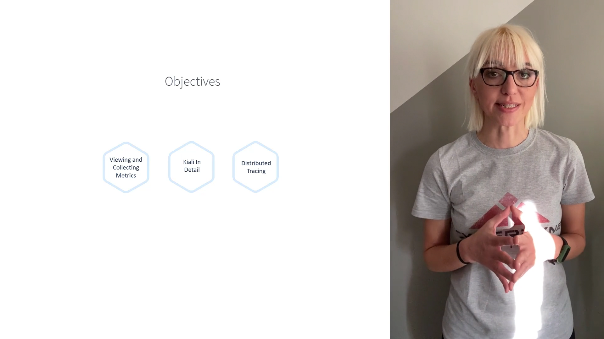

# 010-000-course-introduction

### Subtitles Extracted
Hey everyone, and welcome to the Service Mesh with Istio course. I'm Sevi Karaköse, and I'll be your instructor for this course. I've worked as a software developer and then a team leader for many years. I've also done technical trainings, worked with development and infrastructure teams on DevOps transformation,

- **Timestamp:** 00:20

- 

 and also designed team activities for organizations to be more adaptive to change. Now, as a cloud native engineer, I work with development teams on their legacy applications for microservices transformation and cloud modernization. In this course, we will learn Istio through some lectures and many hands-on labs.

- **Timestamp:** 00:51

- 

 We'll start from the basics of Istio and learn step-by-step with examples and hands-on labs. By the end of this course, you will have an extensive understanding of how to configure and manage your Service Mesh with Istio. Let's look at the objectives of the course. First, we start with an introduction to Istio. We learn about monoliths and microservices and why we need Service Mesh through example-driven lectures. We then get introduced to Istio. We learn how to install Istio and configure it. And we finally look at how to visualize our application and services with Kiali.

- **Timestamp:** 01:32

- 

 We then drill into Istio concepts such as Gateways, Virtual Services, Destination Rules, subsets, Timeouts, Retries, Circuit Breaking, Fault Injection, Request Routing, A/B Testing, etc.

- **Timestamp:** 01:46

- 

 Next, we look at the security aspects such as certificate management, authentication, and authorization.

- **Timestamp:** 02:00

- 

 And finally, we look at observability such as viewing and collecting metrics with Prometheus and Grafana. We then look at K8s in a bit more detail. And finally, distributed tracing.

- **Timestamp:** 02:12

- 

 I am super excited to take you through this journey, so let us begin.
