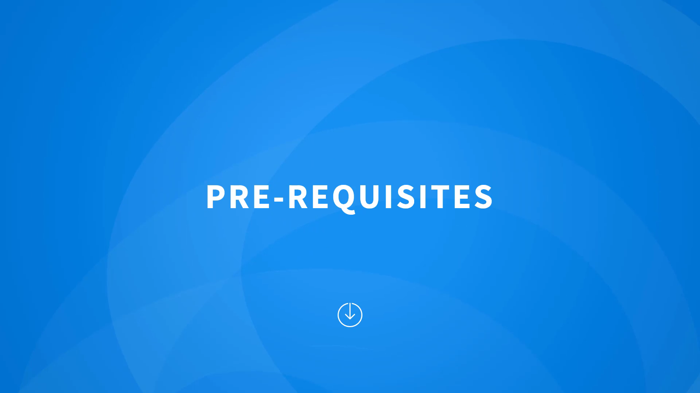
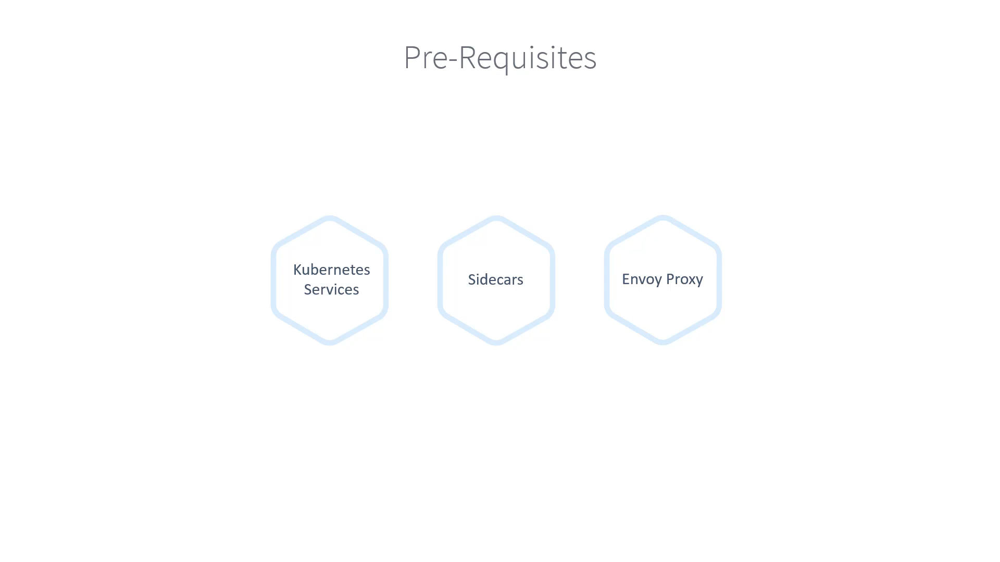

# 010-010-Prerequisites

### Subtitles Extracted
In this section, we will talk about some of the prerequisites you need

- **Timestamp:** 00:03
- **Captions:** In this section, we will talk about some of the prerequisites you need
- 

 for fully grasping the concepts and implementing them in this course. As a prerequisite, you must have basic Kubernetes knowledge, such as how to deploy a basic Kubernetes cluster, basics of Pods, Replica Sets, Deployments, and Services in Kubernetes. If you are new to Kubernetes, I would recommend starting with our Kubernetes for Beginners course. We will, however, recap some concepts that are important to understand Service Meshes and Istio, such as Kubernetes services, sidecars, and Envoy proxy. If you are already familiar with these,

- **Timestamp:** 00:54
- **Captions:** sidecars, and Envoy proxy. If you are already familiar with these,
- 

 feel free to skip this section and go straight into the introduction of Istio. On a side note, you don't necessarily need to set up a Kubernetes cluster while going through this course, as you will be using the lab environment that comes with this course. However, we have some demos that will help you set up your own environment if you would like to try a local setup.
