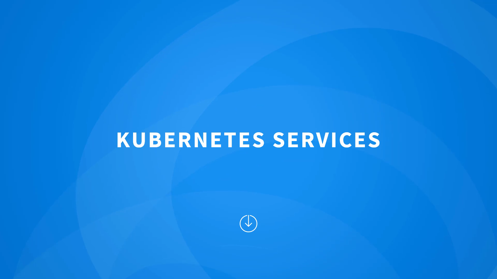
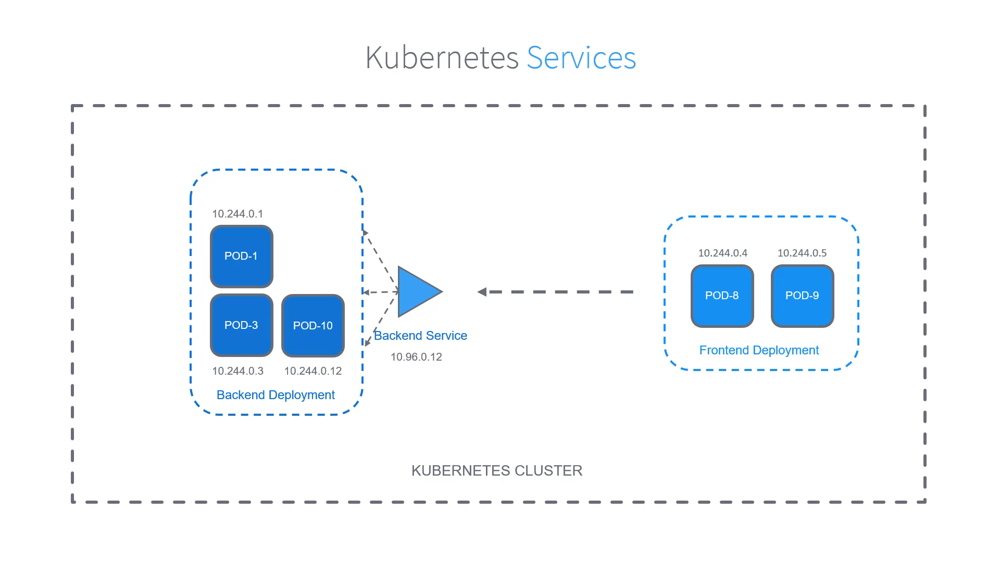

# 010-020-Kubernetes-Services

### Subtitles Extracted

**Timestamp:** 00:04

Let's briefly recap about Kubernetes services.
 So, pods, as we know, are the smallest deployable units in Kubernetes. If you want to run something on Kubernetes, you need to create a pod and place the application in it. Pods are ephemeral, which means they can be created and terminated. To match the cluster state you declared via deployments. We need our pods to find each other and communicate within the cluster, so our application can work as expected. Pods, however, have their own IPs, which is good, but IPs keep changing because Pods are, well, ephemeral. So, how do I find my application spaces in a cluster and help them communicate? Like, let's say a front-end service talks to a back-end service, while these IPs are changing all the time. This is possible via Kubernetes Services. A back-end service can be created to point to the back-end pods, so that any other application within the cluster can use the service to reach the applications in the back end. The service has its own IP, and so we no longer have to rely on the IPs of the individual pods. Services are an abstraction that determines which pods to connect to and a policy on how to connect them. Pods have labels on them, so that our service can select them in a huge pool of other pods.
**Timestamp:** 02:00

 There are three types of services in Kubernetes – NodePort, ClusterIP, and LoadBalancer. The default type of service is called ClusterIP. This is an internal-only service that is created to enable communication between applications within the cluster. This type of service is only accessible within the cluster. If you'd like to make an application accessible outside of the cluster, then you must create a service of type NodePort. This will make the service accessible on a predefined port on all the nodes in the cluster. The third type is called LoadBalancer. This type of service is only supported with specific cloud providers. This is like NodePort service, but invokes a supported external Load Balancer to create a Load Balancer to the ports the application exposed on the nodes in the clusters.
**Timestamp:** 03:18

 That's a quick recap of services. We talk more about services and how to create them in the Kubernetes for the Beginners course.
