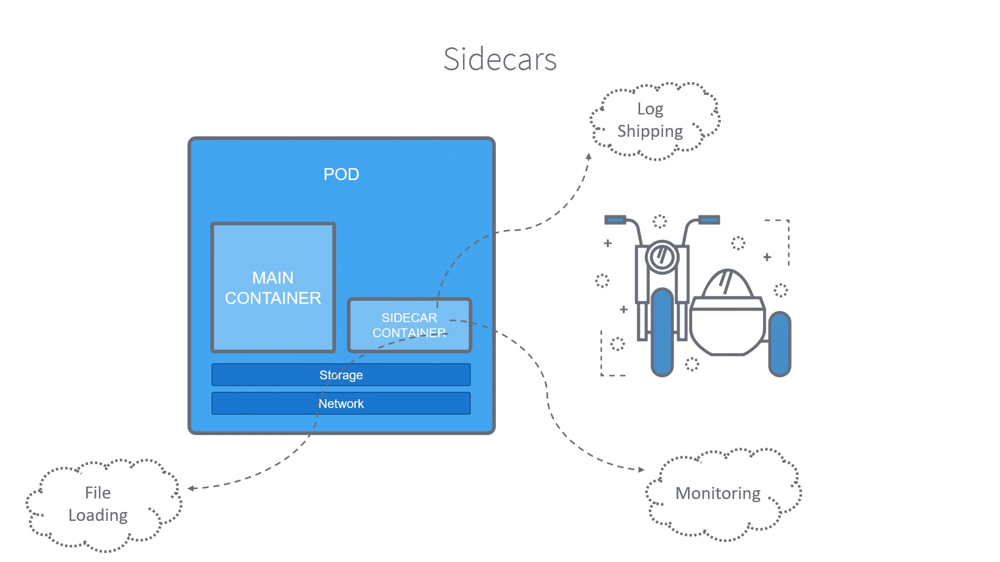
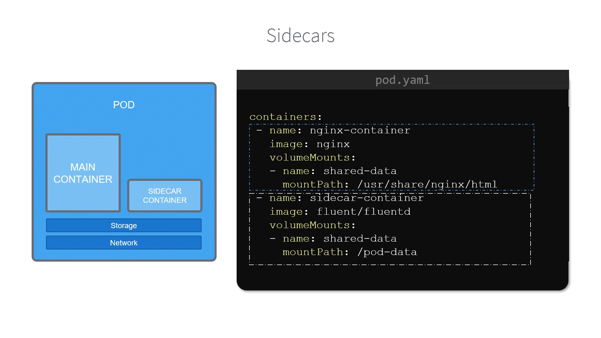

# 010-040-Sidecars
### Subtitles Extracted

**Timestamp:** 00:05


During the course of this training, we will be mentioning Sidecars a lot, so let's quickly brush up on what those are. Have you seen the small passenger cabins attached to the motorcycles? They're called Sidecars. Ah, I always dreamt of traveling inside one of them when I was a kid. In the Kubernetes world, we know containers are encapsulated into Pods. Each pod can have one or more containers. The additional containers that support the main container are called sidecars or sidecar containers. They share the same volume and network, but they have different responsibilities. Sidecars are responsible for log shipping, monitoring, file loading, or in our case, proxying, and they're relatively small in size. Our main container handles the business logic, a functionality that adds value to our application. Sidecars help in isolating these functionalities from our business logic.
**Timestamp:** 01:26



 Here's a sample pod definition file for a sidecar container. 

pod.yml
```
containers:
  - name: nginx-container
    image: nginx
    volumeMounts:
      - name: shared-data
        mountPath: /usr/share/nginx/html
  - name: sidecar-container
    image: fluent/fluentd
    volumeMounts:
      - name: shared-data
        mountPath: /pod-data
```

 Under containers section, first we have an Nginx container, which uses the Nginx image. Then we have a second container, created with a Fluentd image, which is our sidecar container responsible for shipping logs of the main application to a central server. So, that's a sidecar container.
**Timestamp:** 01:52


 Next, we will talk about Envoy.
