# 020-010-monoliths-microservices

### Subtitles Extracted
Before diving into Service Mesh and Istio, I'd like us to have a look at the evolutionary changes in software design in the last two decades. The 2000s started with a breakthrough proposition that would completely change our view of software development. At the time, software development had become very process-oriented and slow. For some industries, like defense and aviation, for example, it took almost 20 years for a project to finish. There was a huge time gap between the software need arising and the software being delivered. Businesses changed before even the software projects got delivered. Many projects had been laid off before even it was finished, and so much money was wasted. Business owners and software professionals both were frustrated.
**Timestamp:** 00:59
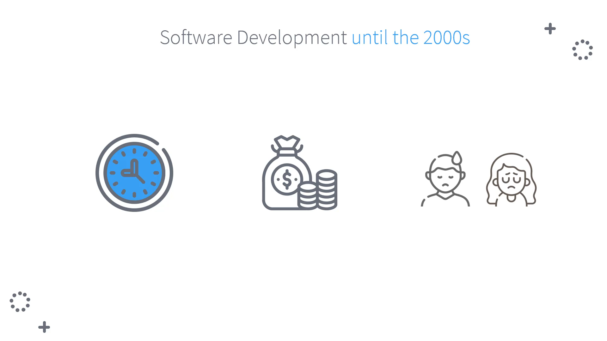

 So, in 2001, 17 independent-minded software practitioners got together and published the Agile Manifesto. They told the world that the way people created software had major flaws and needed to change. 
**Timestamp:** 01:17
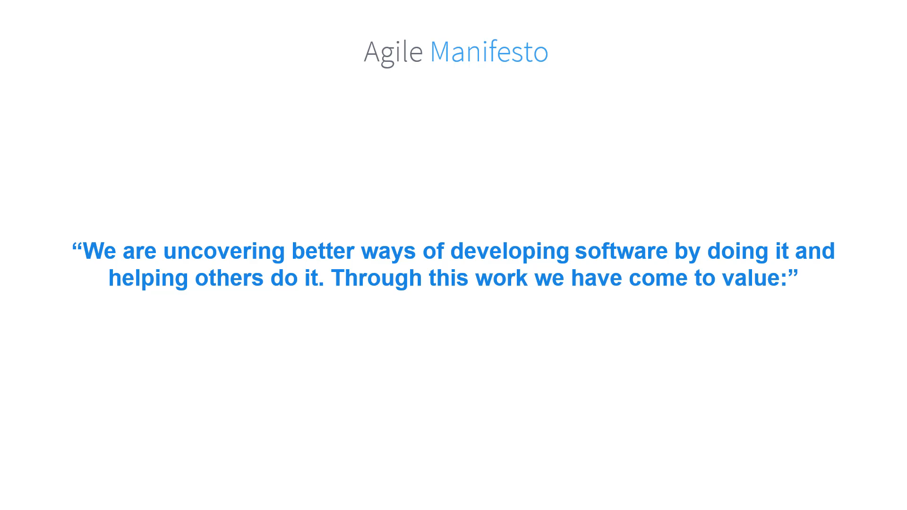

From the experience they had, they decided to value,
 individuals and interactions over processes and tools, 
 working software over comprehensive documentation, 
 customer collaboration over contract negotiation, 
 responding to change over following a plan. 
 That is, while there is value in the items on the right, we value the items on the left more.
 Based on Agile practice, not only do we collaborate with our customers more, but also we evolve our business models and software based on true experimentation. 
**Timestamp:** 01:50
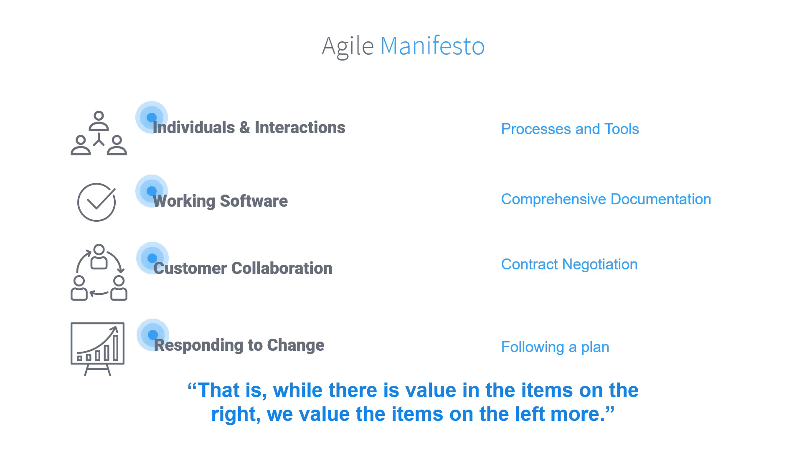

 When you are working on one large app, and if something breaks, it breaks entirely. However, if you're changing small portions of your app, things would be more under control.

**Timestamp:** 02:17
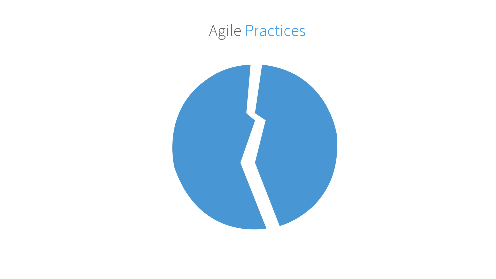

 The piece that you're experimenting with might be affected, but the risk will be less than before.
**Timestamp:** 02:25
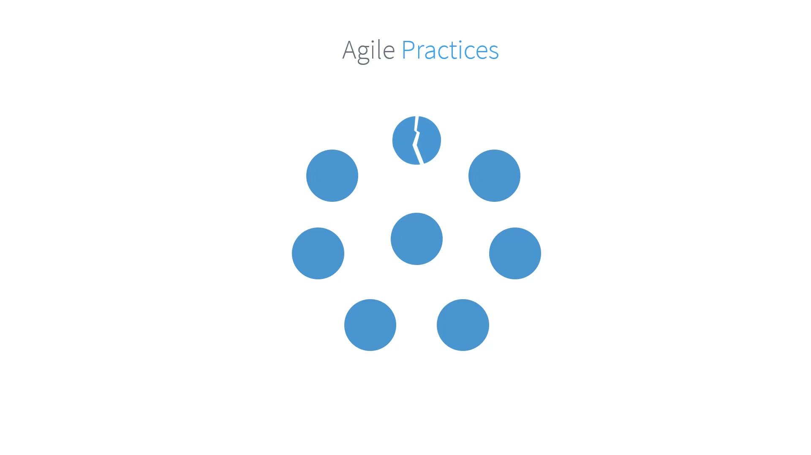
 So, we started designing our applications to be So, we started designing our applications to be smaller and smaller, so that we can isolate risks during experimentation. At the same time, deploy faster and more frequently. So, the joint systems we have been designing have been becoming one big problem, standing in the way of innovation and agility. We had to take a look at our traditional software architectures and redesign them. 
 
 The term monolithic is used when all the functionality in an app needs to be deployed at the same time, and there's a unified approach to all the separate functionalities within the monolithic boundaries. All of this functionality almost always shares the same codebase, and it has no clear boundaries between them. These pieces are tightly coupled. All the code could even be working as a single process. There's usually a single database for persistency in this model, which becomes a huge bottleneck at one point.  
**Timestamp:** 03:46
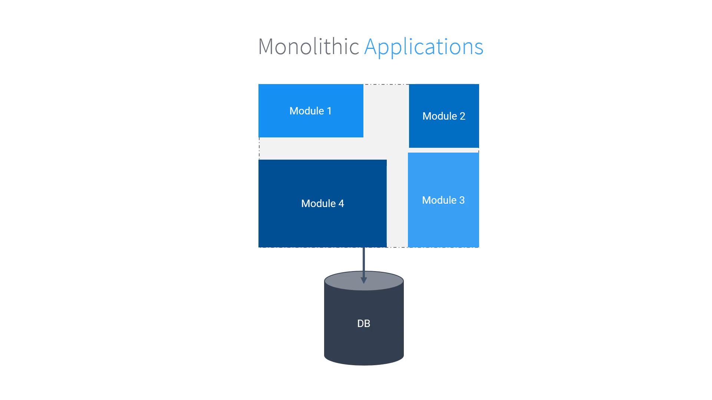

 Let's see how a monolith works in a real-life application. Here is our Bookinfo application. We will use this as our example application  throughout this course.
 It consists of four different modules, namely Details, Reviews, Ratings, and Product page. It is a modular application, but still a monolith. All the services depend on a specific version of the other one. You need to deploy the whole package and possibly send some scripts to the database. 

**Timestamp:** 03:55

 The Product page shows the book's information, reviews, and ratings.
 All the data of this application comes from different modules, but they are not separately designed and cannot be scaled. 
 
**Timestamp:** 04:29

 Let's try to understand the dependencies of the modules and the problems of the monoliths Bookinfo. 
The customer lands on the Product page. Product page gets this information from Reviews and Details modules. Reviews service gathers the number of ratings from Ratings service. They are all written in the same language, Java.
**Timestamp:** 05:09
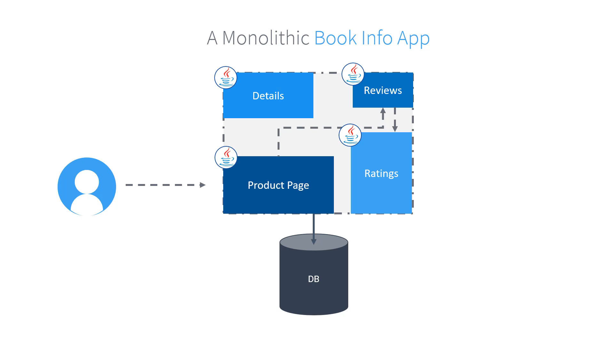

Apart from these modules, the application also takes care of networking, authentication, authorization rules, and how data is transferred between modules, logging, monitoring, tracing, etc.
**Timestamp:** 05:25
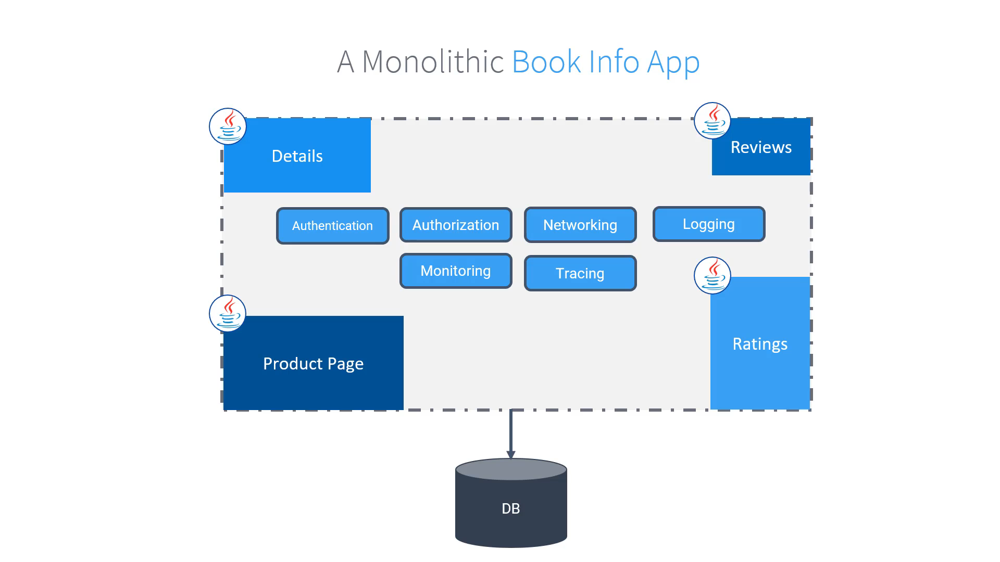

 Every once in a while, the Ratings module, because of the amount of data it holds, has problems, and this affects the whole system. It is not possible to just scale ratings or leave it out of the system without touching the code and redeploying it. 

**Timestamp:** 05:47

- 

Now, a new campaign module is going to be developed.
 But this time, a new team is formed for this, and they want to use a different language. Since everything is unified and all the important functionality like authorization lies within the monolith, they have a hard time designing the architecture. And also, our product owners want to try a new version of Reviews with Red Stars for Christmas. They want to test this functionality on a segment of users, and if they like it, we can use it for the whole system. This is a very simple app, with very little functionality, and you can see the problems we are having to tackle already. Now, think of huge applications that have been around for decades and more. There may be hundreds of applications, and you can see the problems we are having to tackle already. But if you want to make it easier for your users to use the app, that has been around for decades and more. There may be hundreds or more developers working on these systems, and starting with some loose rules on architecture, these systems might become a big ball of mud. Big ball of mud is a famous idiom for these types of software systems. Without noticing, your monolith application can go out of hand and become one of those.  
- **Timestamp:** 07:12
- 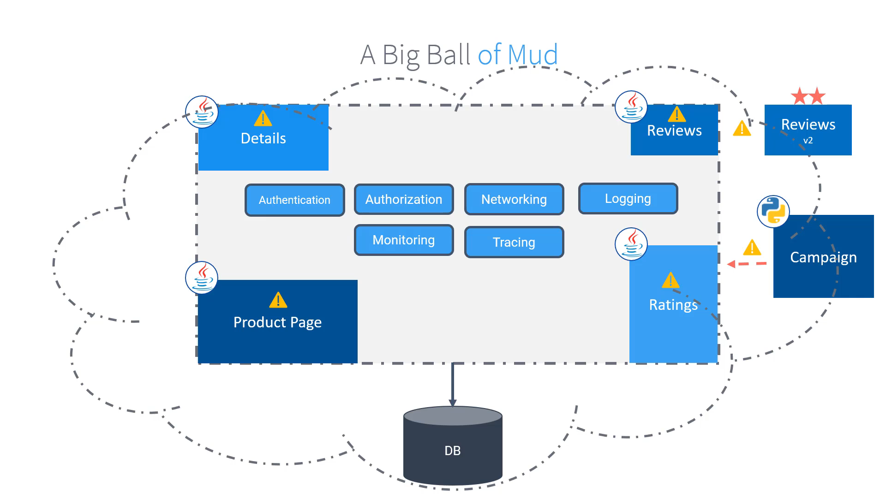

 Let's have a look at how this booking for monolithic application could magically and miraculously turn into microservices. Well, to be honest, it is not an easy task to refactor monoliths, and it's not an overnight transformation. It is a cultural, technical, and organizational effort which paves the way to being cloud native. With the new microservices architecture, each module is now its own independent and separate application. Our product page has been transformed into a Python app. It still functions as our landing page. The book details module has been refactored into a Ruby application. The reviews module has been transformed into a Java app. The ratings module has now been redesigned and implemented in Node.js.

- **Timestamp:** 08:18
- 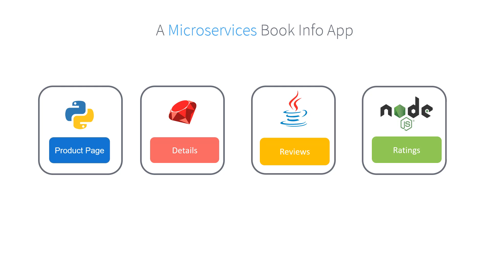

 Moreover, the reviews app now has multiple versions. Version 1, version 2, and version 3 to test different ideas. Version 1 is a no-star version, version 2 is a black star, and version 3 is a red star version. As before, users land on the product page, which contacts the details and review services to show information regarding various products.

- **Timestamp:** 08:51
- 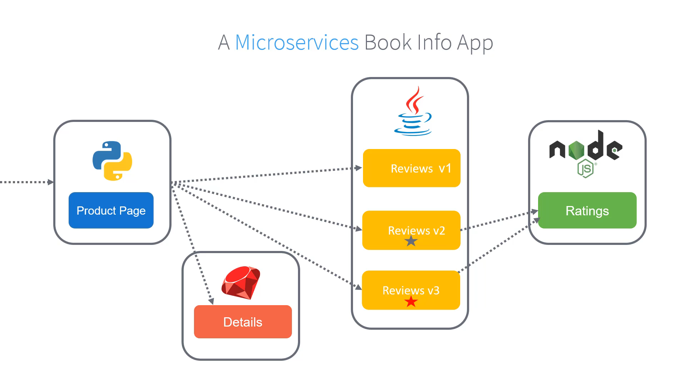

 So now that we have seen how the monolithic booking application has been transformed into microservices, let's talk about the improvements and wins. The ratings module will not be a problem anymore. Now that it is fully independent, we can scale it up or down depending on the load from our customers. We can now deploy every piece of booking for without interfering with others. It will make our releases smaller, faster, and less risky. With microservices architecture, each service can be written with different languages. So here in our application, we have now four different languages and each team has autonomy. Our services are now isolated from the failure of other services because of the loose coupling. And the end-to-end application will have more resilience since its different parts can be monitored, changed, or rolled back easily. Instead of having one big application, we now have six smaller applications. So hopefully, you won't have to deal with a big ball of mud anymore. In an ideal scenario, a microservice should have a single responsibility.  
- **Timestamp:** 10:18
- 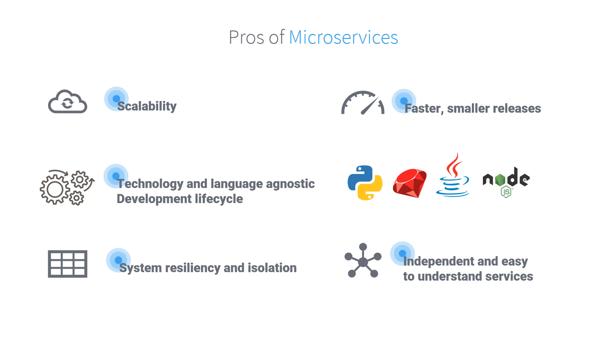

 Earlier, when we discussed the monolithic book application, we said that, apart from the four different modules, the application also takes care of networking, authentication, authorization rules, and how data is transferred between modules as well as logging, monitoring, etc.

- **Timestamp:** 10:41
- 

 But what happened to these when we moved to the microservices model? Well, they are not there. Our microservices currently do not implement any of these. We could move these into each of our Kubernetes services. So let's add all these functionalities to our microservices. By now, you probably have an idea on where this is going. Every microservice boundary has the same functionality coded again and again into them. Every team has to solve the same issues over and over again, and probably they'll solve them differently. Look at the code application here, and how do you go tell these teams to change a certificate or a monitoring agent version? Any developer developing any of these applications will need to be aware of all of these extra components apart from the core business logic. That microservice is meant to serve. These issues we have to deal with in every microservice are called cross-cutting concerns. When coded into the microservice, they disrupt the main reason we designed the microservices. To be able to have smaller, more independent pieces. This is known as the problem of fat microservices.

- **Timestamp:** 12:16
- 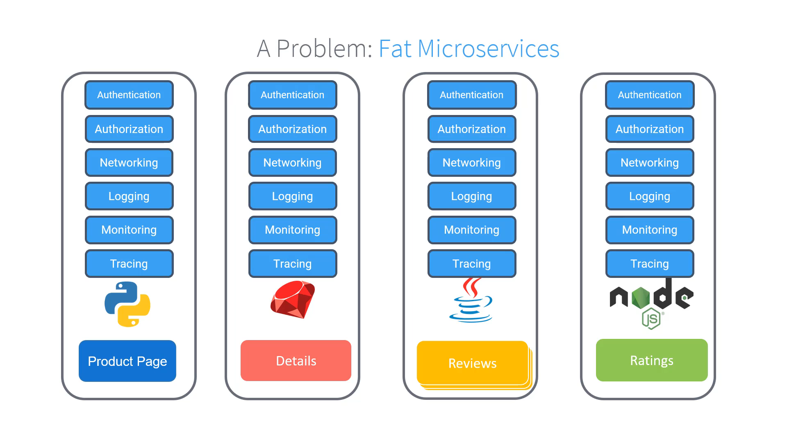

 Microservices are not a piece of cake. They have their own challenges, and they tend to get really complicated. As we just saw in the monolithic version of our application, all aspects such as networking and security were directly coded into the application. But now all those gray areas fabricated into our monolithic application are exposed, and we have to find a way to cover them. How will the product page know which version of reviews to go to? So how will one service know how to find the other one? What are the traffic rules? What are the timeouts? In a very short time, you'll have too many tiny bits of services spread out, and these questions will get much harder to answer. It was much easier to handle the security in our monolith because it provided the proper sheen for us. In our microservices, securing service-to-service communication and end-user-to-service communication can become a problem itself. Now that you have loosely coupled tiny pieces and many abstraction layers, it gets harder to pinpoint a problem in your application. For that, you will need an observability strategy. Just for a small application, we used four different languages. With all those different technologies of microservices, Actually, operations might become a bottleneck for organizations who take on microservices. There's a new approach for that called DevOps, where the development teams work closely with operations, and together, they take the responsibility for the development, deploying , monitoring adn fixing 

- **Timestamp:** 14:33
- 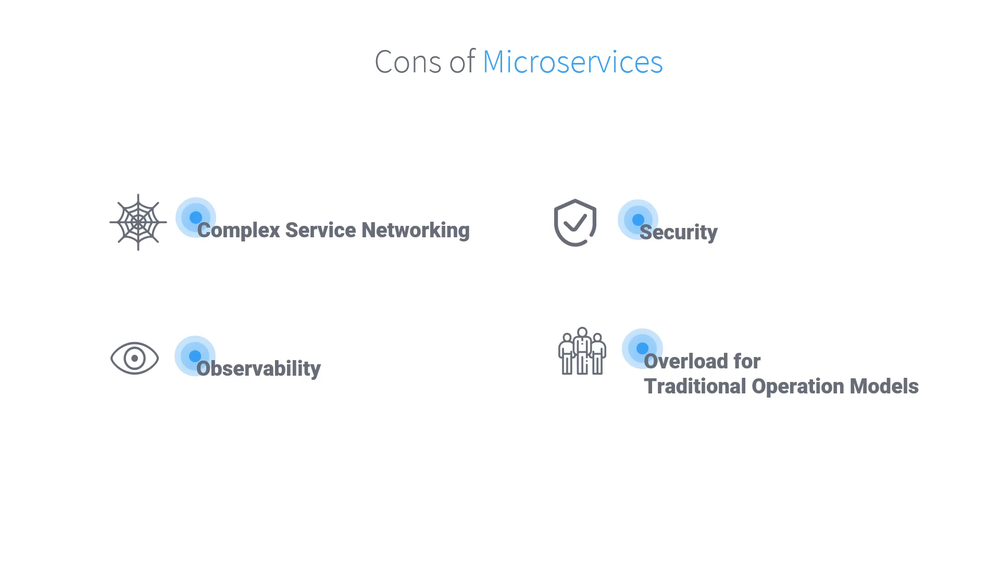

 . In the upcoming lesson, we will look at how service meshes can help solve these challenges with microservices.

