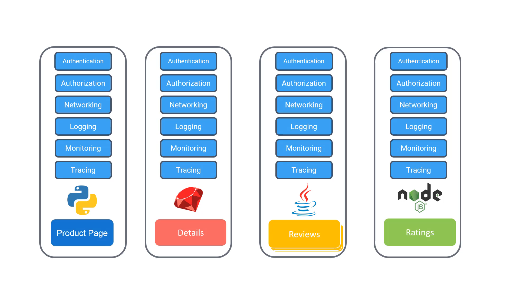
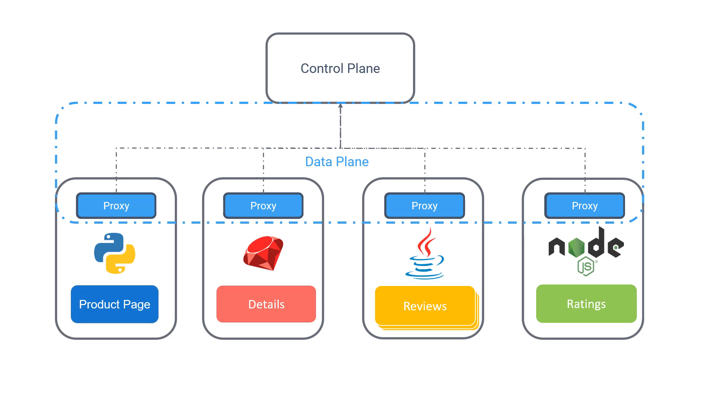
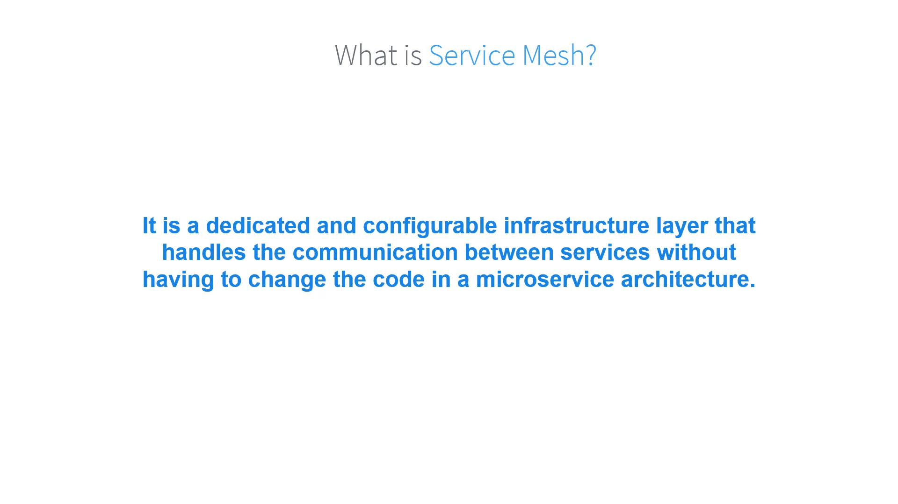

# 020-020-service-mesh

### Subtitles Extracted

So, what is a service mesh? This is where we were in the previous video.
**Timestamp:** 00:07

Instead of embedding all the different requirements into each microservice, we replace them with a single proxy in the form of a sidecar container. The proxies communicate with each other through what is known as a data plane. And they communicate to a server-side component called Control Plane. Control Plane manages all the traffic into and out of your services via proxies. So, all the networking logic is abstracted from your business code. And this approach is known as a service mesh.
**Timestamp:** 00:52

A service mesh is a dedicated and configurable infrastructure layer that handles the communication between services without having to change the code in a microservices architecture.
**Timestamp:** 01:07

With a service mesh, you can dynamically configure how services talk to each other. When services talk to one another, you'll have mutual TLS, so your workloads can be secure. You can see things better. For example, how the application is doing end-to-end, where it is having issues and bottlenecks. And service discovery, which covers three main topics. In a dynamic cluster, we will need to know at which IP and port services are exposed so they can find each other. Health Check helps you dynamically keep services that are up in the mesh while services that are down are left out. Load balancing routes the traffic to healthy instances and cuts it off from the ones that have been failing.
**Timestamp:** 02:12

We will look into each of these in more detail throughout the rest of this course. I'll see you in the next one.
