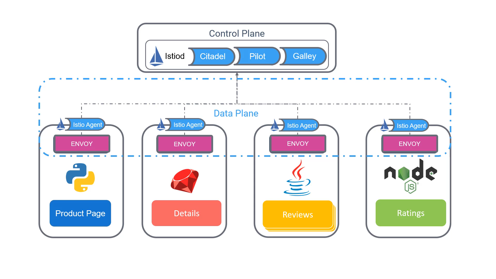

# 020-030-istio

### Subtitles Extracted
Now, we'll have a look at Istio, how it works, its architecture, and its core components. Istio is a free and open-source service mesh that provides an efficient way to secure, connect, and monitor services. Istio works with Kubernetes and traditional workloads, thereby bringing universal traffic management, telemetry, and security to complex deployments. Istio is supported and implemented by leading cloud providers and consultants.
**Timestamp:** 00:33

Earlier, we talked about a proxy service that takes care of all the tasks that should be outsourced from the microservices. These proxies and the communication between them form the data plane. Istio implements these proxies using an open-source high-performance proxy known as Envoy. The proxies talk to a server-side component known as the control plane.
**Timestamp:** 01:03

Let's look at these in a bit more detail. Originally, the control plane consisted of three components, named Citadel, Pilot, and Galley. Citadel managed certificate generation, Pilot helped with service discovery, and Galley helped in validating configuration files. The three components were later combined into a single daemon called Istiod. Each service, or pod, has a separate component in it, along with the Envoy proxy called the Istio agent. The Istio agent is responsible for passing configuration secrets to the Envoy proxies.
**Timestamp:** 01:45

So, that's a high-level overview of Istio. Next, we will get started with Istio by installing it, and later we will dig deeper into Istio's features and functionalities.
