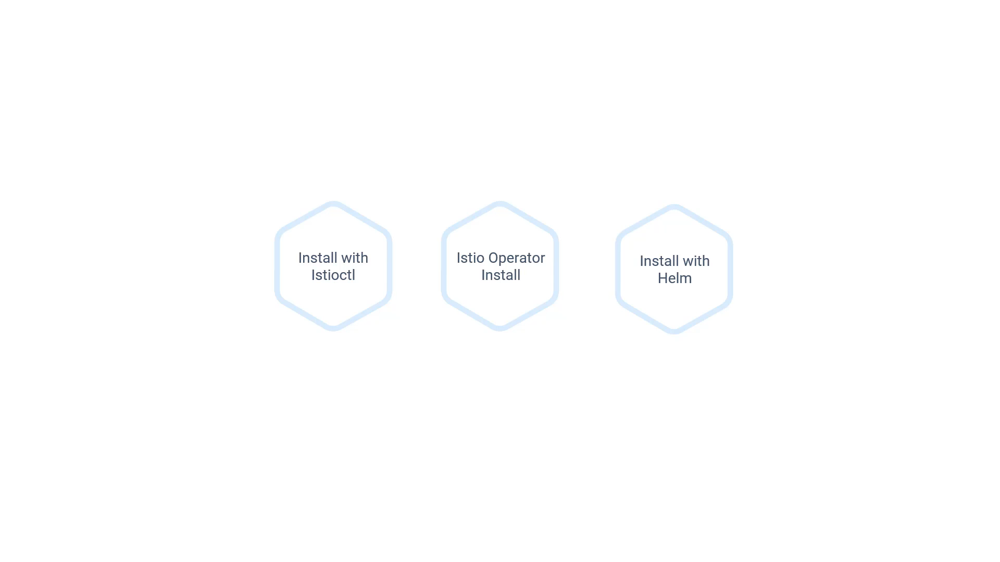
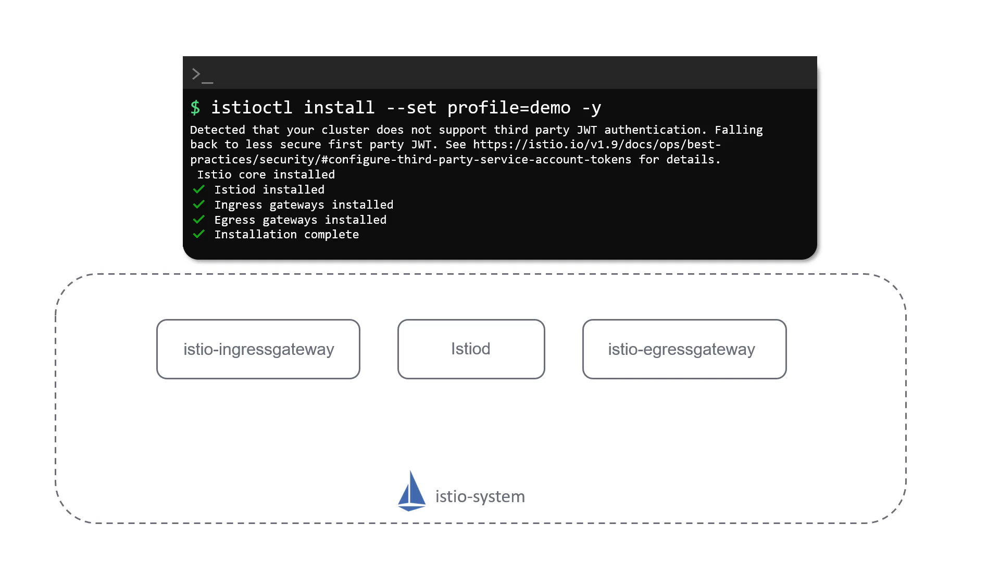
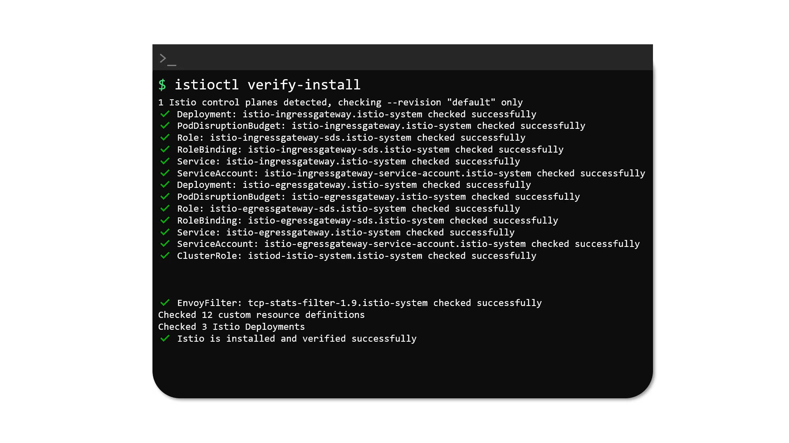

# 020-035-installing-istio


### Subtitles Extracted
Now, it's time to install Istio on our cluster. There are three different approaches to install Istio. We could install it using the command-line utility Istioctl. We could use an Istio operator to install it. Or, we could use a Helm package for the same installation.
**Timestamp:** 00:23



For this training, we will use Istioctl for installing Istio on our cluster. To install Istio using Istioctl, run the Istioctl install command and specify a profile. For this installation, we will use a demo profile. There are also different profiles for production and performance testing. We will not use them in our training, but it's important to know that different environments need different profiles. When this command is run, Istio is deployed in the cluster in the form of a deployment named Istiod, in a new namespace known as the Istio system namespace. Istiod, as we discussed earlier, has different components inside it, such as Citadel, Pilot, and Galley. Along with these, it also deploys two other services known as the Istio Egress Gateway and Istio Ingress Gateway, and a bunch of Kubernetes service objects to expose these services within the cluster.
```
$ istioctl install --set profile=demo -y
Detected that your cluster does not support third party JWT authentication. Falling back to less secure first party JWT. See https://istio.io/v1.9/docs/ops/best-practices/security/#configure-third-party-service-account-tokens for details.
∘ Istio core installed
∘ Istiod installed
∘ Ingress gateways installed
∘ Egress gateways installed
Installation complete
```
**Timestamp:** 01:39



We will talk more about these Gateways when we talk about Gateways in a later section. Once installed, run the Istioctl verify-install command to verify the installation. You'll see a huge list of items here.
```
$ istioctl verify-install
1 Istio control planes detected, checking --revision "default" only
✔ Deployment: istio-ingressgateway.istio-system checked successfully
✔ PodDisruptionBudget: istio-ingressgateway.istio-system checked successfully
✔ Role: istio-ingressgateway-sds.istio-system checked successfully
✔ RoleBinding: istio-ingressgateway-sds.istio-system checked successfully
✔ Service: istio-ingressgateway.istio-system checked successfully
✔ ServiceAccount: istio-ingressgateway-service-account.istio-system checked successfully
✔ Deployment: istio-egressgateway.istio-system checked successfully
✔ PodDisruptionBudget: istio-egressgateway.istio-system checked successfully
✔ Role: istio-egressgateway-sds.istio-system checked successfully
✔ RoleBinding: istio-egressgateway-sds.istio-system checked successfully
✔ Service: istio-egressgateway.istio-system checked successfully
✔ ServiceAccount: istio-egressgateway-service-account.istio-system checked successfully
✔ ClusterRole: istiod.istio-system checked successfully


✔ EnvoyFilter: tcp-stats-filter-1.9.istio-system checked successfully
Checked 12 custom resource definitions
Checked 3 Istio Deployments
✔ Istio is installed and verified successfully
```
**Timestamp:** 01:58
- 


As we talked about earlier, Istio extends Kubernetes, so you can see CRDs here. Let's now see this in action in the upcoming demo.
