# 020-040-installing-istioctl


### Subtitles Extracted
So, for this demo, you'll need Minikube installed on your machine. First, let's create a cluster in Minikube. If you use the start minikube command, Minikube will use the default driver. As you can see, I also have Docker running in my system, and I'm using Docker as my default driver. If Minikube finds that you're running Docker on your local system, it just lends itself as a container in Docker.

```bash
$ minikube start 
😄  minikube v1.16.0 on Darwin 10.15.7
✨  Automatically selected the docker driver. Other choices: hyperkit, virtualbox
👍  Starting control plane node minikube in cluster minikube g
🔥  Creating docker container (CPUs=2, Memory=1987MB) ...
🐳  Preparing Kubernetes v1.20.0 on Docker 20.10.0 ...
  • Generating certificates and keys ...
  • Booting up control plane ...
  • Configuring RBAC rules ...
🔎  Verifying Kubernetes components...
🌟  Enabled addons: storage-provisioner, default-storageclass
🏄  Done! kubectl is now configured to use "minikube" cluster and "default" namespace by default
```
**Timestamp:** 00:32
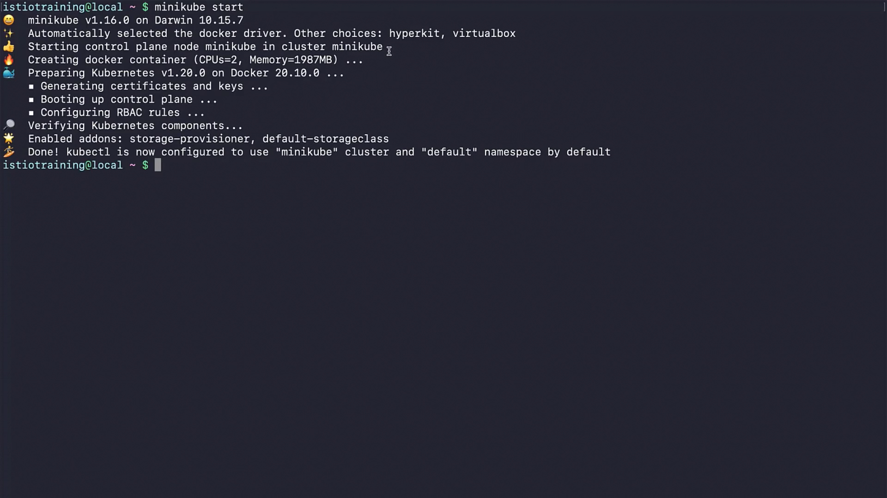

You might as well run into this issue, that says, due to the networking limitations of Docker on Darwin, ingress add-on is not supported. So, this bug is all about the ingress add-on not being supported on Docker driver on macOS due to the limitation on Docker bridge for Mac. By the time this training is released, the bug might be resolved, and you might not encounter the issue.
```bash
$ minikube addons enable ingress

❌  Exiting due to MK_USAGE: Due to networking limitations of driver docker on darwin, ingress addon is not supported.
Alternatively to use this addon you can use a vm-based driver:

            'minikube start --vm=true'

To track the update on this work in progress feature please check:
https://github.com/kubernetes/minikube/issues/7332
```
**Timestamp:** 01:05
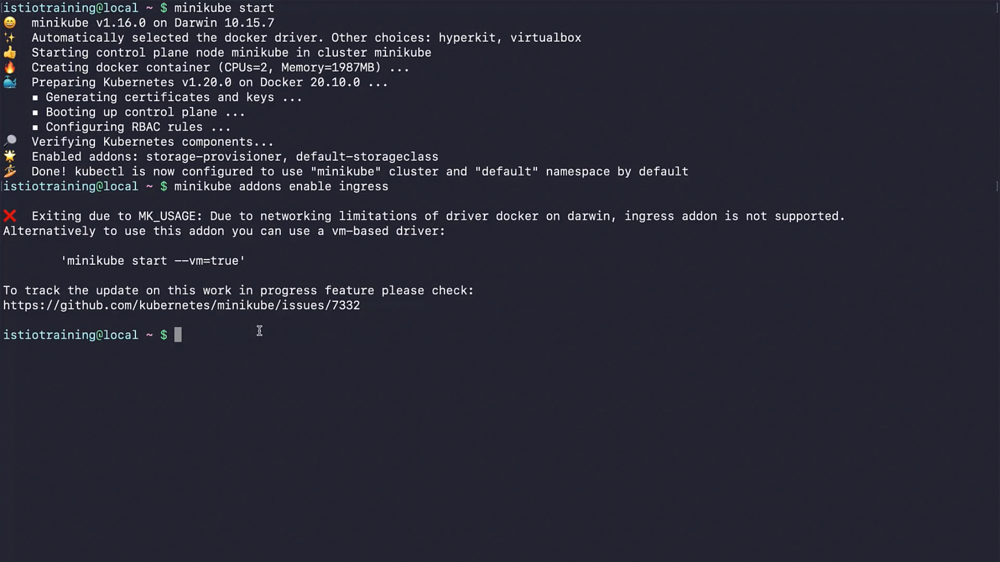


But, if you did, here's a way to make it work. Let's delete this cluster, 
```bash
$ minikube delete
🔥  Deleting "minikube" in docker ...
🔥  Deleting container "minikube" ...
🔥  Removing /Users/istiotraining/minikube/machines/minikube
💀  Removed all traces of the "minikube" cluster.
```
**Timestamp:** 01:14
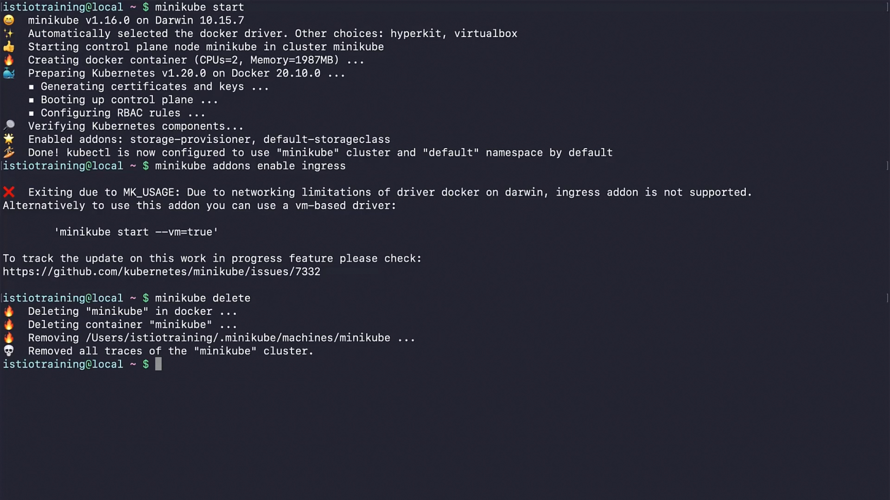


and use this command. 

```bash 
$ minikube start --vm=true 
😄  minikube v1.16.0 on Darwin 10.15.7
✨  Automatically selected the hyperkit driver
👍  Starting control plane node minikube in cluster minikube
🔥  Creating hyperkit VM (CPUs=2, Memory=4000MB, Disk=20000MB) ...
🐳  Preparing Kubernetes v1.20.0 on Docker 20.10.0 ...
    • Generating certificates and keys ...
    • Booting up control plane ...
    • Configuring RBAC rules ...
🔎  Verifying Kubernetes components...
🌟  Enabled addons: storage-provisioner, default-storageclass 
🏄  Done! kubectl is now configured to use "minikube" cluster and "default" namespace by default
```
**Timestamp:** 01:32
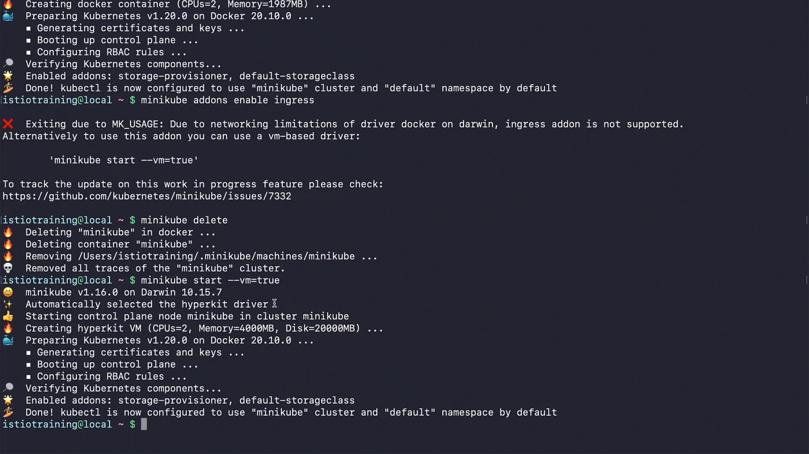


Now, you can use Minikube with a VM-based driver, as it will not work on Docker; instead, it will work in a VM. Let's try enabling ingress. Yes, we see that it's enabled. Now, with this command, we can run Minikube on a VM-based driver.
```bash 
$ minikube addons enable ingress
🔎  Verifying ingress addon...
🌟  The 'ingress' addon is enabled
```
**Timestamp:** 01:50
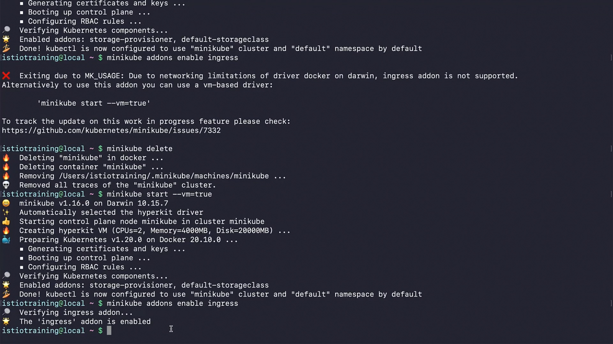


Now, with this command, we will install Istio control plane, which we will use in this training a lot. Be careful, this command will download the latest Istio release to the current directory, so make sure you download it somewhere safe and reliable. At the time of this recording, the latest release is already installed, the latest release of Istio is 1.10.3, so this might be different in your case.


```bash 
$ curl -L https://git.io/getLatestIstio | sh -
  % Total    % Received % Xferd  Average Speed   Time    Time     Time  Current
                                 Dload  Upload   Total   Spent    Left  Speed
110   102  100   102    0     0     44      0 00:00:02 00:00:02 --:--:--    44
100  4573  100  4573    0     0   1697      0 00:00:02 00:00:02 --:--:--  1697

Downloading istio-1.10.3 from https://github.com/istio/istio/releases/download/1.10.3/istio-1.10.3-osx.tar.gz
Istio 1.10.3 Download Complete!

Istio has been successfully downloaded into the istio-1.10.3 folder on your system.

Next Steps:
See https://istio.io/latest/docs/setup/install/ to add Istio to your Kubernetes cluster.

To configure the istioctl client tool for your workstation, 
add the /Users/istiotraining/istio-1.10.3/bin directory to your environment path variable with:
            export PATH="$PATH: /Users/istiotraining/istio-1.10.3/bin"
Begin the Istio pre-installation check by running:
            istioctl x precheck
Need more information? Visit https://istio.io/latest/docs/setup/install/
```
**Timestamp:** 02:27
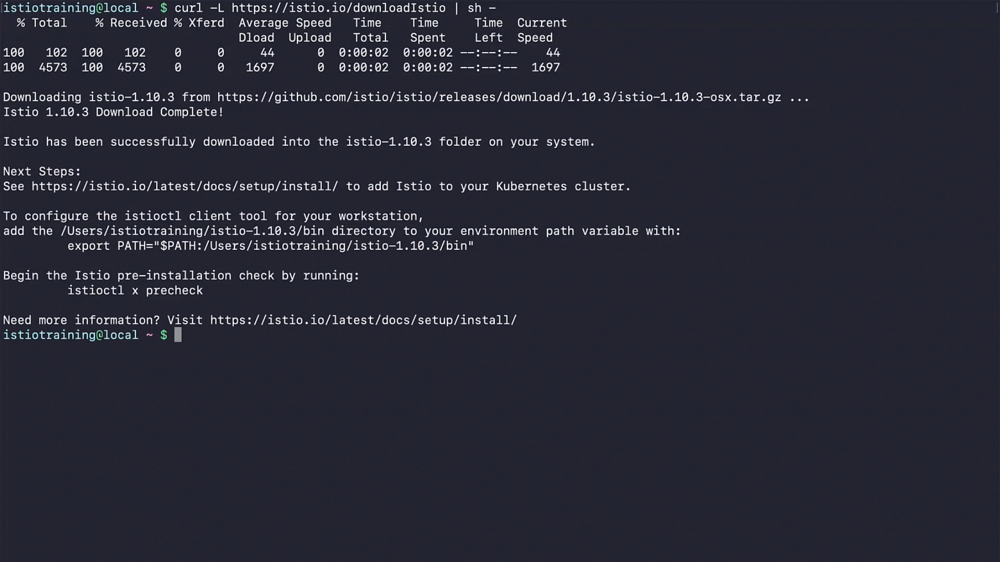


Now, move to the Istio package directory. This directory is also named with the Istio version we downloaded. Let's see what we got with the Istio package. We have the license and README files.
```bash
$ cd istio-1.10.3/
$ ls
LICENSE  READE.md  bin  manifest.yaml  manifests  samples  tools
```
**Timestamp:** 02:46
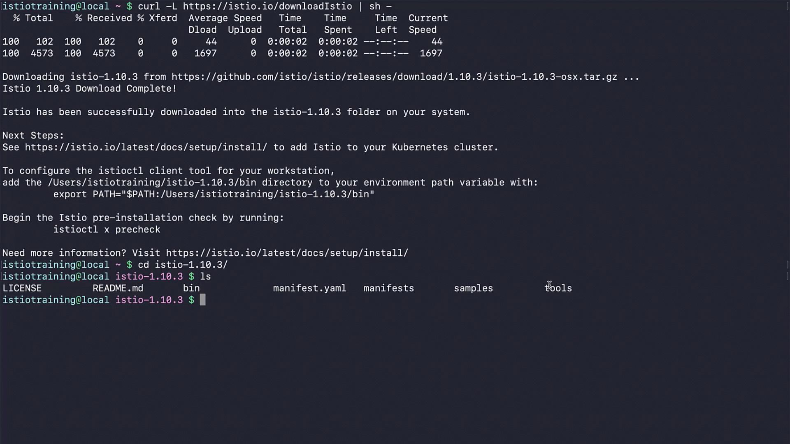


There are lots of samples in the samples folder, and Istio client binary is in /bin.
```bash 
$ ls bin/ 
istioctl
```
**Timestamp:** 02:53
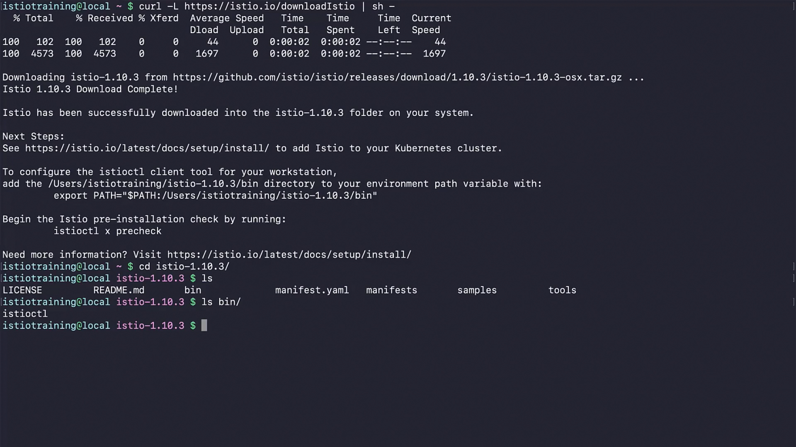


In the samples folder, we have our sample application that will be used throughout the course, and also there are other interesting examples, you can go search for more information in the Istio docs.
```bash
$ ls samples/ 
README.md    custom-bootstrap    helloworld       multicluster    sleep
addons       extauthz            httpbin          operator        tcp-echo
bookinfo     external            jwt-server       ratelimit       websockets
certs        health-check        kubernetes-blog  security
```
**Timestamp:** 03:08
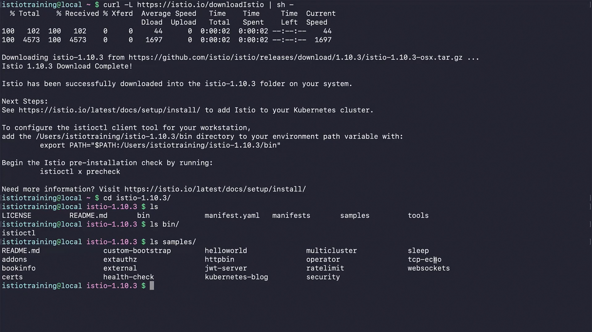


Let's see what's in the tools folder, nothing much. 
```bash 
$ ls tools/ 
_istioctl    certs    istioctl.bash
```
**Timestamp:** 03:17
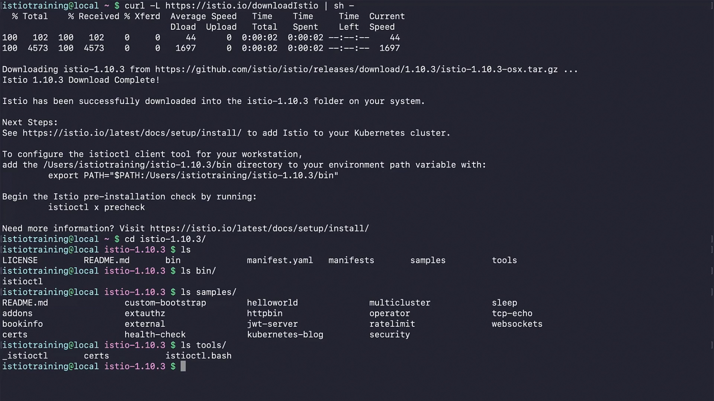


Now with this command in Linux and macOS, we add the Istio control client to our path. 
```bash
$ export PATH=$PWD/bin:$PATH
```
**Timestamp:** 03:31
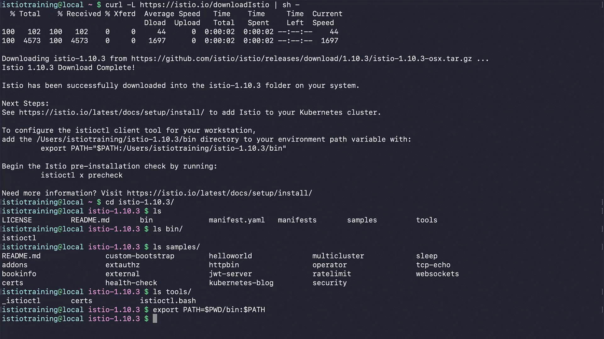

Let's check if Istio control plane is installed. Yes, it is, and it is running in 1.10.3.
```bash 
$ istioctl version 
no running Istio pods in "istio-system"
1.10.3
```
**Timestamp:** 03:41
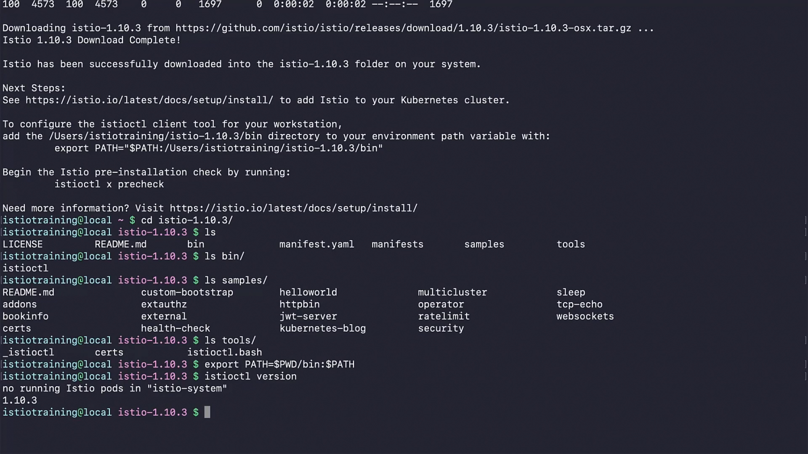


Now, using the Istio control plane, let's check if our cluster has Istio installed. Hmm, well, that's because it does not. As you can see, it is telling us there is no Istio control plane.

Timestamp: 04:01


 Let's install Istio on our cluster in next lesson.

```bash 
$ istioctl verify-install
0 Istio control planes detected, checking --revision "default" only 
error while fetching revision: the server could not find the requested resource
0 Istio injectors detected
Error: could not load IstioOperator from cluster: the server could not find the requested resource. Use --filename 
```

