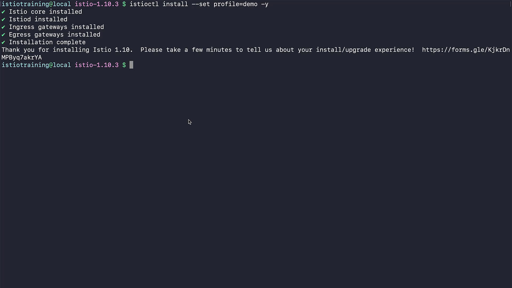
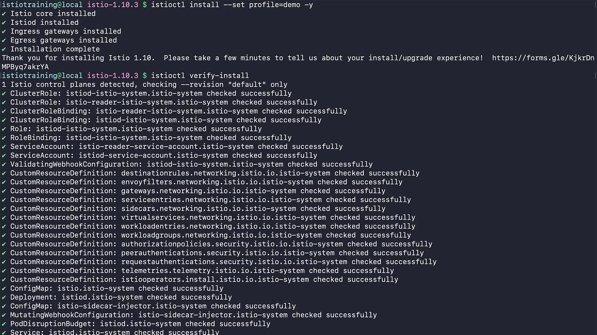
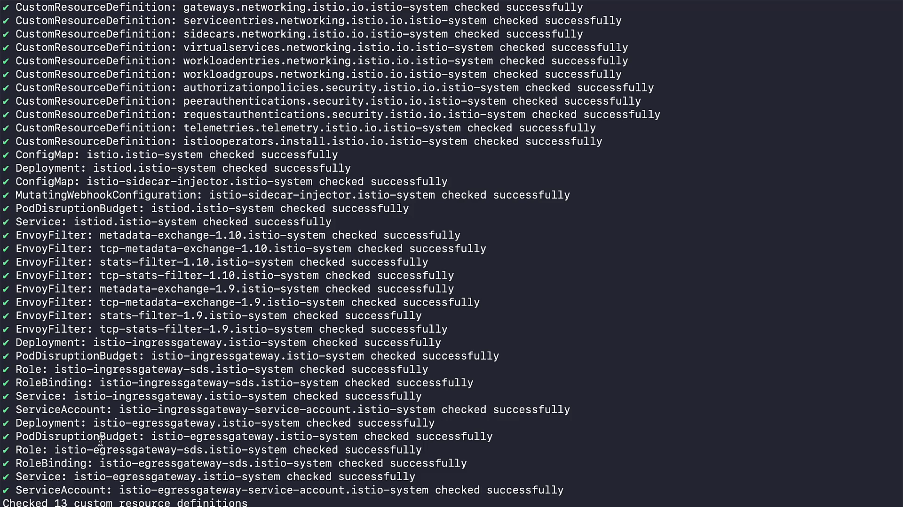

# 020-050-installing-istio-on-your-cluster


### Subtitles Extracted
So, in this demo, we'll be installing Istio on our cluster using istioctl. For this, let's use istioctl install command.As we have talked earlier, for demo purposes, we'll use demo profile. Let's run this command now. 

```bash
$ istioctl install --set profile=demo -y
• Istio core installed
• Istiod installed
• Ingress gateways installed
• Egress gateways installed
• Installation complete
Thank you for installing Istio 1.10. Please take a few minutes to tell us about your install/upgrade experience! https://forms.gle/KjkrDnMPByq/akrYA
```

**Timestamp:** 00:35



Once installed, let's use the verify install command to check if everything is installed without any problems. As you can see, now in our cluster there are a bunch of new resources that Istio has added.
```bash
$ istioctl verify-install
1 Istio control planes detected, checking -revision "default" only
✓ ClusterRole: istiod-istio-system. istio-system checked successfully
✓ ClusterRole: istio-reader-istio-system.istio-system checked successfully
✓ ClusterRoleBinding: istio-reader-istio-system.istio-system checked successfully
✓ ClusterRoleBinding: istiod istio-system. istio-system checked successfully
✓ Role: istiod-istio-system. istio-system checked successfully
✓ RoleBinding: istiod-istio-system.istio-system checked successfully  
✓ ServiceAccount: istio-reader-service-account.istio-system checked successfully
✓ ServiceAccount: istiod-service-account.istio-system checked successfully
✓ ValidatingWebhookConfiguration: istiod-istio-system.istio-system checked successfully 
✓ CustomResourceDefinition: destinationrules.networking.istio.io.istio-system checked successfully
✓ CustomResourceDefinition: envoyfilters.networking.istio.io.istio-system checked successfully
✓ CustomResourceDefinition: gateways.networking.istio.io.istio-system checked successfully
✓ CustomResourceDefinition: serviceentries.networking.istio. io. istio system checked successfully
✓ CustomResourceDefinition:sidecars.networking.istio.io.istio-system checked successfully
✓ CustomResourceDefinition: virtualservices.networking.istio.io.istio-system checked successfully
✓ CustomResourceDefinition: workloadentries.networking.istio.io.istio-system checked successfully
✓ CustomResourceDefinition: workloadgroups.networking.istio.io. istio-system checked successfully
✓ CustomResourceDefinition: authorizationpolicies.security.istio. io. istio system checked successfully
✓ CustomResourceDefinition: peerauthentications.security istio.io.istio-system checked successfully
✓ CustomResourceDefinition: requestauthentications.security.istio.io.istio-system checked successfully
✓ CustomResourceDefinition: telemetries.telemetry.istio.io. istio-system checked successfully
✓ CustomResourceDefinition: istiooperators. install. istio. io. istio-system checked successfully
✓ ConfigMap: istio istio-system checked successfully
✓ Deployment: istiod istio-system checked successfully
✓ ConfigMap: istio-sidecar-injector.istio-system checked successfully
✓ MutatingWebhookConfiguration: istio-sidecar-injector istio-system checked successfully
✓ PodDisruptionBudget: istiod.istio-system checked successfully
✓ Service: istiod.istio-system checked successfully
✓ EnvoyFilter: metadata-exchange-1.10.istio-system checked successfully
✓ EnvoyFilter: tcp-metadata-exchange-1.10. istio-system checked successfully
✓ EnvoyFilter: stats-filter-1.10.istio-system checked successfully
✓ EnvoyFilter: tcp-stats-filter-1.10 istio-system checked successfully
✓ EnvoyFilter: metadata-exchange-1.9. istio-system checked successfully
✓ EnvoyFilter: tcp-metadata-exchange-1.9.istio-system checked successfully
✓ EnvoyFilter: stats-filter-1.9.istio-system checked successfully
✓ EnvoyFilter: tcp-stats-filter-1.9.istio-system checked successfully
✓ Deployment: istio-ingressgateway istio-system checked successfully
✓ PodDisruptionBudget: istio ingressgateway istio-system checked successfully
✓ Role: istio-ingressgateway-sds.istio-system checked successfully
✓ RoleBinding: istio-ingressgateway-sds.istio-system checked successfully
✓ Service: istio-ingressgateway istio-system checked successfully
✓ ServiceAccount: istio-ingressgateway-service-account.istio-system checked successfully
✓ Deployment: istio-egressgateway istio system checked successfully
✓ PodDisruptionßudget: istio-egressgateway istio-system checked successfully
✓ Role: istio-egressgateway-sds. istio-system checked successfully
✓ RoleBinding: istio-egressgateway-sds. istio-system checked successfully
✓ Service: istio-egressgateway.istio-system checked successfully
✓ ServiceAccount: istio-egressgateway-service-account.istio-system checked
Checked 13 custom resource definitions
```
**Timestamp:** 00:49

horizationpolicies. sec

Some of these are cluster roles, cluster role bindings, custom resource definitions, and three Istio deployments with 13 custom definitions. Our Istio cluster is installed and verified successfully. Let's move on to the next section.


**Timestamp:** 01:12


