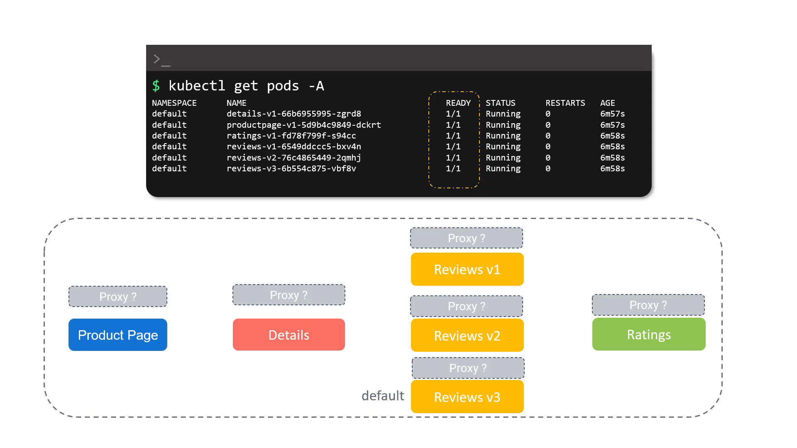
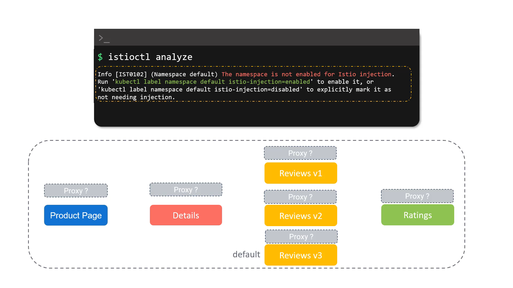
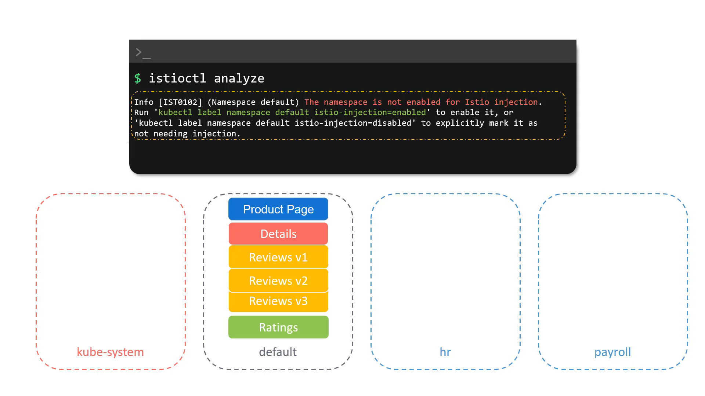
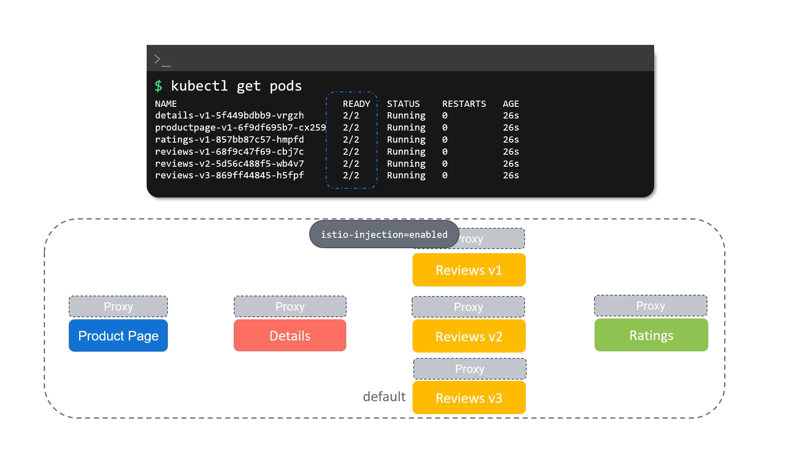

# 020-065-deploying-our-first-application-on-istio


### Subtitles Extracted
Now to try Istio, let's deploy our application.In the Samples folder we downloaded, you will find the Sample Bookinfo application. To deploy it, please use this command.
If you have Istio samples somewhere else on your computer, you can also change this directory. In the output that follows, you will see a number of deployments and services created. 
```bash
$ kubectl apply -f samples/bookinfo/platform/kube/bookinfo.yaml
  deployment.apps/details-v1 created
  deployment.apps/ratings-v1 created
  deployment.apps/reviews-v1 created
  deployment.apps/reviews-v2 created
  deployment.apps/reviews-v3 created
  deployment.apps/productpage-v1 created
...
```
**Timestamp:** 00:13


 
 

Let's check the status of the pods deployed. We see that we have a pod for the ProductPage microservice, the Details microservice, the Ratings service, and three different versions of the Review service.
```bash
$ kubectl get pods -A
NAMESPACE        NAME                                 READY  STATUS    RESTARTS  AGE
default        productpage-v1-5d9b4c9849-dckrt        1/1    Running      0      6m57s
default        ratings-v1-fd78f799f-s94cc             1/1    Running      0      6m58s
default        details-v1-66b6955995-zgrd8            1/1    Running      0      6m57s
default        reviews-v1-6549ddccc5-bxv4n            1/1    Running      0      6m58s
default        reviews-v2-76c4865449-2qmhj            1/1    Running      0      6m58s
default        reviews-v3-6b554c875-vbf8v             1/1    Running      0      6m58s
 ```
**Timestamp:** 00:42


We see that everything is deployed in the default namespace. And now that we have Istio installed, we expect each pod to have the additional proxy container that we talked about. However, that is not to be seen. We can see that each pod only has a single container, as shown in the ready column here. So why is that?
**Timestamp:** 01:16



We can use the Istioctl analyze command to see why that may be the case. It seems that we have a problem here. The analysis tells us that Istio injection is not enabled.
```bash
$ istioctl analyze
Info [IST0102] (Namespace default) The namespace is not enabled for Istio injection. 
Run 'kubectl label namespace default istio-injection=enabled' to enable it, or 'kubectl label namespace default istio-injection=disabled' to explicitly mark it as not needing injection
```
**Timestamp:** 01:33



What does it mean by namespace is not enabled for Istio injection? You might be having multiple namespaces on your Kubernetes cluster. KubeSystem being the namespace where all the core applications run. And the default being the default namespace where applications are deployed when no namespace is specifically given. As it is in our case. There may be other applications running in other namespaces, such as HR or Payroll, etc.
**Timestamp:** 02:14



You must explicitly enable Istio sidecar injection at a namespace level if you would like Istio to inject proxy services as sidecars to the applications deployed in a namespace. For this, as given in the output of the command, you must run the kubectl label command to specify the namespace where you want to enable sidecar injection by setting the value of the label Istio injection to enable. Similarly, if you'd like to explicitly disable Istio injection, then you must set this label to disabled using the same command. We will now delete what we deployed so we can set the label and deploy it again.
```bash
kubectl delete -f samples/bookinfo/platform/kube/bookinfo.yaml
service "details" deleted
serviceaccount "bookinfo-details" deleted
service "ratings" deleted
serviceaccount "bookinfo-ratings" deleted
serviceaccount "bookinfo-reviews" deleted
service "productpage" deleted
serviceaccount "bookinfo-productpage" deleted
```
**Timestamp:** 03:10


 Let's enable Istio sidecar injection in the default namespace. Once this command is run, every new app in the default namespace will get a sidecar automatically.
```bash
$ kubectl label namespace default istio-injection=enabled
namespace/default labeled
```
**Timestamp:** 03:24


Let's deploy our app again. 
```bash
kubectl apply -f samples/bookinfo/platform/kube/bookinfo.yaml
deployment.apps/details-v1 created
deployment.apps/ratings-v1 created
deployment.apps/reviews-v1 created
deployment.apps/reviews-v2 created
deployment.apps/reviews-v3 created
service/productpage created
deployment.apps/productpage-v1 created
```
**Timestamp:** 03:33


Let's check the status of our mesh now.
```bash
$ istioctl analyze
✔ No validation issues found when analyzing namespace: default.
```
**Timestamp:** 03:36


Let's check if we have Envoy sidecar proxies. Yes, they're here and running. Istio has now injected sidecar proxies into each pod.
```bash
$ kubectl get pods
NAME                              READY   STATUS    RESTARTS   AGE
details-v1-5f449bdbb9-vrgzh       2/2     Running   0          26s
productpage-v1-6f9df695b7-cx259   2/2     Running   0          26s
ratings-v1-857bb87c57-hmpfd       2/2     Running   0          26s
reviews-v1-68f9c47f69-cbj7c       2/2     Running   0          26s
reviews-v2-5d56c488f5-wb4v7       2/2     Running   0          26s
reviews-v3-869ff44845-h5fpf       2/2     Running   0          26s
```
**Timestamp:** 03:48


You will explore more about these in the upcoming labs. Well, that's it for now and I'll see you in the demo.

