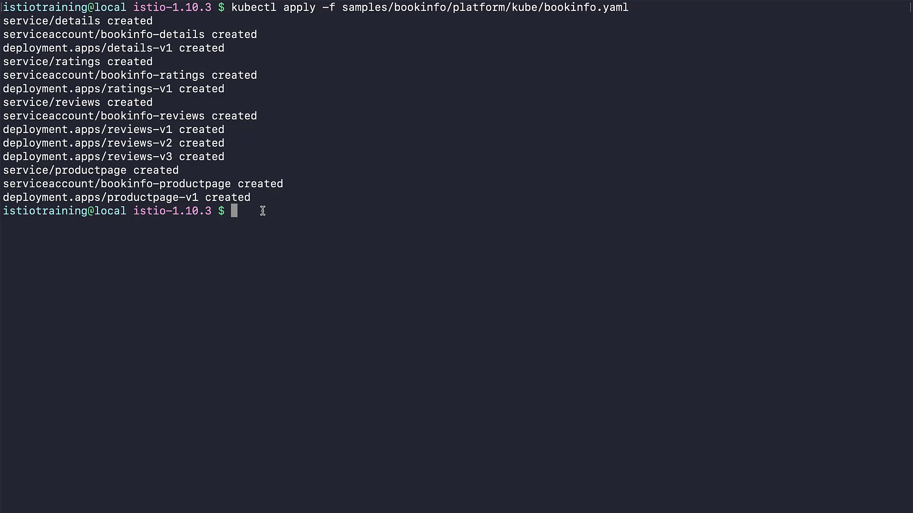
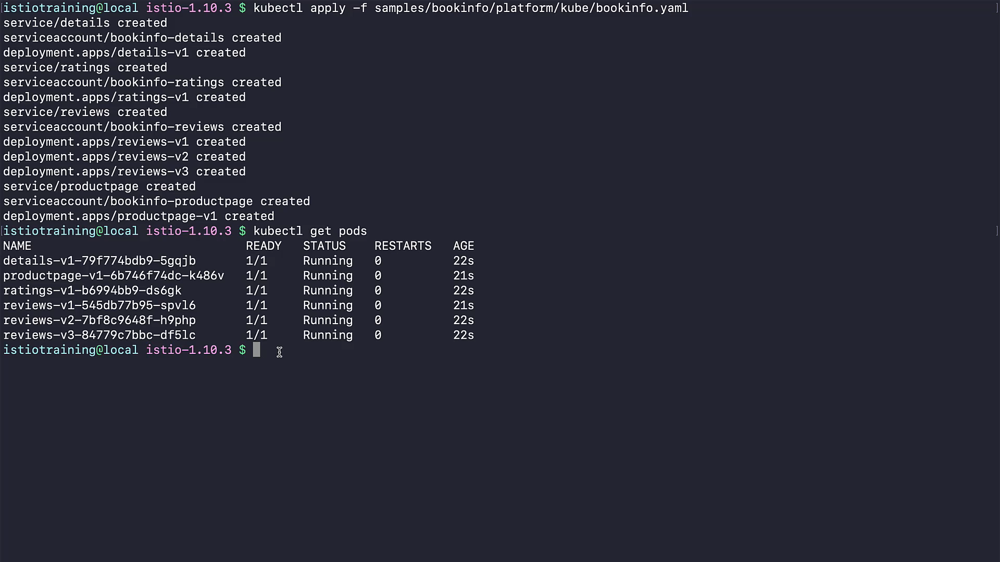
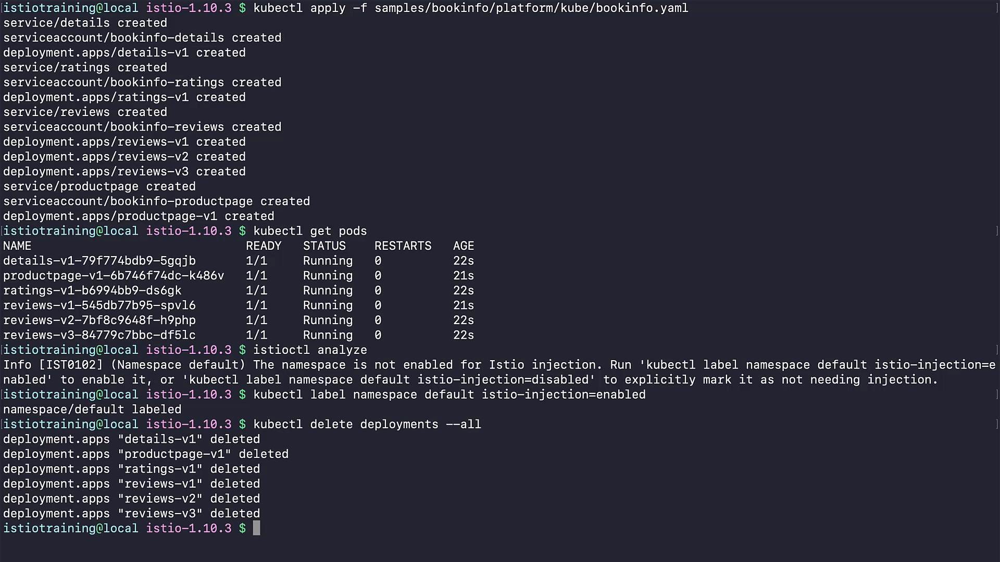
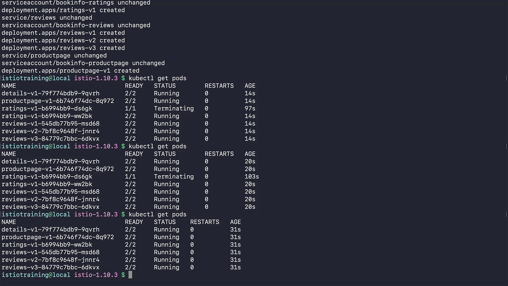
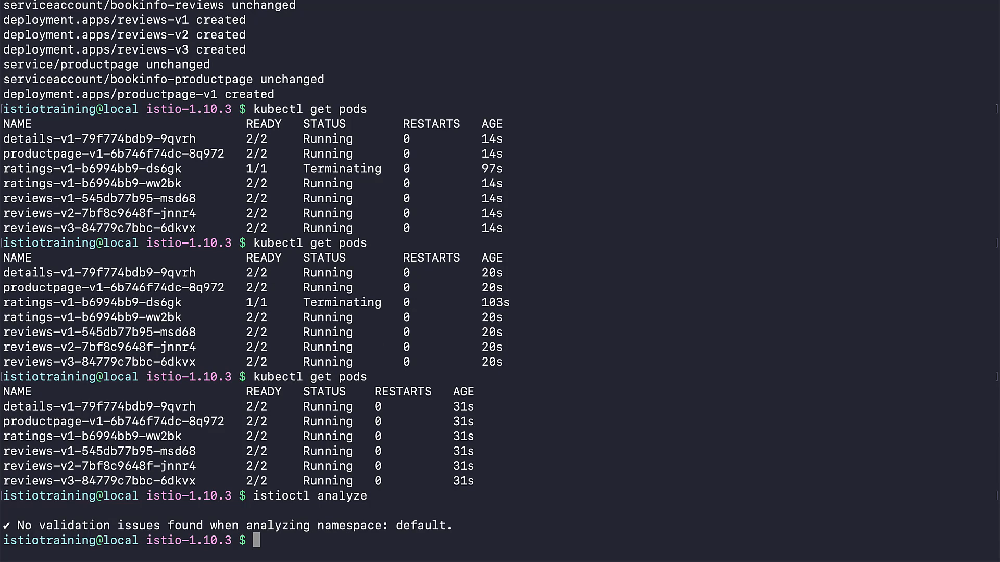

# 020-070-deploying-our-first-application-on-istio


### Subtitles Extracted
So, in this demo, we'll deploy the Bookinfo application on our cluster, enable sidecar injection to run our Envoy sidecars properly, and prepare our mesh for our first interaction with it. For this, we're going to use the Bookinfo app under the samples folder we downloaded with Istio. So, it's here in the platform directory, let's apply it with kubectl. As you can see, each service has a service, service account, and deployment objects described in this file. You can even see the three different versions of previews deployed already.
```bash
kubectl apply -f samples/bookinfo/platform/kube/bookinfo.yaml
service/details created 
serviceaccount/bookinfo-details created 
deployment.apps/details-v1 created 
service/ratings created 
serviceaccount/bookinfo-ratings created 
deployment.apps/ratings-v1 created 
service/reviews created 
serviceaccount/bookinfo-reviews created 
deployment.apps/reviews-v1 created 
deployment.apps/reviews-v2 created 
deployment.apps/reviews-v3 created 
service/productpage created 
serviceaccount/bookinfo-productpage created 
deployment.apps/productpage-v1 created
```
**Timestamp:** 00:51



Let's check the status of our pods. So, they're all ready and running, which is nice. This means our application must be running properly. But do we have a service mesh in place? Here, as you can see, there's only one container for each of our Pods, which is not a very good sign.
```bash
$ kubectl get pods
NAME                             READY    STATUS    RESTARTS    AGE
details-v1-79f774bdb9-5gqjb      1/1      Running       0       22s
productpage-v1-6b746f74dc-k486v  1/1      Running       0       21s
ratings-v1-b6994bb9-ds6gk        1/1      Running       0       22s
reviews-v1-545db77b95-spv16      1/1      Running       0       21s
reviews-v2-7bf8c9648f-h9php      1/1      Running       0       22s
reviews-v3-84779c7bbc-df51c      1/1      Running       0       22s
```
**Timestamp:** 01:19



Why could this be happening? Let's use Istioctl analyze command here to check if there's anything wrong. Oops, there's an info message about the default namespace here. It says, default namespace is not enabled for Istio injection. This is because we need to explicitly mark a namespace for injecting Istio sidecars in to the pods in that namespace.
```bash
$ istioctl analyze 
Info [IST0102] (Namespace default) The namespace is not enabled for Istio injection. Run 'kubectl label namespace default istio-injection=enabled' to enable it, or 'kubectl label namespace default istio-injection=disabled' to explicitly mark it as not needing injection.
```
**Timestamp:** 01:52


Let's use this suggested approach here to label our namespace. Yep, it is marked.
```bash
$
$ kubectl label namespace default istio-injection=enabled
namespace/default labeled
```
**Timestamp:** 02:06


Now, to get this working, we need our Pods to be recreated. A fast way to do that is to delete all our Deployments.
```bash
$ kubectl delete deployments --all 
deployment.apps "details-v1" deleted 
deployment.apps "productpage-v1" deleted 
deployment.apps "ratings-v1" deleted 
deployment.apps "reviews-v1" deleted 
deployment.apps "reviews-v2" deleted 
deployment.apps "reviews-v3" deleted
```
**Timestamp:** 02:18



And create them with our initial YAML file. Here, it has only created the missing ones, and the rest is not changed. 
```bash
kubectl apply -f samples/bookinfo/platform/kube/bookinfo.yaml 
service/details unchanged 
serviceaccount/bookinfo-details unchanged 
deployment.apps/details-v1 created 
service/ratings unchanged 
serviceaccount/bookinfo-ratings unchanged 
deployment.apps/ratings-v1 created 
service/reviews unchanged 
serviceaccount/bookinfo-reviews unchanged 
deployment.apps/reviews-v1 created 
deployment.apps/reviews-v2 created 
deployment.apps/reviews-v3 created 
service/productpage unchanged 
serviceaccount/bookinfo-productpage unchanged 
deployment.apps/productpage-v1 created
```
**Timestamp:** 02:36


Now, let's check our pods once again.
Yes, they have sidecars injected to each one of them. Here, an older deployment still has some pods in a terminating state, but it's just a matter of time that it disappears. And yes, it did.
```bash
$ kubectl get pods
NAME                              READY         STATUS          RESTARTS          AGE
details-v1-79f774bdb9-9qvrh       2/2           Running             0              31s
productpage-v1-6b746f74dc-8q972   2/2           Running             0              31s
ratings-v1-b6994bb9-ww2bk         2/2           Running             0              31s
reviews-v1-545db77b95-msd68       2/2           Running             0              31s
reviews-v2-7bf8c9648f-jnnr4       2/2           Running             0              31s
reviews-v3-84779c7bbc-6dkvx       2/2           Running             0              31s
```
**Timestamp:** 02:56



Okay, so let's try Istioctl analyze command once again. It is telling us, the command just analyzed the default namespace and found no issues regarding Istio objects. 
```bash
$ istioctl analyze

• No validation issues found when analyzing namespace: default.
```
**Timestamp:** 03:05



Congratulations, we now can start building our Service Mesh.
