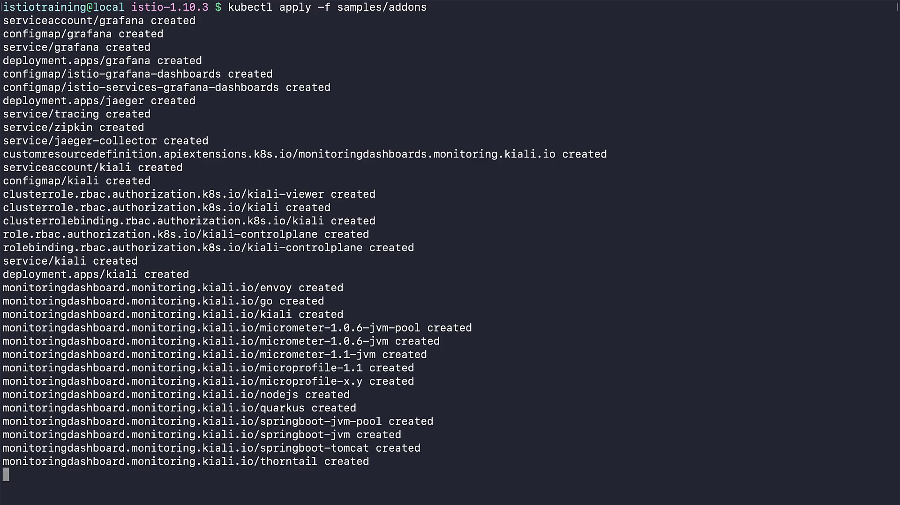
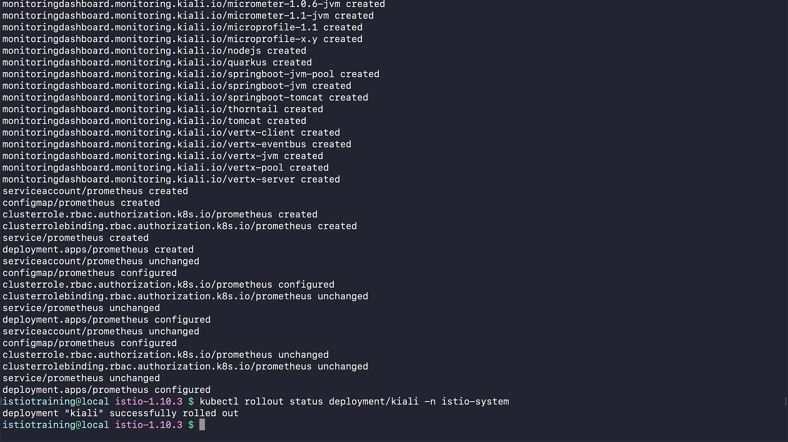
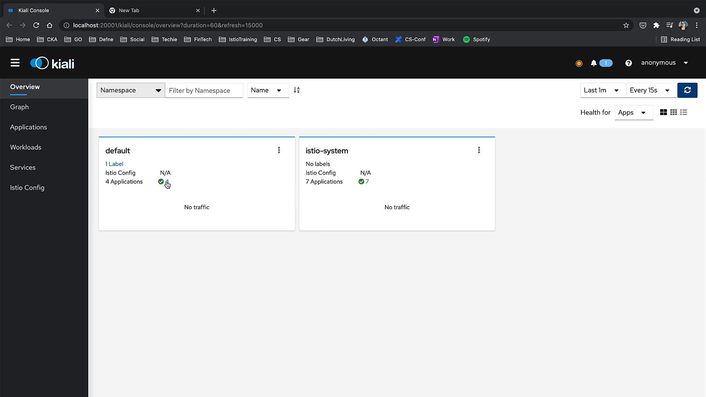
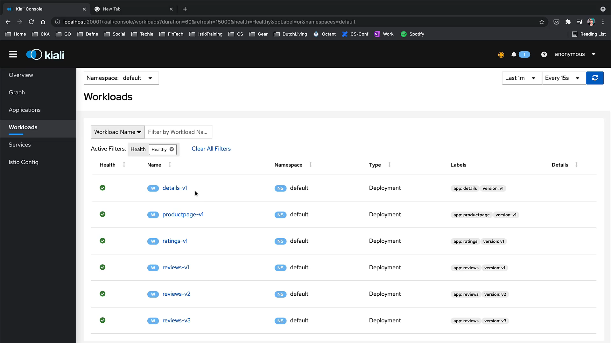
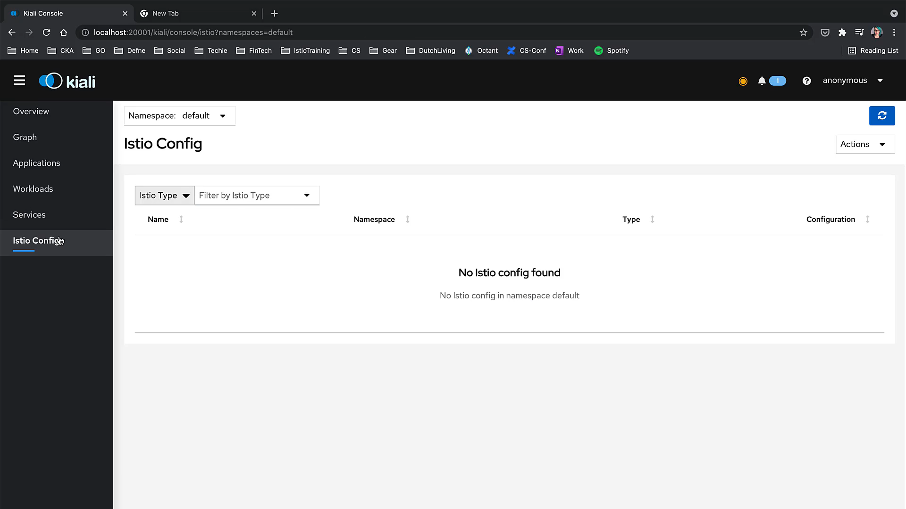

# 020-090-installing-kiali


### Subtitles Extracted
Now let's install Kiali on our cluster so we can visualize our service mesh. Let's use this command to install and see all the add-ons that are provided in the samples folder. We will talk about more of these tools in the observability chapter again.
As you can see, Grafana has its service account and a set of config maps and deployments, and Jaeger is also installed from the add-ons, and we will talk about it in the upcoming chapters. Then there is a large group of objects that has come with Kiali installation. Then at the very end, you can see Prometheus also installed. An important note is that these add-ons are not tuned for performance and security. These are meant for only demo purposes. 
```bash
$ kubectl apply -f samples/addons 
serviceaccount/grafana created 
configmap/grafana created 
service/grafana created 
deployment.apps/grafana created
configmap/istio-grafana-dashboards created 
configmap/istio-services-grafana-dashboards created 
deployment.apps/jaeger created 
service/tracing created 
service/zipkin created 
service/jaeger-collector created
customresourcedefinition.apiextensions.k8s.io/monitoringdashboards.monitoring.kiali.io created serviceaccount/kiali created 
configmap/kiali created
clusterrole.rbac.authorization.k8s.io/kiali-viewer created
clusterrole.rbac.authorization.k8s.io/kiali created
clusterrolebinding.rbac.authorization.k8s.io/kiali created 
role.rbac.authorization.k8s.io/kiali-controlplane created
rolebinding.rbac.authorization.k8s.io/kiali-controlplane created 
service/kiali created 
deployment.apps/kiali created
monitoringdashboard.monitoring.kiali.io/envoy created 
monitoringdashboard.monitoring.kiali.io/go created 
monitoringdashboard.monitoring.kiali.io/kiali created
monitoringdashboard.monitoring.kiali.io/micrometer-1.0.6-jvm-pool created 
monitoringdashboard.monitoring.kiali.io/micrometer-1.0.6-jvm created 
monitoringdashboard.monitoring.kiali.io/micrometer-1.1-jvm created 
monitoringdashboard.monitoring.kiali.io/microprofile-1.1 created 
monitoringdashboard.monitoring.kiali.io/microprofile-x.y created 
monitoringdashboard.monitoring.kiali.io/nodejs created 
monitoringdashboard.monitoring.kiali.io/quarkus created
monitoringdashboard.monitoring.kiali.io/springboot-jvm-pool created 
monitoringdashboard.monitoring.kiali.io/springboot-jvm created 
monitoringdashboard.monitoring.kiali.io/springboot-tomcat created
monitoringdashboard.monitoring.kiali.io/thorntail created 
monitoringdashboard.monitoring.kiali.io/tomcat created
monitoringdashboard.monitoring.kiali.io/vertx-client created 
monitoringdashboard.monitoring.kiali.io/vertx-eventbus created 
monitoringdashboard.monitoring.kiali.io/vertx-jvm created 
monitoringdashboard.monitoring.kiali.io/vertx-pool created 
monitoringdashboard.monitoring.kiali.io/vertx-server created
serviceaccount/prometheus created 
configmap/prometheus created
clusterrole.rbac.authorization.k8s.io/prometheus created
clusterrolebinding.rbac.authorization.k8s.io/prometheus created 
service/prometheus created 
deployment.apps/prometheus created 
serviceaccount/prometheus unchanged 
configmap/prometheus configured
clusterrole.rbac.authorization.k8s.io/prometheus configured
clusterrolebinding.rbac.authorization.k8s.io/prometheus unchanged 
service/prometheus unchanged 
deployment.apps/prometheus configured 
serviceaccount/prometheus unchanged 
configmap/prometheus configured
clusterrole.rbac.authorization.k8s.io/prometheus unchanged
clusterrolebinding.rbac.authorization.k8s.io/prometheus unchanged 
service/prometheus unchanged 
deployment.apps/prometheus configured
```
**Timestamp:** 00:16



So, let's check the status of our Kiali deployment. Yes, it has been rolled out successfully.
```bash
kubectl rollout status deployment/kiali -n istio-system 
deployment "kiali" successfully rolled out
```
**Timestamp:** 01:08



And let's verify if the Kiali service is running. You can use this command if you need to check if Kiali is running or not. On your cluster.
```bash
kubectl -n istio-system get svc kiali
NAME      TYPE        CLUSTER-IP     EXTERNAL-IP    PORT (S)                AGE
kiali     ClusterIP   10.102.20.34   ‹none>         20001/TCP, 9090/TCP     93s
```
**Timestamp:** 01:28


And now with this command, we can start Kiali dashboard.
```bash
istioctl dashboard kiali
```
**Timestamp:** 01:31


It will start a browser and land on the overview page. In the address bar, you can see it is being served on the port 20001.

**Timestamp:** 01:43


On the left menu, you can see different levels of visualizing your mesh. And on the top left, you can change the type of filter that you can use. On the far right, you can filter your whole mesh by time intervals. And next to it, you can change how often you need your data to be refreshed. Now, here are all the namespaces in our service mesh.You should be able to see all that. 
**Timestamp:** 02:13


When you click this number next to the applications,
**Timestamp:** 02:18



it will take you to the applications page, which is also accessible from the left.Here you will find our four applications from Bookinfo.
**Timestamp:** 02:23


You can always jump to some other namespace to see what's going on there. If you go to the workloads from the menu, you will see all our different deployments listed as workloads.
**Timestamp:** 02:41



Now, let's check services. There are no services, which is weird. Sometimes it takes a while to load all the Service Mesh applications and objects.

**Timestamp:** 02:50


Yes, they are here now. 
**Timestamp:** 03:00


And when we go to the Istio config menu, we will see nothing because we actually don't have any Istio configurations for this name. 
**Timestamp:** 03:07



And the last bit, but a very powerful tool, is the graph menu, where we'll have most of the fun. We see this is also empty because there's no traffic right now.

**Timestamp:** 03:17


Now, let's start creating some traffic to visualize here. And here we have our traffic. And here we have our traffic to visualize here.


