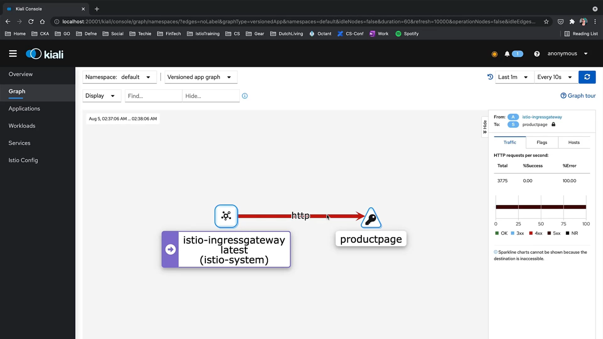

# 020-100-create-traffic-into-your-mesh


### Subtitles Extracted
To see some real action in Kiali, our application needs to accept some traffic first. Let's do this together now. Let's create a Gateway for our application. We will cover this topic in our next chapter, and all you need to know right now is that Gateway will configure our Service Mesh to accept traffic from outside the cluster. In order to do this, we'll use the bookinfo-gateway.yaml in the networking directory. There's also a Virtual Service in the sample file, and we will talk about Virtual Services in our Traffic Management chapter.
```bash
$ cd istio-1.10.3/
$ kubectl apply -f samples/bookinfo/networking/bookinfo-gateway.yaml
gateway.networking.istio.io/bookinfo-gateway created 
virtualservice.networking.istio.io/bookinfo created
```
**Timestamp:** 00:35


Let's check if everything's alright with our mesh. There are no validation issues.
```bash
$ istioctl analyze
• No validation issues found when analyzing namespace: default.
```
**Timestamp:** 00:51


Let's find out at which IP our local cluster is reachable. Now, we will export this IP to a variable to use it more efficiently. Depending on your local cluster, you may export this IP with a command like this.
Let's check it. Yes, it's set.
```bash
$ minikube ip
192.168.64.20
$ export INGRESS_HOST=$(minikube ip)
$ echo SINGRESS_HOST
192.168.64.20
```
**Timestamp:** 01:19


Let's also get the proper port numbers, with this command from istio-ingress-gateway service.
Let's check if the port is also set.
```bash
$ export INGRESS_PORT=$(kubectl -n istio-system get service istio-ingressgateway -o jsonpath='{.spec.ports[?(@.name=="http2")].nodePort}')
$ echo $INGRESS_PORT
31285
```
**Timestamp:** 01:35


Now, we can curl the product page using this address from our terminal.
As you can see, it works.
```bash
$ curl "http://$INGRESS_HOST:$INGRESS_PORT/productpage"
```
**Timestamp:** 01:42


The whole HTML code of the product page is printed out. 
**Timestamp:** 01:47


We can now also try to reach the Bookinfo app from our browser. To do that, we can get the URL easily by removing the curl from this command. Here, let's try this. Let's try this.
```bash
echo "http://$INGRESS_HOST:$INGRESS_PORT/productpage"
http://192.168.64.26:31950/productpage
```
**Timestamp:** 02:04


Yes, our app is up and running.
And every time we refresh it, the color of the stars is changing, so it also shows that our app uses three different versions of Reviews right now. 
**Timestamp:** 02:19


Now, let's create some more traffic into our service mesh, because it will be much easier to experiment with it when we don't need to make requests to our app one by one through curl or from the browser. For this, I use this very simple command that creates a loop of cURL to the product page. And I did not get the output of the cURL printed on the terminal, which might look very crowded. And please take care of the backslashes in this command. Sometimes while copying, it could get messy. 
```bash
while sleep 0.01; do curl -sS 'http://'"$INGRESS_HOST"':'"$INGRESS_PORT"'/productpage'\ &> /dev/null ; done
```
**Timestamp:** 03:15


 
Now, let's go to the Kiali dashboard to see if we'll have any real action. It usually takes some time for Kiali to gather all the data and visualize it, so it might be helpful to change the time interval and refresh the graph a few times. As you can see, it is coming all together. Yes, it now looks exactly like we've been expecting it to look so far. And from the menu, we can see the applications are all healthy, 
**Timestamp:** 04:02


`we're all happy with the results, and we can see that we have a lot of traffic coming in. Let's go back to the Kiali dashboard to see if we'll have any real action.`

And from the menu, we can see the applications are all healthy, workloads and services as well. Let's check what we've added as Istio config with the bookinfo-gateway.yaml.
Here is the bookinfo-gateway and bookinfo-virtual-service.
These are the only Istio configurations we've done so far.
Applications:
**Timestamp:** 04:18


Workloads:
**Timestamp:** 04:22


Services:
**Timestamp:** 04:25


Istio Config:
**Timestamp:** 04:30


In the next chapter, we'll cover both of these in detail. Kiali is very helpful in identifying problems in service meshes. To create some actual problems, let's delete one of our deployments to see what will happen. Okay, that's a very nasty thing to do. That's a very nasty thing to do.
```bash
$ kubectl delete deployments/productpage-v1
deployment.apps "productpage-v1 deleted
```
**Timestamp:** 05:03


Now, moving to Kiali dashboard, let's wait to see the impact of our change here in the graph. Yeah, in the graph, we can see the product page going into a half-unavailable, half-available state,

**Timestamp:** 05:18


which is because the last one-minute interval still holds the data from the time the product page was working and then it is marked totally in dark red,

**Timestamp:** 05:30


which can also be seen at the bar on the right, because now all of the requests are getting 500 errors.

**Timestamp:** 05:40



And in the applications menu, product page has no health information,

Applications:
**Timestamp:** 05:46


and since we deleted the deployment, it has totally disappeared from the workloads.
 
workloads:
**Timestamp:** 05:53


Once the product page is gone, none of the services are receiving traffic from our cURL loop. This can also be seen in the services page with question marks in the health column. We don't have any information about the health of those services anymore.

Services:
**Timestamp:** 06:09


