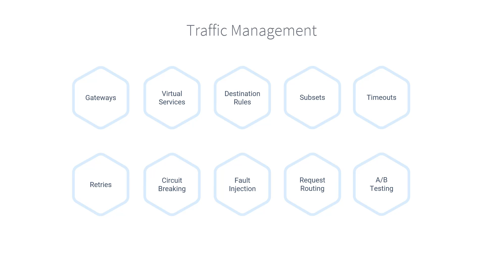

# 030-000-section-introduction

### Subtitles Extracted
In this section, you're going to learn how to manage traffic in your Istio service mesh. And the most powerful part of it is that you'll do it without changing your application code.

First, we will talk about the core components such as Gateways, Virtual Services, and Destination Rules. Then we'll jump into the traffic management concepts like subsets, Timeouts, Retries, Circuit Breaking, Fault Injection, Request Routing, and A/B Testing.

**Timestamp:** 00:33

