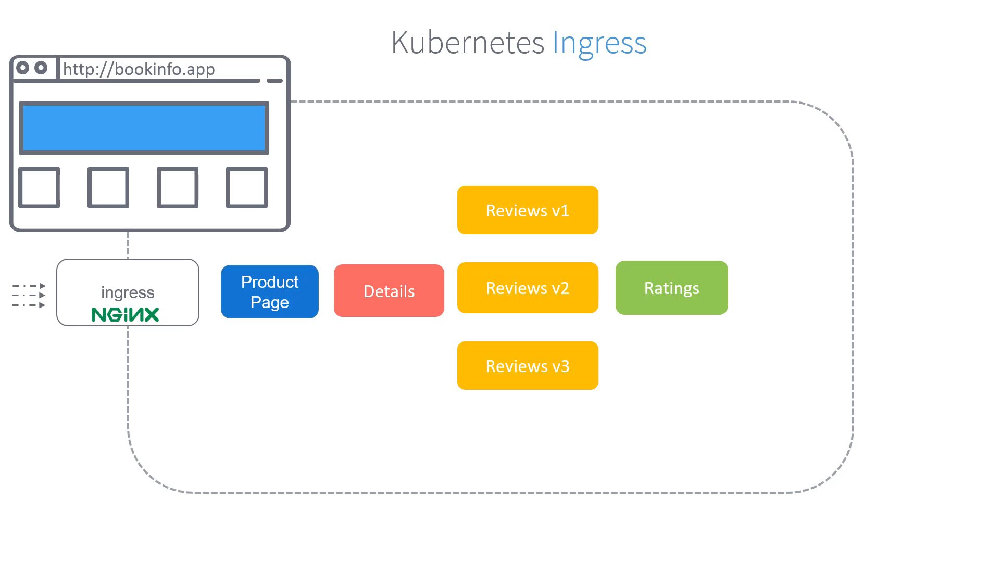
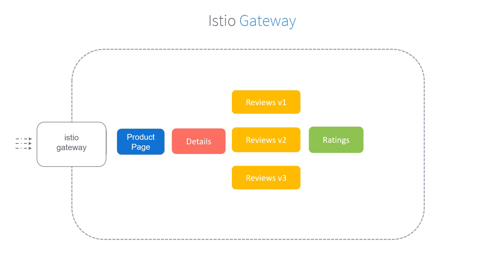
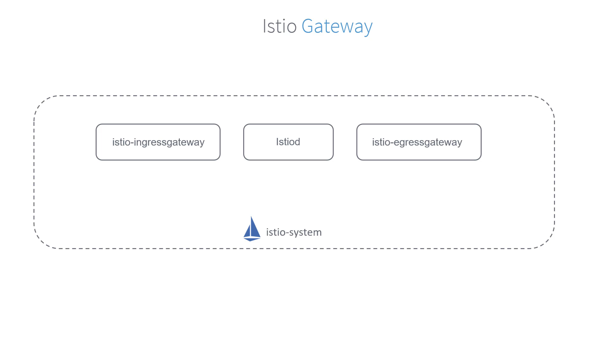
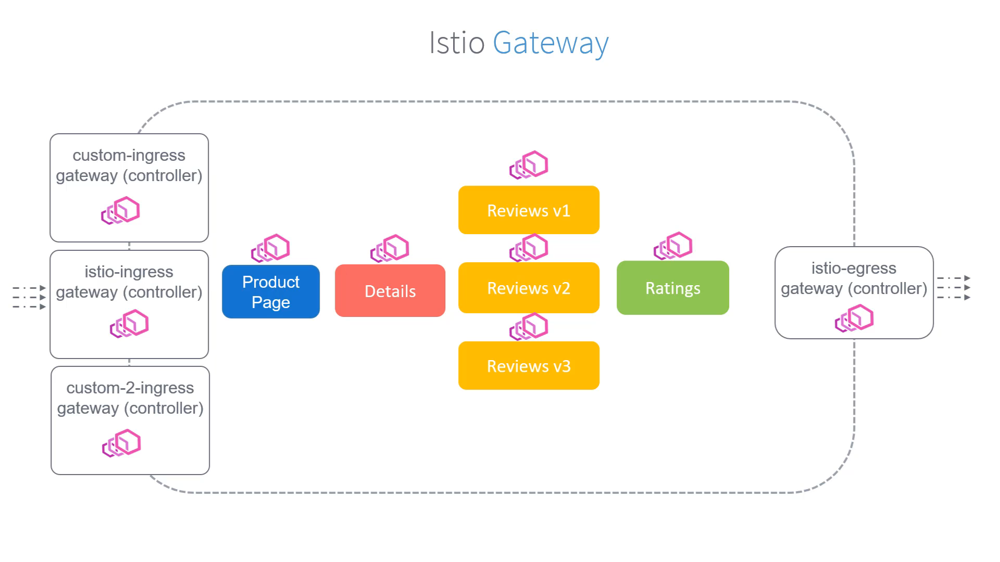
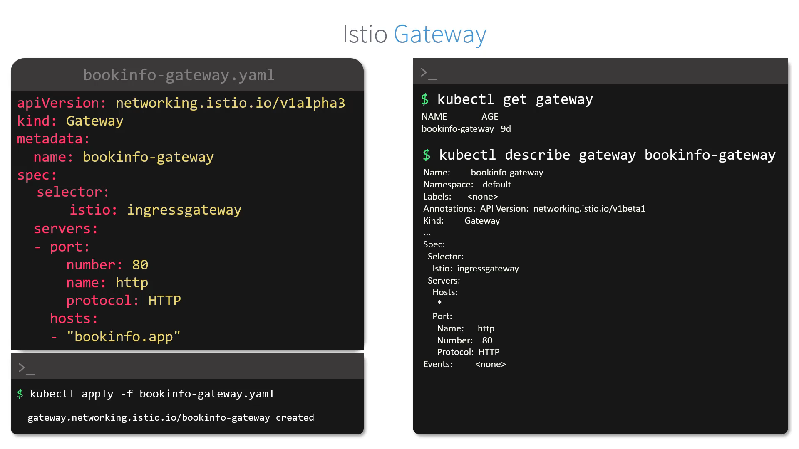

# 030-010-gateways

### Subtitles Extracted
Let's have a look at Gateways in Istio.

- **Timestamp:** 00:02

- 

 Now that we have deployed the application and set up a Service Mesh, how can we make these services accessible to external users? In our case, the page that users need to view is the product page. How can we make the product page accessible to external users? Our requirement is that if someone goes to the URL http://bookinfo.app, they should view the product page with the details about all products. How can we achieve this? When we learn Kubernetes, we learn about Ingress. Ingress controls traffic coming into the Kubernetes cluster. We learn that it is implemented by deploying an Ingress controller, such as an NGINX controller, and by defining a set of routing rules that route the traffic to the appropriate service. With Ingress, we could configure rules to say any traffic to the Kubernetes cluster with the hostname set to the bookinfo.app should be directed to the product service.

- **Timestamp:** 01:17

- 

 So, here's a sample Ingress object that we could create to drive traffic coming into the cluster at hostname bookinfo.app, so they're routed to the product page service.

- **Timestamp:** 01:35

- 

 Now, this is Kubernetes Ingress. While Istio supports Kubernetes Ingress, there's also another approach that Istio offers and recommends that supports more Istio features such as advanced monitoring and routing rules. And that is called the Istio Gateway.

- **Timestamp:** 01:57

- 

 Gateways are load balancers that sit at the edge of the mesh. They are the main configurations that manage the inbound and the outbound traffic to the service mesh. This is the recommended approach, such as compared to just using Kubernetes Ingress. If you remember, we discussed earlier that when we deploy Istio on our cluster, it deploys two additional components known as the Istio Ingress Gateway and Istio Egress Gateway. These are Istio Gateway controllers,

- **Timestamp:** 02:35

- 

 just like the Ingress controller that we talked about earlier. The Ingress Gateway manages all inbound traffic to the services and the Egress Gateway manages all outbound traffic from these services. We discussed that Ingress is deployed in Kubernetes using controllers like NGINX. Istio, on the other hand, deploys Ingress Gateways using Envoy proxies. We have learned that all services have an Envoy proxy deployed as a sidecar container. However, the Ingress and Egress gateways are just standalone Envoy proxies sitting at the edge of the service mesh. They do not work as a Sidecar. These are the default Gateway controllers that were deployed when Istio was deployed on the cluster. However, we can have our own set of custom gateway controllers as well. So, our goal here is to catch all traffic coming through this Istio Ingress Gateway controller and route all traffic at hostname bookinfo.app to our product page.

- **Timestamp:** 03:49

- 

 For this, we first create a Gateway object. So, here we create a Gateway object named bookinfo.gateway. It serves all HTTP traffic at port 80 coming to the cluster through the Istio Ingress Gateway controller with the hostname bookinfo.app. But which Istio Ingress controller? Here we have three controllers. The two custom ones we created.

- **Timestamp:** 04:19

- 

 For this, add a selector and specify the label of the desired controller. In our case, we want to use the default Istio Ingress Gateway controller, so we set the selector Ingress Gateway. And we ignore the two custom ones we created. We then create the bookinfo Gateway by applying this configuration.

- **Timestamp:** 04:44

- 

 To list the created Gateways, run the kubectl get-gateway command. And to view details about a particular Gateway, run the kubectl describe-gateway command.

- **Timestamp:** 04:59

- 

 So, we now have a bookinfo Gateway object created to capture traffic coming through the default Istio Ingress Gateway controller through the URL bookinfo.app. But how and where is that traffic routed to? We will discuss that next when we talk about Virtual Services.
