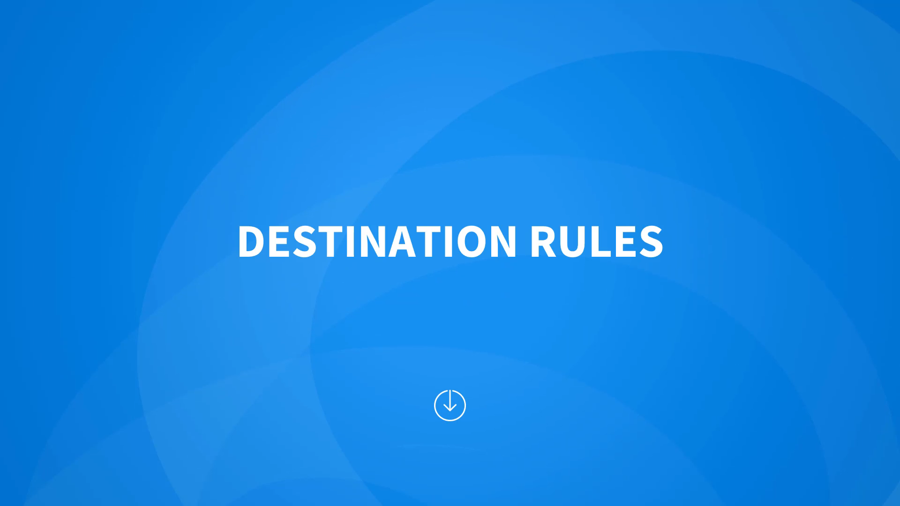
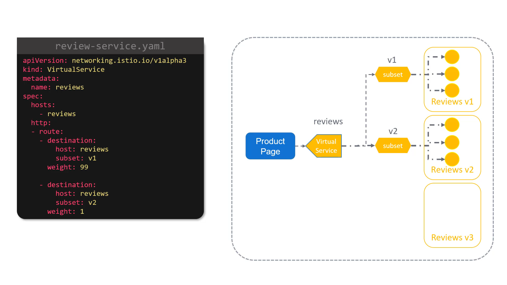
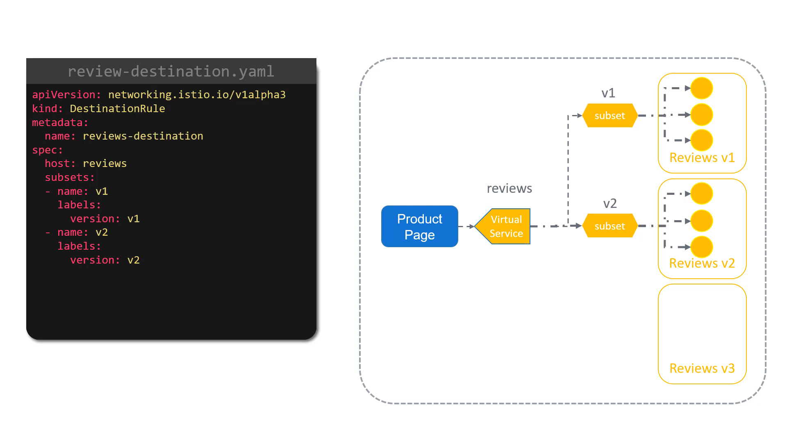
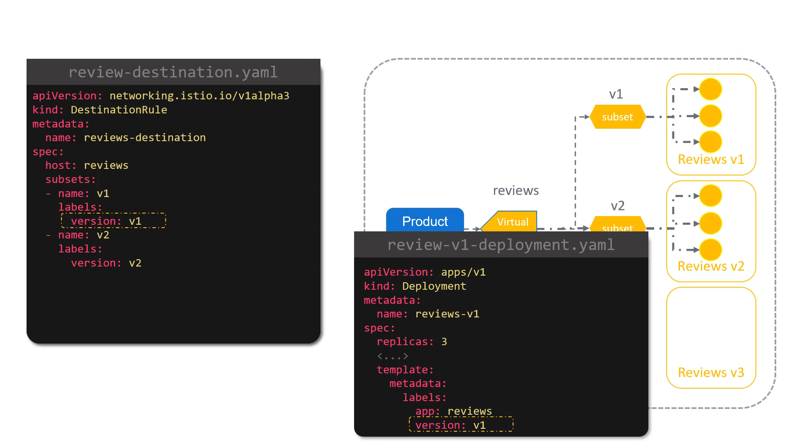
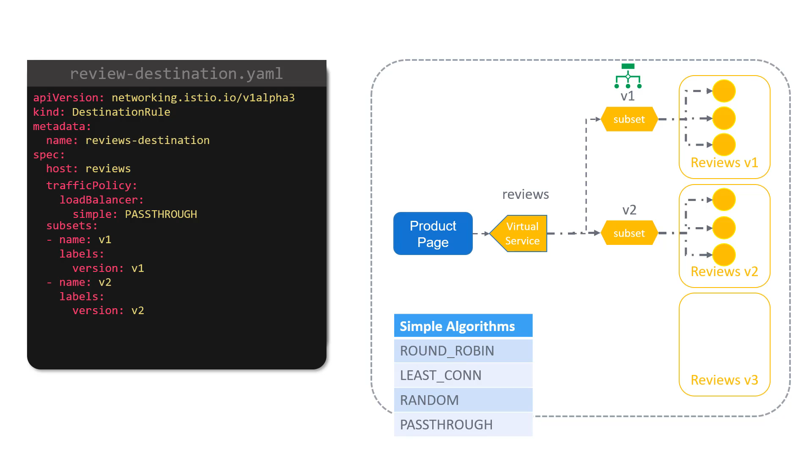
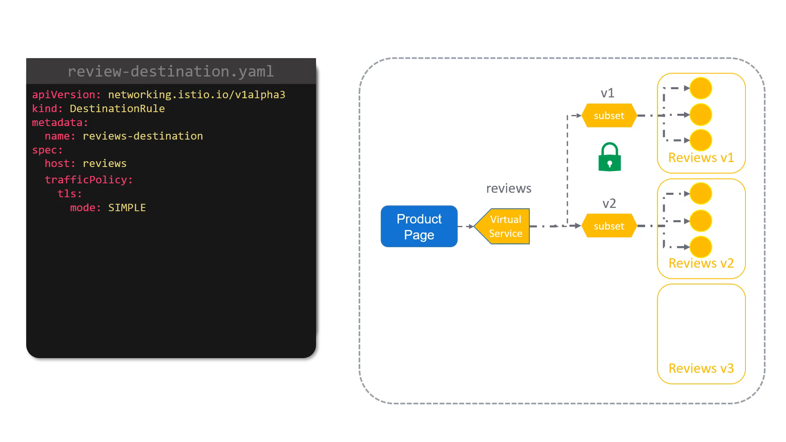
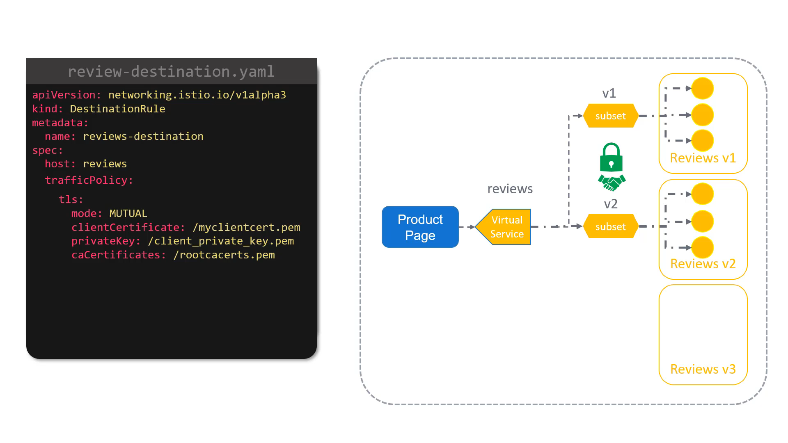
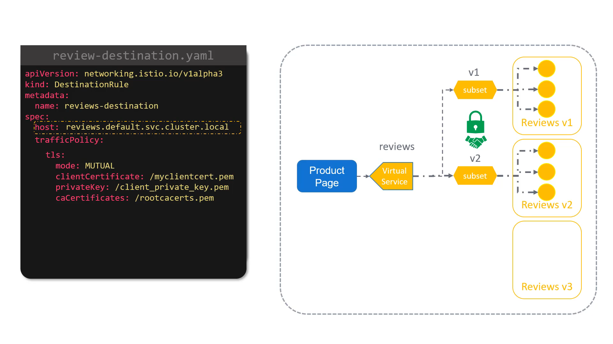

# 030-030-destination-rules

### Subtitles Extracted
Let us now have a look at Destination Rules.

- **Timestamp:** 00:04

- 

 Destination Rules apply routing policies after the traffic is routed to a specific service. Let's see what this actually means. Earlier, we talked about Virtual Services and how the review service can be configured with a Virtual Service to distribute a percentage of traffic to different versions. We know that 99% of traffic is sent to the subset V1 and 1% is sent to subset V2.

- **Timestamp:** 00:40

- 

 So where and how are these subsets defined? Subsets are defined in Destination Rules. So, we create a Destination Rule with the kind SetToDestinationRule, name SetToReviews-Destination and host SetToReviews. We then define two subsets, V1 and V2, and provide labels under it. We set the version to V1 and V2, respectively. These are the labels set on the Pods for the respective version of Reviews deployment.

- **Timestamp:** 01:28

- 

 This is how we define a separate subset of services, so that we can control the amount of traffic going to each subset.

- **Timestamp:** 01:38

- 

 By default, Envoy load balances traffic in a round-robin fashion. This can be customized through the destination rule by specifying a traffic policy of load balancer. Set the traffic policy to a simple pass-through policy. This will route traffic to the host that has fewer active requests. There are other simple algorithms such as round-robin, random and pass-through.

- **Timestamp:** 02:15

- 

 What if we want to override a different load balancing policy for specific subsets? For example, for subset V2, we would like to have a random load balancing policy. For this, we can specify a traffic policy at the subset level like this and configure a different policy.This way, we can configure one load balancing policy for all subsets and a separate one for selected subsets as required. 

- **Timestamp:** 02:44
- 

 
 There are many more configurations supported by Destination Rules. For example, to configure a client to use TLS, specify simple TLS.

- **Timestamp:** 03:08
- 

 Or to configure mutual TLS, set the mode to mutual and provide the path to the certificate files.

- **Timestamp:** 03:18
- 

 One important thing to note is the host field here. It is currently set to reviews, which is the name of the service. It is the short name of the service. When using short names instead of fully qualified domain names, Istio will interpret the short name based on the rule's namespace and not the service's actual namespace. This might lead to misconfigurations if your service is in another namespace. To avoid this, using fully qualified names over short names is recommended.

- **Timestamp:** 03:57
- 

 Well, that's all for now. Next, we will see these in action in the demo videos that follow.
