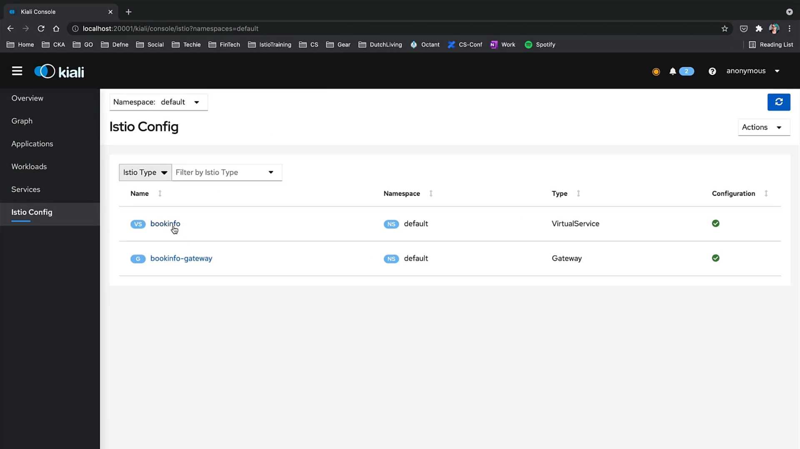

# 030-040-gateways

00:02 of 04:08

### Subtitles Extracted
So, let's try Gateways in a demo. We already have a Gateway configured. Let's check that one first.
- **Timestamp:** 00:10
- 

 From the samples folder, we applied this Gateway and it worked. As you can see, there's a wildcard in the host section.

Timestamp: 00:20

 But, how do we configure a Gateway with a proper hostname? Before doing that, let's get the product page deployment created again from the bookinfo.yaml to make sure we have all our apps running.

Timestamp: 00:35

 And here's our gateway.

Timestamp: 00:41

 And I'm going to delete this one. Timestamp: 00:49

Now, let us create a gateway with a specific hostname. Here is the YAML we can use for that. As you can see, it is using Istio Gateway and allowing traffic from port 80 on HTTP protocol. And it will allow in only the traffic coming to the bookinfo.app host.

Timestamp: 01:12

 For this Gateway to take effect, we need to create a Virtual Service to handle incoming traffic. 

Timestamp: 01:22

 And we'll have Virtual Services demo later on, but it is important to note that hosts need to match with the one in the Gateway and the Virtual Service. So, this Virtual Service is bound to the bookinfo Gateway we just created. In the Virtual Service configuration, there are some match rules and a route rule which we'll cover soon. For this gateway to allow traffic, we need to use bookinfo.app as our host in our request. In curl, we can add the "-H" flag to set HTTP header to bookinfo.app". Yay! It works!

Timestamp: 02:10

 Now, our bookinfo application is open to outside traffic using our bookinfo Gateway. Let's check it on Kiali's Istio config section.

Timestamp: 02:24

 Here is the Gateway, and you can also change some configuration from Kiali.

Timestamp: 02:36

 And here's the Virtual Service we just configured.

Timestamp: 02:39

 Let's go to our browser and try this hostname now. And in order to do so, we can add the IP and hostname to our hosts file with this command. Now, let's try it.
 
Timestamp: 03:05

 Here, in my browser, I'll type http://bookinfo.app, colon, my port number, slash, product page. And as you can see, we could go through the Gateway we just configured using the bookinfo.app command. Let's try it. And as you can see, we could go through the Gateway we just configured using the bookinfo.app hostname.

Timestamp: 03:27

 Now, I want to go back to the Gateway and change the hostname back to wildcard. Because throughout this training, we might need to go back to default configuration using sample YAMLs to have a fresh start.

Timestamp: 03:39

 And as you might remember, we had a wildcard in the hostname. So we'll stick to that format through this training and use IPs instead of the hostname, if there's no specific use for that. Now, we can also revert the hostname in the Virtual Services back to the wildcard as well.

Timestamp: 04:03

Timestamp: 04:07

