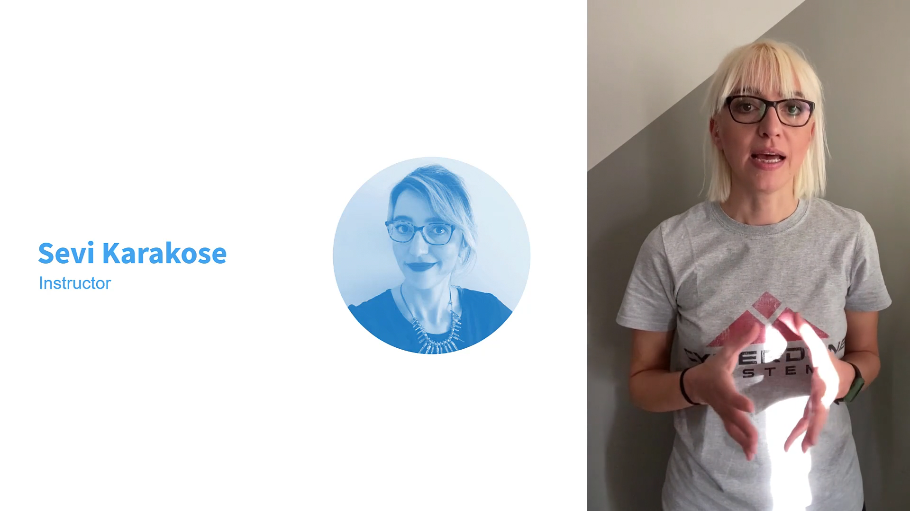
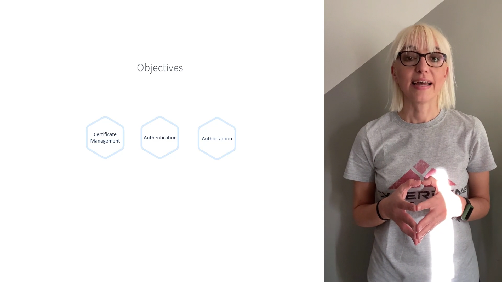
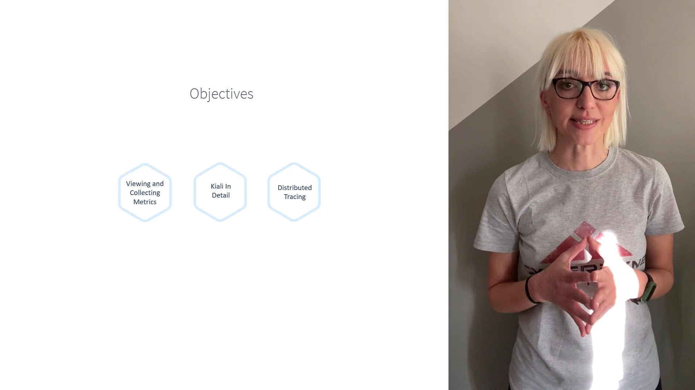

# 010-000 - Course Introduction

## Instructor Introduction

* The course is taught by **Sevi Karaköse**.

* Background:

  * Worked as a **software developer** and later as a **team leader**.
  * Has experience in **technical training**, **DevOps transformation**, and **working with infrastructure & development teams**.
  * Designed **team activities** to help organizations adapt to change.
  * Currently works as a **Cloud Native Engineer**, focusing on:

    * **Microservices transformation** of legacy applications.
    * **Cloud modernization** projects.

* **Timestamp:** 00:20

* 

---

## Course Style & Learning Approach

* The course is a mix of:

  * **Lectures** (theory & concepts).
  * **Hands-on labs** (practical demos).

* Goal: By the end, learners will have a **solid and practical understanding** of how to **configure and manage Istio** in real-world Kubernetes environments.

* **Timestamp:** 00:51

* 

---

## Course Roadmap & Objectives

The course is structured into **progressive learning stages**:

### 1. **Introduction to Istio**

* Understand **Monoliths vs. Microservices**.
* Learn **why Service Mesh is needed** (real-world examples).
* First exposure to **Istio basics**.

---

### 2. **Installing and Configuring Istio**

* Learn to:

  * **Install Istio** on a Kubernetes cluster.
  * **Configure core components**.
* Hands-on labs to solidify installation & setup.

---

### 3. **Visualizing Applications and Services**

* Use **Kiali** (Istio’s observability & visualization tool).

* See **service-to-service communication** in real-time.

* **Timestamp:** 01:32

* 

---

### 4. **Core Istio Concepts**

Learn and practice:

* **Gateways**

* **Virtual Services**

* **Destination Rules**

* **Subsets**

* **Timeouts**

* **Retries**

* **Circuit Breaking**

* **Fault Injection**

* **Request Routing**

* **A/B Testing**

* **Timestamp:** 01:46

* 

---

### 5. **Security in Istio**

* **Certificate Management**

* **Authentication** (service-to-service identity)

* **Authorization** (access control policies)

* **Timestamp:** 02:00

* 

---

### 6. **Observability in Istio**

* Collecting and analyzing **metrics** with:

  * **Prometheus**
  * **Grafana**

* Exploring Kubernetes details.

* **Distributed Tracing** for debugging microservices latency & request flow.

* **Timestamp:** 02:12

* 

---

## Course Wrap-Up (Introduction Section)

* The course promises a **step-by-step journey** into Istio.
* You will learn **both theoretical concepts and hands-on skills**.
* By the end, you’ll be able to confidently:

  * Install, configure, and operate Istio.
  * Apply advanced service mesh concepts.
  * Secure and observe your microservices ecosystem.

---

✅ **End of Section: Course Introduction**

---