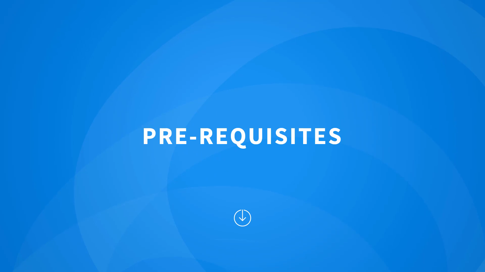

# 010-010 – Prerequisites

## Overview

Before diving into Istio and Service Mesh concepts, there are certain **prerequisites** that will help you fully understand and implement the lessons in this course.

* **Timestamp:** 00:03
* 

---

## Required Knowledge

To follow along effectively, you should already have **basic Kubernetes knowledge**. Specifically, you should know:

1. **How to deploy a Kubernetes cluster** (at least a simple one).
2. **Fundamental Kubernetes objects:**

   * **Pods** → the smallest deployable units that run containers.
   * **ReplicaSets** → ensure a specified number of pod replicas are running at all times.
   * **Deployments** → manage ReplicaSets and provide declarative updates for Pods.
   * **Services** → expose applications running in pods, provide stable networking endpoints, and enable load balancing across replicas.

👉 If you are completely new to Kubernetes, it is recommended to first complete the **“Kubernetes for Beginners” course** before starting with Istio.

---

## Recap Topics (Important for Istio)

Even if you have prior Kubernetes experience, this course will **recap** some important concepts that are **essential to understanding Service Meshes and Istio**:

1. **Kubernetes Services**

   * Provide abstraction over pods.
   * Enable stable DNS, load balancing, and service discovery.

2. **Sidecars**

   * Sidecars are additional containers that run alongside the main application container inside a pod.
   * Istio uses **Envoy proxy** as a sidecar to handle service-to-service communication.

3. **Envoy Proxy**

   * A high-performance proxy that enables traffic routing, observability, and security features.
   * Core component of Istio’s **data plane**.

* **Timestamp:** 00:54
* 

---

## Optional Setup Notes

* You **do not need to set up your own Kubernetes cluster** to take this course.
* The course provides a **dedicated lab environment** where you can practice Istio concepts.
* However, if you want to try it on your own:

  * The instructor provides **demos** to help you set up a **local Kubernetes environment**.
  * This is useful if you want to practice outside the provided labs.

---

## Key Takeaways

* **Mandatory:** Basic Kubernetes knowledge (Pods, ReplicaSets, Deployments, Services).
* **Recommended:** Familiarity with **sidecars** and the **Envoy proxy**.
* **Not required:** A personal Kubernetes cluster (since a lab environment is included).
* **Optional:** Set up your own local environment for extra practice.

---

✅ With these prerequisites in place, you’re ready to move on to the **Introduction to Istio** section.

---
