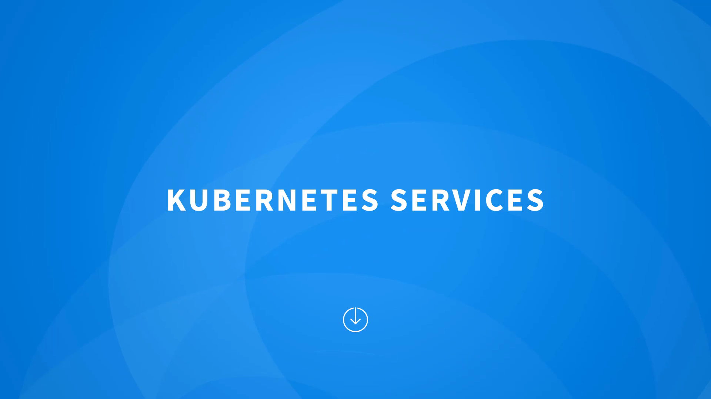
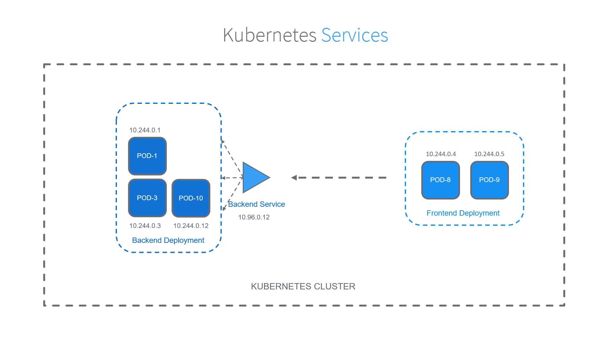
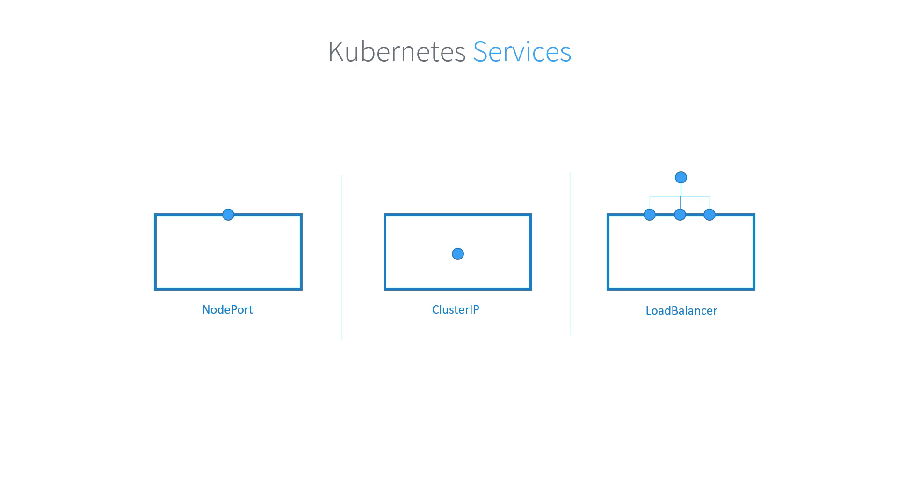

# 010-020 – Kubernetes Services

## Introduction

In Kubernetes, applications run inside **Pods**, which are the **smallest deployable units** in a Kubernetes cluster. However, pods are **ephemeral**:

* They can be **created, terminated, or replaced** at any time.
* Each pod gets its own **unique IP address**, but these IPs **change whenever pods restart**.

This presents a challenge:
👉 How do applications **find and communicate with each other** if their IPs keep changing?

The solution is **Kubernetes Services**.

* **Timestamp:** 00:04
* 

---

## Why Do We Need Services?

Imagine a **frontend service** that needs to talk to a **backend service**:

* Pods in the backend are constantly being replaced, which means their IPs change.
* If the frontend tried to connect directly to pod IPs, it would constantly break.

Kubernetes solves this problem using **Services**, which act as a **stable network abstraction**.

### Key Features of a Service

* Provides a **stable IP address** that does not change, even if pods do.
* Uses **selectors and labels** to automatically route traffic to the correct pods.
* Defines a **policy for accessing pods**, handling load balancing between multiple replicas.

📌 **In short**: Services ensure that microservices can always find and communicate with each other reliably, regardless of pod IP changes.

---

## How Services Work

* **Pods have labels** (key-value pairs).
* **Services use selectors** to group pods based on these labels.
* When another application calls the service, Kubernetes automatically forwards the request to one of the matching pods.

This allows services to:

1. **Discover pods dynamically**.
2. **Load balance traffic** across multiple replicas.

* **Timestamp:** 02:00
* 

---

## Types of Kubernetes Services

Kubernetes supports different **types of services** depending on how you want to expose your application:

### 1. **ClusterIP (Default)**

* **Internal-only service**.
* Provides communication **within the cluster**.
* Applications inside the cluster can use the ClusterIP to communicate.
* ❌ Not accessible from outside the cluster.

**Use case:** Internal communication between microservices (e.g., frontend ↔ backend).

---

### 2. **NodePort**

* Makes the service accessible **externally** by opening a **specific port** on each worker node.
* External clients can access the application via:

  ```
  <NodeIP>:<NodePort>
  ```
* Built on top of **ClusterIP** (a ClusterIP service is created automatically).

**Use case:** Exposing applications in test/dev environments without a cloud load balancer.

---

### 3. **LoadBalancer**

* Supported only on specific **cloud providers** (e.g., AWS, GCP, Azure).
* Automatically provisions a **cloud load balancer** that routes external traffic to NodePorts and then to pods.
* Built on top of both **ClusterIP + NodePort**.

**Use case:** Exposing production applications to the internet with high availability.

---

## Visual Summary

* **ClusterIP** → Internal-only, stable communication inside the cluster.

* **NodePort** → Exposes service externally on a static port of each node.

* **LoadBalancer** → Cloud-managed load balancer for production-grade external access.

* **Timestamp:** 03:18

* 

---

## Key Takeaways

* Pods are **ephemeral**, and their IPs change frequently.
* Services provide a **stable networking abstraction** for reliable communication.
* Services use **labels and selectors** to target pods.
* Types of Services:

  * **ClusterIP** → Internal access (default).
  * **NodePort** → External access via node ports.
  * **LoadBalancer** → Cloud-provider-managed external access.

📌 For a deeper dive into services and hands-on YAML creation, check the **“Kubernetes for Beginners” course**.

---
