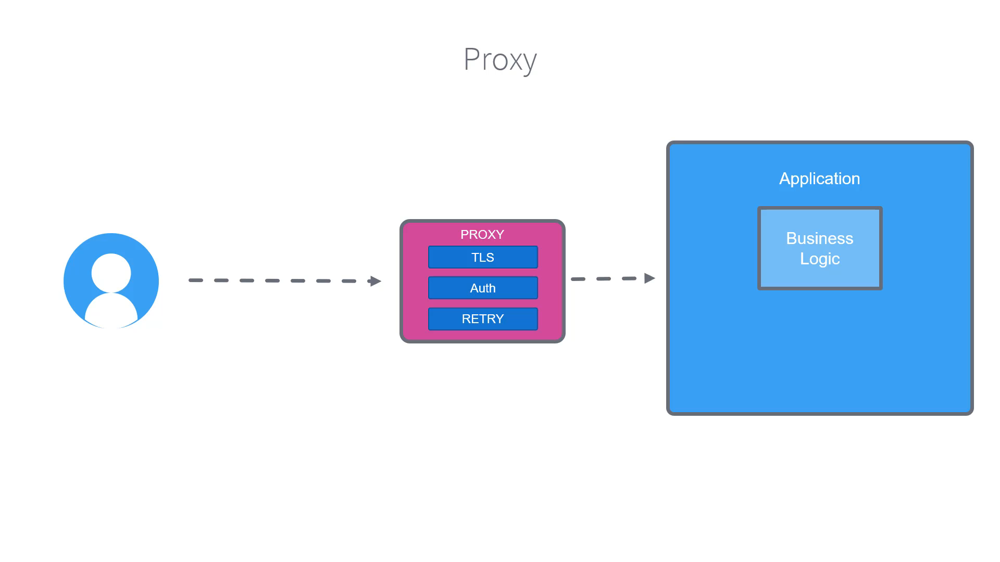
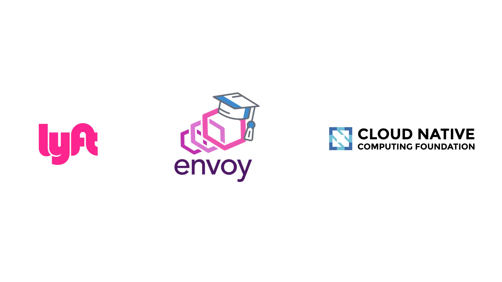
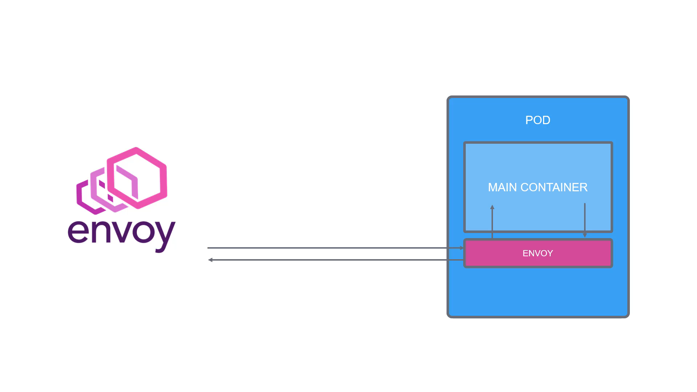

# 010-050 – Envoy

## Introduction to Envoy

When working with a **Service Mesh**, one of the most important technologies you’ll encounter is **Envoy**.

But before diving into Envoy itself, let’s step back and understand the role of a **proxy**.

---

## What is a Proxy?

A **proxy** acts as an intermediary between the **user/client** and the **application**.

Normally, an application does two types of work:

1. **Business Logic**: The core functionality of the app (e.g., an e-commerce site processing an order).
2. **Non-Business Concerns**: Tasks like:

   * Securing connections with **TLS encryption**.
   * Handling **authentication/authorization**.
   * Implementing **retries** when requests fail.
   * Performing **load balancing** between replicas.

Traditionally, developers had to **build these concerns into the application code** itself, which:

* Increased complexity.
* Reduced developer productivity.
* Introduced repeated effort across multiple services.

👉 Instead of embedding these extra responsibilities in every application, they can be **outsourced to a proxy**.

### How it works:

* The **user sends requests** to the proxy.
* The **proxy handles all cross-cutting concerns** (security, retries, routing).
* The **proxy forwards the request** to the actual application.

This way, developers only focus on the **fun part – business logic**.

---

**Timestamp:** 01:21

---

## What is Envoy?

* **Envoy** is a **high-performance, open-source proxy** built for modern, cloud-native, service-oriented architectures.
* It was **created at Lyft in 2015** to solve challenges in managing their **microservices architecture**.
* Designed for:

  * **Distributed systems**.
  * **Dynamic service discovery**.
  * **Observability** (metrics, logs, traces).
  * **Advanced traffic routing**.

### CNCF Journey

* **2017** → Envoy was donated to the **Cloud Native Computing Foundation (CNCF)**.
* **2018** → Envoy graduated from CNCF (signifying: production-ready, widely adopted, strong community support).

This graduation status means Envoy is **battle-tested** and has become a **standard building block** in many service mesh implementations.

---

**Timestamp:** 02:07

---

## Envoy in Service Mesh

Envoy is more than just a simple proxy. It is often described as a **“proxy and communication bus”** with advanced capabilities.

### Key Features in Service Mesh:

* **Sidecar Pattern**:

  * Envoy runs **next to your main container** inside a pod.
  * All **incoming and outgoing traffic** flows through Envoy.
  * This allows Envoy to enforce security, routing, retries, and monitoring **without modifying the application code**.

* **Observability**:

  * Exposes detailed metrics for monitoring and debugging.
  * Integrates with tools like **Prometheus, Grafana, Jaeger**.

* **Traffic Control**:

  * Handles **load balancing**, **circuit breaking**, **fault injection**, and **traffic shifting**.

* **Service Mesh Backbone**:

  * Most service meshes today (including **Istio**) use Envoy as their **data plane proxy**.
  * The control plane (e.g., Istiod in Istio) provides configuration to Envoy, and Envoy enforces it.

👉 This makes Envoy the **heart of Istio’s service mesh** functionality.

---

**Timestamp:** 02:41

---

## Recap

* A **proxy** offloads cross-cutting concerns from applications.
* **Envoy** is a **modern, high-performance proxy** built specifically for microservices and distributed architectures.
* It is **widely adopted** and forms the **data plane** of Istio and other service meshes.
* In Kubernetes, Envoy runs as a **sidecar container** in each pod, transparently managing service-to-service communication.

---

✅ Next, we will explore how Envoy is tightly integrated into **Istio’s core architecture** to provide **traffic management, observability, and security**.

