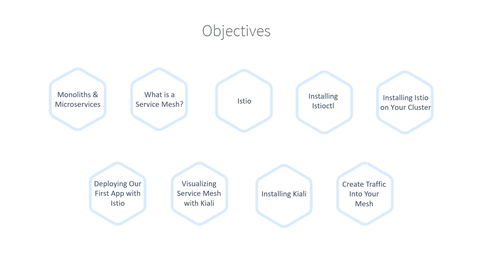

# 020-000 – Section Introduction

## Overview

In this section, we are going to explore:

1. **Introduction to Microservices**

   * What they are and how they evolved.
   * Why traditional monolithic architectures started to break down.
   * The challenges microservices introduced.

2. **Service Mesh Introduction**

   * Why service meshes were needed.
   * How they help solve microservice communication challenges.

3. **Istio – The Service Mesh of Choice**

   * What Istio is and why it became one of the most popular service meshes.
   * How it simplifies service-to-service communication, security, and observability.

4. **Hands-on with Istio**

   * Installing the **`istioctl` utility** (command-line tool).
   * Installing Istio on a Kubernetes cluster.
   * Deploying an **example microservices application** to the cluster.

5. **Traffic Generation and Visualization**

   * How to generate traffic between services inside the mesh.
   * Introducing **Kiali** – the visualization dashboard.
   * Understanding how traffic flows inside the mesh through an intuitive UI.

6. **Preview vs Deep Dive**

   * In this section:

     * You’ll get a **high-level overview** of Kiali and its capabilities.
   * Later in the course:

     * We’ll **dig deeper** into Kiali and advanced service mesh operations.

---

**Timestamp:** 01:02

---

## Why this section matters

By the end of this section, you will:

* Understand the **transition from monoliths → microservices → service mesh**.
* Get your **first hands-on experience** with Istio.
* Learn to **deploy Istio and visualize traffic** in a Kubernetes environment.
* Build the foundation for deeper Istio topics coming later in the course.

👉 This section sets the **stage for the entire Istio journey**, so make sure you follow along with the installations and examples.

---