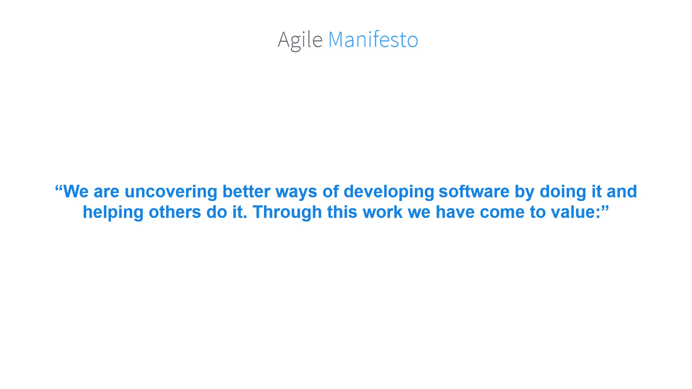
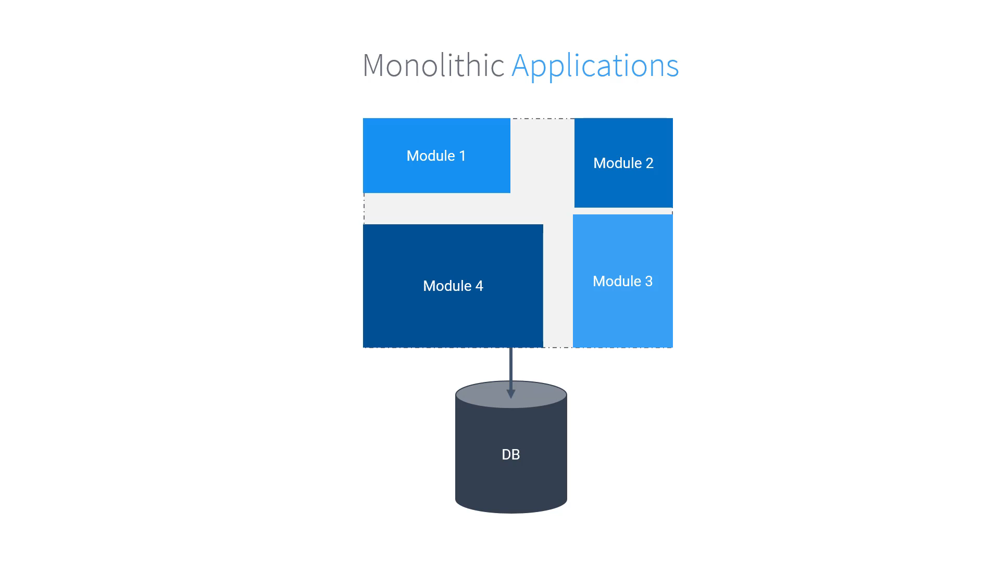
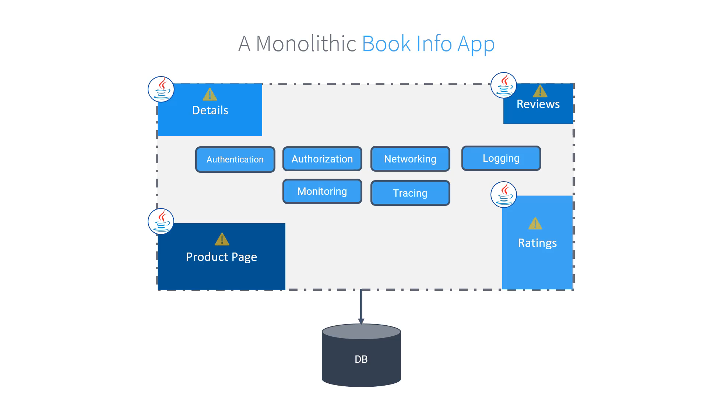
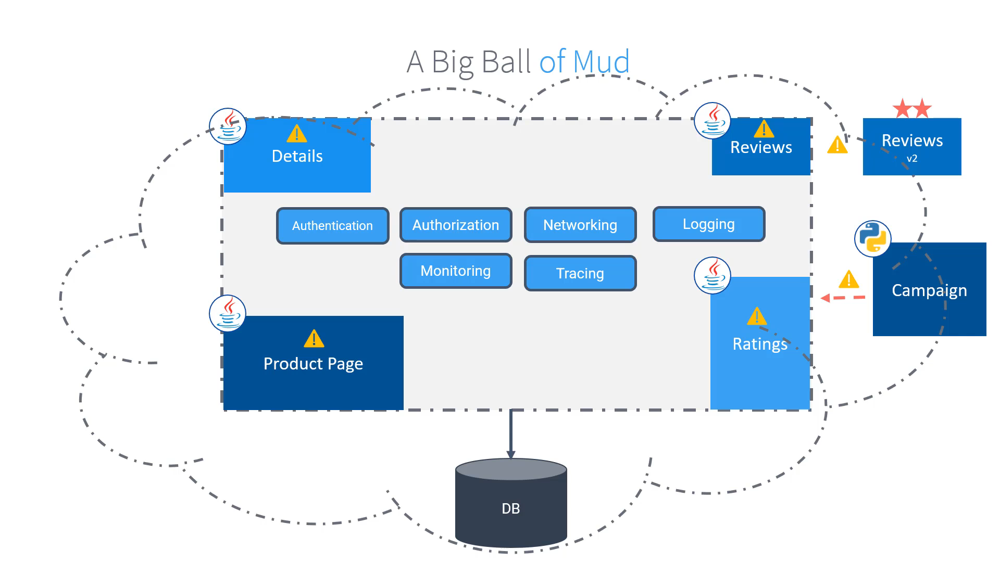
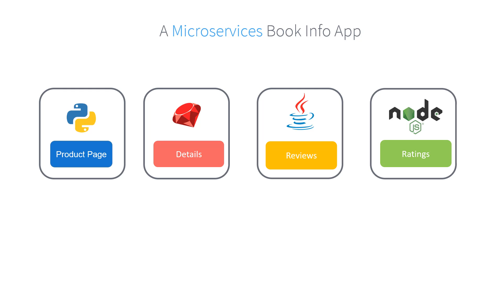
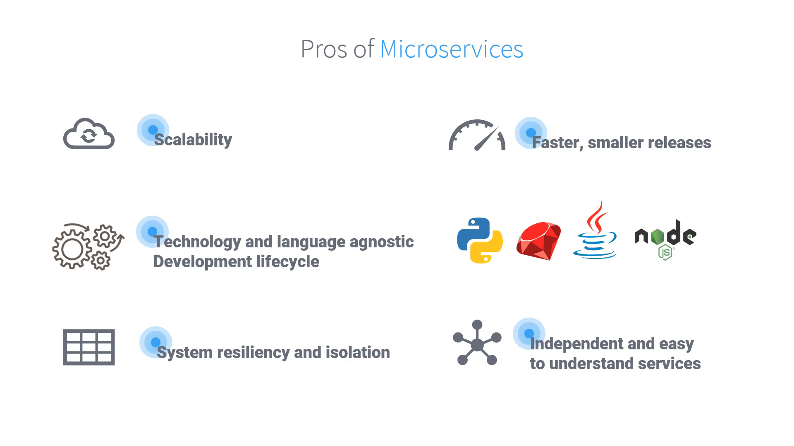
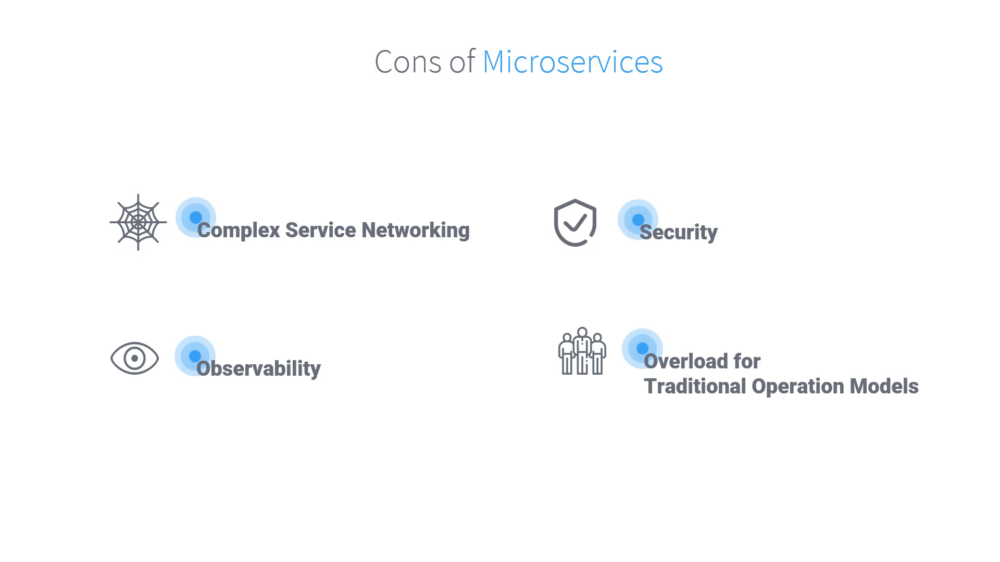

# 020-010 – Monoliths to Microservices

## 1. Background: Evolution in Software Design

### The Problem with Traditional Development

* In the **2000s**, software development was slow and process-heavy.
* Large industries like **defense and aviation** often had projects spanning **10–20 years**.
* By the time the software was delivered:

  * Business needs had already changed.
  * Many projects were canceled mid-way.
  * Billions of dollars and years of work were wasted.
* Both **business owners** and **software engineers** grew frustrated.

**Timestamp:** 00:59

---

### The Agile Revolution (2001)

* In **2001**, **17 software practitioners** came together to publish the **Agile Manifesto**.
* They recognized flaws in traditional, rigid software development processes.
* Agile values:

  * **Individuals and interactions** over processes and tools.
  * **Working software** over comprehensive documentation.
  * **Customer collaboration** over contract negotiation.
  * **Responding to change** over following a fixed plan.

> ⚡ Note: Agile doesn’t reject the right-side values—it just prioritizes the left-side ones.

**Timestamp:** 01:17            |  **Timestamp:** 01:50
:-------------------------:|:-------------------------:
 |  

---

### Why Smaller Components Help

* With **monolithic apps**, a single bug or failure could break the entire system.
* Agile encouraged **smaller, independent changes** → less risk.
* Applications began evolving into **smaller deployable pieces** for faster iteration.

**Timestamp:** 02:17          |  **Timestamp:** 02:25
:-------------------------:|:-------------------------:
 |  

---

## 2. Monolithic Architectures

### What is a Monolith?

* All features of the application are **tightly coupled** inside one codebase.
* Characteristics:

  * Single deployable unit.
  * All functionalities share the **same database**.
  * Runs as **one process**.
  * No clear boundaries → difficult to scale or isolate.

**Timestamp:** 03:46

---

### Example: Bookinfo Monolithic Application

* **Modules:**

  1. Product Page
  2. Details
  3. Reviews
  4. Ratings

* Despite modularity, it is still a **monolith**:

  * Services depend on each other’s versions.
  * A single deployment package (including DB scripts).
  * Cannot scale components independently.

| **Timestamp:** 03:55 | **Timestamp:** 04:29 |
|---|---|
|  | 
 |

---

### Problems with Monoliths

* **Tight coupling**: one failing module (e.g., Ratings) can bring down the whole system.
* **Scaling issues**: can’t scale individual components.
* **Innovation bottleneck**: experimenting with features (e.g., Red Stars in Reviews) is hard.
* **Technology lock-in**: all code must use the same language/framework.
* **Big Ball of Mud**: over time, large monoliths become messy, unmaintainable, and fragile.

| 05:09 | 05:25 |
| --- | --- |
|  |  |

| 05:47 | 07:12 |
| --- | --- |
|  |  |

---

## 3. Microservices: The Next Evolution

### Refactoring to Microservices

* Transitioning from monoliths → microservices is **not easy**.
* It requires **cultural, technical, and organizational change**.
* Microservices make applications **cloud-native** and more resilient.

**Example Transformation of Bookinfo App:**

* **Product Page** → Python
* **Details** → Ruby
* **Reviews** → Java
* **Ratings** → Node.js

**Timestamp:** 08:18

---

### Microservices Advantages

* **Independent scaling**: scale Ratings service without touching others.
* **Independent deployments**: release one service at a time.
* **Polyglot freedom**: different services can use different languages/frameworks.
* **Team autonomy**: each team manages their own microservice.
* **Loose coupling**: one service failing doesn’t take down everything.
* **Resilience**: monitoring, rolling back, or replacing services is easier.

| 08:51 | 10:18 |
| --- | --- |
|  |  |

---

## 4. The Challenges of Microservices

### Missing Cross-Cutting Features

* In monoliths: things like **networking, authentication, logging, monitoring, tracing** were **built-in**.
* In microservices: every team must implement these **individually**.
* Leads to:

  * Duplication of effort.
  * Inconsistent implementations.
  * “Fat microservices” (business logic + all extra concerns).

| 10:41 | 12:16 |
| --- | --- |
|  |  |

---

### New Problems with Microservices

* **Service Discovery**: How does one service find another?
* **Traffic Management**: Which version of Reviews (v1, v2, v3) should the Product Page use?
* **Security**: End-user → service & service → service authentication/authorization.
* **Observability**: Tracing, logging, metrics across dozens or hundreds of services.
* **Operational complexity**:

  * Multiple languages, frameworks, and tools.
  * Managing deployments, monitoring, and fixing requires new practices.

---

### DevOps to the Rescue

* Traditional operations → bottleneck in microservices.
* **DevOps**: Dev + Ops teams **collaborate closely**.
* Shared responsibility for **development, deployment, monitoring, and fixing**.

**Timestamp:** 14:33

---

## 5. What’s Next?

* Microservices solve some problems of monoliths but **introduce new challenges**.
* **Service Meshes** (like Istio) emerge as the solution:

  * Handle cross-cutting concerns (security, observability, traffic control).
  * Allow microservices to stay small and focused on business logic.

👉 In the next section, we will explore how **Service Meshes** address these microservice challenges.

