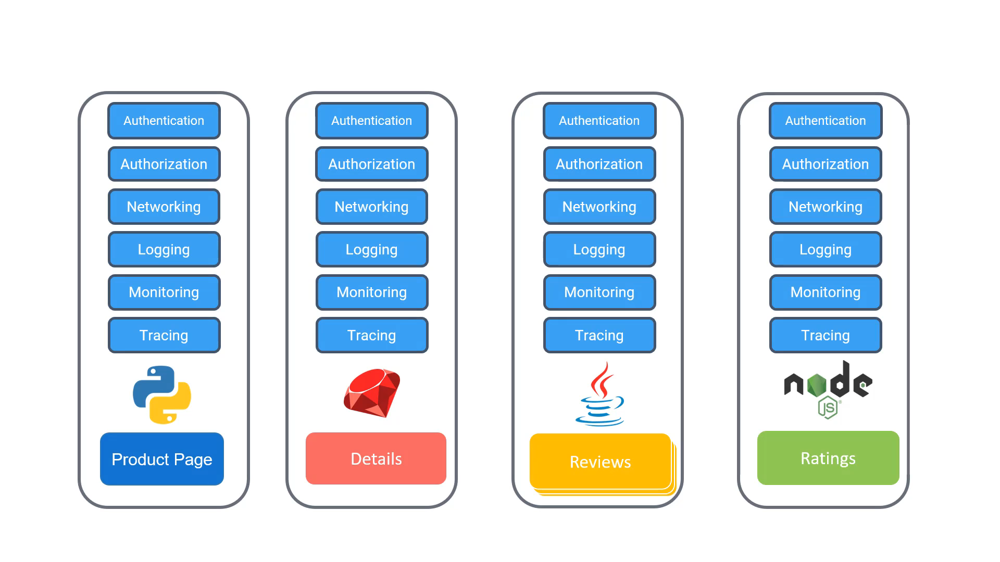
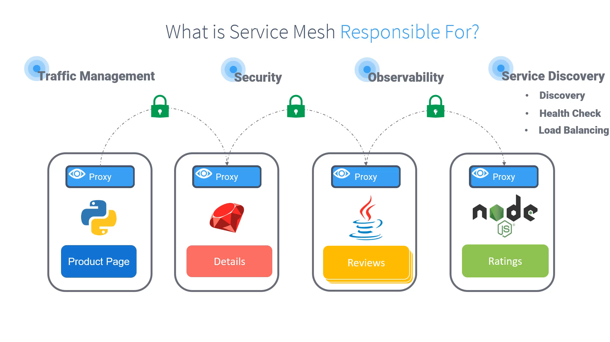

---

# 020-020 – Service Mesh

## 1. Recap: Where We Left Off

* In the **previous lesson**, we saw the challenges with **microservices**:

  * Each service must handle networking, authentication, authorization, logging, monitoring, etc.
  * These **cross-cutting concerns** duplicate effort and increase complexity.

**Timestamp:** 00:07

---

## 2. Introducing the Service Mesh

### The Idea

* Instead of embedding extra functionalities into **every microservice**, we introduce a **proxy** alongside each service.
* This proxy runs as a **sidecar container** in the same pod.
* **Responsibilities of the proxy:**

  * Handle networking logic.
  * Manage retries, timeouts, authentication, encryption, monitoring, and logging.
  * Allow developers to focus purely on **business logic**.

### Data Plane & Control Plane

* **Data Plane**:

  * Consists of all the **sidecar proxies** running next to each microservice.
  * They handle communication **between services**.

* **Control Plane**:

  * Central management component.
  * Configures and controls the proxies.
  * Ensures consistent traffic management, routing, and security policies.

Together, this architecture is called a **Service Mesh**.

**Timestamp:** 00:52

---

## 3. What is a Service Mesh?

* **Definition**: A service mesh is a **dedicated and configurable infrastructure layer** for managing service-to-service communication in a microservices architecture.
* **Key point**: You don’t need to modify your service code—communication, observability, and security are handled by the mesh.

**Timestamp:** 01:07

---

## 4. Capabilities of a Service Mesh

A service mesh enables **dynamic configuration** of how services interact. Major benefits include:

### 🔒 Security

* **Mutual TLS (mTLS)** for all service-to-service communication.
* Ensures **data encryption**, **authentication**, and **integrity** of communication.

---

### 👀 Observability

* End-to-end visibility of how services communicate.
* Identify **bottlenecks, latency issues, and failures** across the system.
* Metrics and tracing are automatically collected by proxies.

---

### 🔎 Service Discovery

* In dynamic clusters (e.g., Kubernetes), services scale up/down and IPs change.
* Service Mesh provides automatic **service discovery** so services can find each other.

---

### ❤️ Health Checks

* Continuously monitors services.
* Only **healthy services** remain in the mesh.
* Automatically removes failing services from routing.

---

### ⚖️ Load Balancing

* Distributes traffic across multiple healthy service instances.
* Prevents routing to unhealthy services.
* Improves performance and reliability.

**Timestamp:** 02:12

---

## 5. Looking Ahead

* This section gave us a **high-level introduction** to Service Mesh.
* In the rest of the course, we will dive deeper into:

  * Security (mTLS, certificates, authentication).
  * Observability (metrics, logging, tracing).
  * Advanced traffic control (retries, timeouts, circuit breaking, A/B testing).
  * Istio as the most widely used Service Mesh.

---

