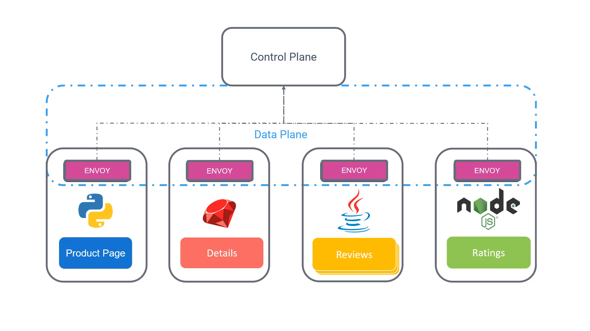

 ```
t](../020-030-istio/
t](../020-030-istio/../020-030-istio/
```


---

# 020-030 – Istio

## 1. Introduction to Istio

* **What is Istio?**

  * A **free and open-source Service Mesh**.
  * Provides an **efficient way** to:

    * 🔒 **Secure** services.
    * 🔗 **Connect** services.
    * 👀 **Monitor** services.
  * Works with **Kubernetes** and **traditional workloads**.
  * Delivers **universal traffic management, telemetry, and security** to complex deployments.
  * Widely supported by **major cloud providers** and **consulting companies**.

**Timestamp:** 00:33


---

## 2. Istio Architecture

### Data Plane

* Recall: In a service mesh, the **proxies** take care of communication between microservices.
* These proxies form the **data plane**.
* Istio uses **Envoy Proxy** (an open-source, high-performance proxy) for this role.
* Each service sends/receives traffic **through Envoy**, which applies the policies and handles secure communication.

### Control Plane

* The **control plane** configures and manages the proxies.
* In Istio, the control plane is responsible for:

  * Service discovery.
  * Traffic management rules.
  * Security policies.
  * Telemetry collection (metrics, logging, tracing).

**Timestamp:** 01:03


---

## 3. Core Components of Istio

### Early Istio Architecture

* Originally, the **control plane** was made of **three separate components**:

  1. **Citadel** → Managed **certificate generation** for secure communication.
  2. **Pilot** → Responsible for **service discovery** and traffic rules.
  3. **Galley** → Handled **validation and distribution of configuration**.

---

### Modern Istio Architecture

* These three components were later merged into a **single daemon: Istiod**.
* **Istiod** simplifies deployment and maintenance.
* Key responsibilities of **Istiod**:

  * Manages certificates and identities.
  * Configures Envoy proxies with policies.
  * Validates configuration.

---

### Istio Agent

* Each **service (or pod)** in Kubernetes has:

  * An **Envoy proxy** (sidecar container).
  * An **Istio agent**.

* **Istio Agent’s role**:

  * Passes **configuration and secrets** from Istiod to the Envoy proxy.
  * Ensures each proxy runs with the correct security credentials and routing rules.

**Timestamp:** 01:45


---

## 4. High-Level Summary

* Istio provides a **powerful Service Mesh** solution by combining:

  * **Data Plane** → Envoy proxies (sidecars) in each pod.
  * **Control Plane** → Istiod managing policies, certificates, and configuration.
* Benefits:

  * Centralized traffic control.
  * Strong service-to-service security (mTLS).
  * Rich observability (metrics, logs, traces).
* Next steps:

  * Learn how to **install Istio** in a Kubernetes cluster.
  * Explore Istio’s features in greater depth (traffic shifting, retries, failover, monitoring, etc.).

---

✅ This way, you get a **clear and layered breakdown** with explanations → *Intro → Architecture → Components → Summary*.

