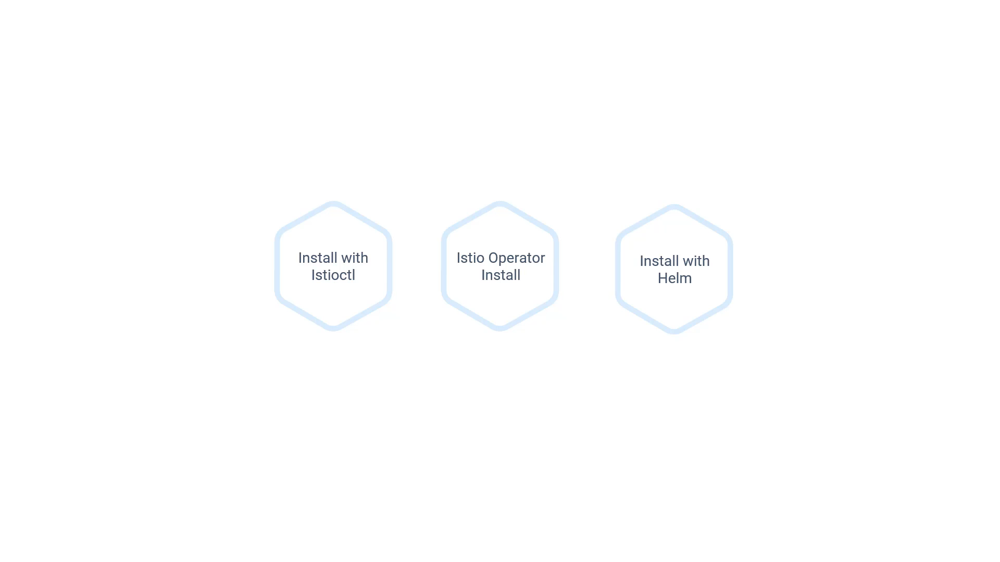

---

# 020-035 – Installing Istio

## 1. Approaches to Install Istio

Istio can be installed on a Kubernetes cluster in **three different ways**:

1. **Using Istioctl (Command-Line Utility)**

   * Official Istio CLI tool.
   * Provides direct control over installation and configuration.
   * Recommended for learning and simple setups.

2. **Using Istio Operator**

   * Automates installation and lifecycle management.
   * Suitable for production environments where automation is critical.

3. **Using Helm Package**

   * Uses Helm charts for installation.
   * Flexible and integrates with existing Helm-based workflows.

**Timestamp:** 00:23


---

## 2. Installing Istio with Istioctl

For this training, we will use **Istioctl**.

### Installation Command

Run the following command to install Istio using the **demo profile**:

```bash
$ istioctl install --set profile=demo -y
```

### Profiles in Istio

* **Demo Profile**:

  * Preconfigured for learning and testing.
  * Includes most Istio features enabled for demonstration.
* **Production Profile**:

  * Optimized for real-world deployments.
  * Secure and performance-focused, with minimal overhead.
* **Performance Testing Profile**:

  * Used for benchmarking and testing system limits.

### What Happens During Installation?

* A new namespace **`istio-system`** is created.
* A **deployment named `istiod`** is installed.

  * `istiod` bundles together Istio’s core components:

    * Citadel (certificates & security).
    * Pilot (service discovery & traffic management).
    * Galley (configuration validation).
* Additional services are created:

  * **Istio Ingress Gateway** – Handles incoming traffic to the mesh.
  * **Istio Egress Gateway** – Manages traffic leaving the mesh.
* Kubernetes Service objects are also deployed to expose these components.

**Sample Output** after installation:

```bash
$ istioctl install --set profile=demo -y
Detected that your cluster does not support third party JWT authentication. Falling back to less secure first party JWT. See https://istio.io/v1.9/docs/ops/best-practices/security/#configure-third-party-service-account-tokens for details.
∘ Istio core installed
∘ Istiod installed
∘ Ingress gateways installed
∘ Egress gateways installed
Installation complete
```

**Timestamp:** 01:39


---

## 3. Verifying Installation

After installation, you should verify that Istio is properly set up.

Run the command:

```bash
$ istioctl verify-install
```

### What This Does

* Checks Istio control plane components.
* Validates Kubernetes resources created by Istio.
* Ensures CRDs (Custom Resource Definitions) are correctly registered.

### Example Output (truncated for clarity):

```bash
$ istioctl verify-install
1 Istio control planes detected, checking --revision "default" only
✔ Deployment: istio-ingressgateway.istio-system checked successfully
✔ PodDisruptionBudget: istio-ingressgateway.istio-system checked successfully
✔ Role: istio-ingressgateway-sds.istio-system checked successfully
✔ RoleBinding: istio-ingressgateway-sds.istio-system checked successfully
✔ Service: istio-ingressgateway.istio-system checked successfully
✔ ServiceAccount: istio-ingressgateway-service-account.istio-system checked successfully
✔ Deployment: istio-egressgateway.istio-system checked successfully
✔ PodDisruptionBudget: istio-egressgateway.istio-system checked successfully
✔ Role: istio-egressgateway-sds.istio-system checked successfully
✔ RoleBinding: istio-egressgateway-sds.istio-system checked successfully
✔ Service: istio-egressgateway.istio-system checked successfully
✔ ServiceAccount: istio-egressgateway-service-account.istio-system checked successfully
✔ ClusterRole: istiod.istio-system checked successfully


✔ EnvoyFilter: tcp-stats-filter-1.9.istio-system checked successfully
Checked 12 custom resource definitions
Checked 3 Istio Deployments
✔ Istio is installed and verified successfully
```

**Timestamp:** 01:58


---

## 4. Key Takeaways

* Istio provides multiple installation methods, but **Istioctl** is the simplest for training and demos.
* The **demo profile** is used for learning → production environments require stricter profiles.
* Istio extends Kubernetes using **Custom Resource Definitions (CRDs)**, which allow it to manage advanced networking and security features.
* After installation, always use **`istioctl verify-install`** to confirm successful setup.
* The gateways (Ingress & Egress) are critical components that will be explored in detail in later sections.

---
