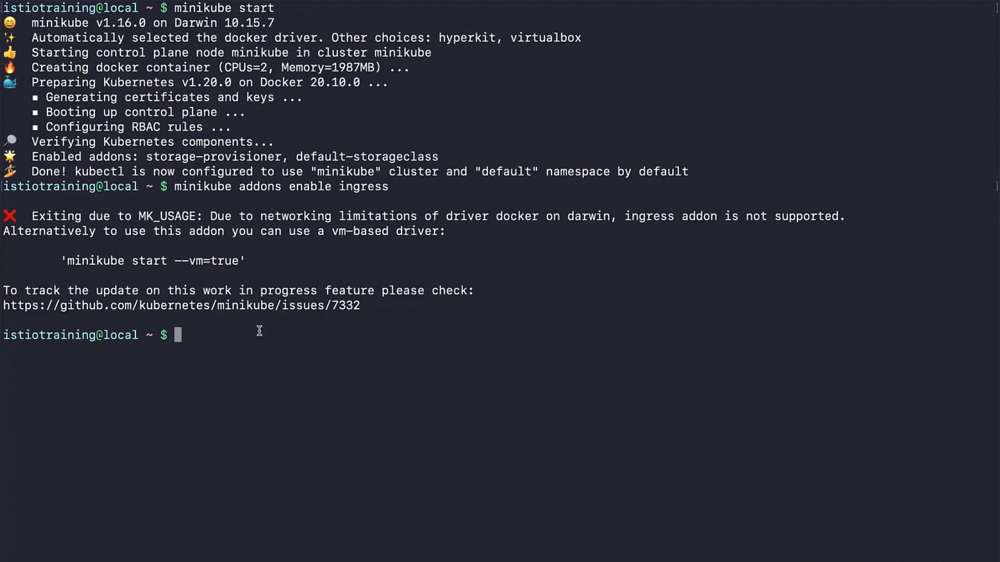
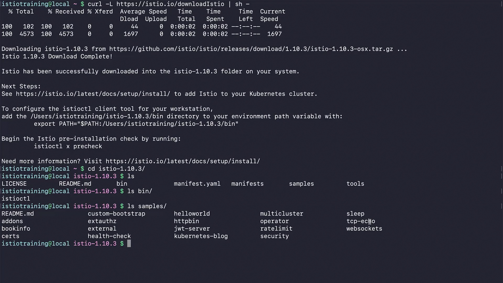
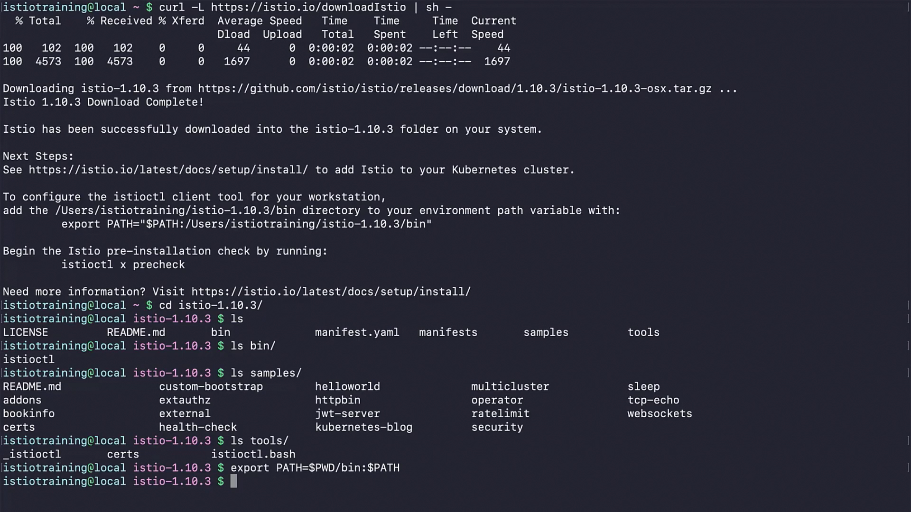

 ```
t](../020-040-installing-istioctl/
t](../020-040-installing-istioctl/../020-040-installing-istioctl/
```

Got it ✅ Thanks for pasting the subtitles. I’ll now **rewrite everything into structured, detailed notes** while keeping your real screenshots (``) exactly as they are. These notes will be **step-by-step, very detailed**, and ready to paste into your `.md` file for easy understanding.

Here’s the rewritten content for **020-040 – Installing Istioctl**:

---

# 020-040 – Installing Istioctl

In this lesson, we will prepare our local Kubernetes environment with **Minikube** and install **Istioctl**, the Istio client CLI.

---

## 1. Setting Up Minikube

Before installing Istioctl, you need a running Kubernetes cluster. For this demo, we’ll use **Minikube**.

### Start Minikube

Run the following command:

```bash
$ minikube start
```

Sample output:

```bash
😄  minikube v1.16.0 on Darwin 10.15.7
✨  Automatically selected the docker driver. Other choices: hyperkit, virtualbox
👍  Starting control plane node minikube in cluster minikube
🔥  Creating docker container (CPUs=2, Memory=1987MB) ...
🐳  Preparing Kubernetes v1.20.0 on Docker 20.10.0 ...
  • Generating certificates and keys ...
  • Booting up control plane ...
  • Configuring RBAC rules ...
🔎  Verifying Kubernetes components...
🌟  Enabled addons: storage-provisioner, default-storageclass
🏄  Done! kubectl is now configured to use "minikube" cluster and "default" namespace by default
```

**Timestamp:** 00:32


---

## 2. Issue with Docker Driver on macOS

On macOS, when using Docker as the Minikube driver, the **Ingress add-on is not supported** due to networking limitations with Docker bridge on macOS.

Trying to enable ingress shows the following error:

```bash
$ minikube addons enable ingress

❌  Exiting due to MK_USAGE: Due to networking limitations of driver docker on darwin, ingress addon is not supported.
Alternatively to use this addon you can use a vm-based driver:

            'minikube start --vm=true'

To track the update on this work in progress feature please check:
https://github.com/kubernetes/minikube/issues/7332
```

**Timestamp:** 01:05


---

## 3. Switching to a VM-Based Driver

To fix this issue, delete the current Minikube cluster:

```bash
$ minikube delete
```

Output:

```bash
🔥  Deleting "minikube" in docker ...
🔥  Deleting container "minikube" ...
🔥  Removing /Users/istiotraining/minikube/machines/minikube
💀  Removed all traces of the "minikube" cluster.
```

**Timestamp:** 01:14


Now restart Minikube with a VM driver instead of Docker:

```bash
$ minikube start --vm=true
```

Sample output:

```bash
😄  minikube v1.16.0 on Darwin 10.15.7
✨  Automatically selected the hyperkit driver
👍  Starting control plane node minikube in cluster minikube
🔥  Creating hyperkit VM (CPUs=2, Memory=4000MB, Disk=20000MB) ...
🐳  Preparing Kubernetes v1.20.0 on Docker 20.10.0 ...
    • Generating certificates and keys ...
    • Booting up control plane ...
    • Configuring RBAC rules ...
🔎  Verifying Kubernetes components...
🌟  Enabled addons: storage-provisioner, default-storageclass
🏄  Done! kubectl is now configured to use "minikube" cluster and "default" namespace by default
```

**Timestamp:** 01:32


Now you can enable ingress successfully:

```bash
$ minikube addons enable ingress
```

Output:

```bash
🔎  Verifying ingress addon...
🌟  The 'ingress' addon is enabled
```

**Timestamp:** 01:50


---

## 4. Installing Istioctl

Next, download the **Istio release package**:

```bash
$ curl -L https://git.io/getLatestIstio | sh -
```

⚠️ Note: This command downloads the **latest Istio release** into your current directory. At the time of this recording, it was **Istio v1.10.3**.

Sample output:

```bash
Downloading istio-1.10.3 from https://github.com/istio/istio/releases/download/1.10.3/istio-1.10.3-osx.tar.gz
Istio 1.10.3 Download Complete!

Istio has been successfully downloaded into the istio-1.10.3 folder on your system.
```

**Timestamp:** 02:27


---

## 5. Exploring the Istio Package

Move into the Istio package directory:

```bash
$ cd istio-1.10.3/
$ ls
LICENSE  README.md  bin  manifest.yaml  manifests  samples  tools
```

**Timestamp:** 02:46
<!--  -->

### Important folders:

* **bin/** → contains the `istioctl` CLI tool.

  ```bash
  $ ls bin/
  istioctl
  ```

  **Timestamp:** 02:53
  <!--  -->

* **samples/** → contains demo applications (e.g., Bookinfo) and examples used throughout the course.

  ```bash
  $ ls samples/
  addons  bookinfo  helloworld  httpbin  sleep  tcp-echo  ...
  ```

  **Timestamp:** 03:08
  <!--  -->

* **tools/** → contains helper scripts for Istio.

  ```bash
  $ ls tools/
  _istioctl  certs  istioctl.bash
  ```

  **Timestamp:** 03:17
  <!--  -->

---

## 6. Adding Istioctl to PATH

Add `istioctl` to your environment PATH so you can use it globally:

```bash
$ export PATH=$PWD/bin:$PATH
```

**Timestamp:** 03:31


---

## 7. Checking Istioctl Installation

Verify that Istioctl is installed correctly:

```bash
$ istioctl version
```

Sample output:

```bash
no running Istio pods in "istio-system"
1.10.3
```

**Timestamp:** 03:41


This confirms that `istioctl` is installed locally, but Istio is not yet running on the cluster.

---

## 8. Verifying Istio Installation on the Cluster

Try running:

```bash
$ istioctl verify-install
```

Since Istio is not yet installed in the cluster, you’ll see errors like:

```bash
0 Istio control planes detected, checking --revision "default" only
error while fetching revision: the server could not find the requested resource
Error: could not load IstioOperator from cluster: the server could not find the requested resource.
```

This is expected. We will install Istio on the cluster in the next lesson.

---

## ✅ Key Takeaways

* **Minikube Setup**: Use a VM-based driver (`--vm=true`) on macOS to avoid ingress issues.
* **Istioctl**: Installed via latest Istio release package → located in `bin/`.
* **Samples**: The `samples/` folder provides demo applications like Bookinfo.
* **Next Step**: Install Istio control plane into the cluster using Istioctl.

---

