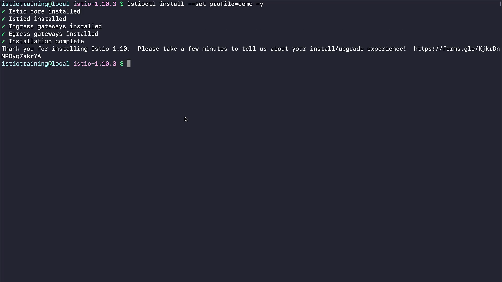

 ```
t](../020-050-installing-istio-on-your-cluster/
t](../020-050-installing-istio-on-your-cluster/../020-050-installing-istio-on-your-cluster/
```

Perfect 👍 I’ll rewrite this section into **structured, detailed notes** with explanations, while keeping all your screenshots intact (as they make it easier to follow along). Here’s the improved version for your Markdown file:

---

# 020-050-installing-istio-on-your-cluster

## 🎯 Objective

In this lesson, we will install **Istio on a Kubernetes cluster** using the `istioctl` command-line tool. After the installation, we will run verification checks to confirm that all the required components, roles, and CRDs (Custom Resource Definitions) are correctly set up.

---

## 1. Installing Istio using `istioctl`

The installation command is:

```bash
$ istioctl install --set profile=demo -y
• Istio core installed
• Istiod installed
• Ingress gateways installed
• Egress gateways installed
• Installation complete
Thank you for installing Istio 1.10. Please take a few minutes to tell us about your install/upgrade experience! https://forms.gle/KjkrDnMPByq/akrYA
```

### 🔎 Explanation of Command

* **`istioctl install`** → Installs Istio control plane components.
* **`--set profile=demo`** → Uses the **demo profile**, which enables most Istio features for testing and learning purposes.

  * ⚠️ Not recommended for production (too resource-heavy, not tuned for performance/security).
* **`-y`** → Skips confirmation prompts and directly applies the installation.

✅ Once executed, this command installs:

* **Istio core components**
* **Istiod (control plane)**
* **Ingress Gateway** (handles incoming traffic to the mesh)
* **Egress Gateway** (handles outgoing traffic leaving the mesh)

**Timestamp:** 00:35


---

## 2. Verifying the Installation

After installation, always verify that Istio was installed correctly:

```bash
$ istioctl verify-install
```

This command checks **all Istio components** in the cluster, ensuring that resources such as Deployments, Roles, CRDs, and Webhooks are correctly applied.

**Sample Output (trimmed for clarity):**

```
1 Istio control planes detected, checking -revision "default" only
✓ ClusterRole: istiod-istio-system checked successfully
✓ ClusterRole: istio-reader-istio-system checked successfully
✓ ClusterRoleBinding: istio-reader-istio-system checked successfully
✓ ServiceAccount: istiod-service-account.istio-system checked successfully
✓ ValidatingWebhookConfiguration: istiod-istio-system checked successfully
✓ CustomResourceDefinition: destinationrules.networking.istio.io checked successfully
✓ CustomResourceDefinition: gateways.networking.istio.io checked successfully
✓ Deployment: istiod.istio-system checked successfully
✓ Deployment: istio-ingressgateway.istio-system checked successfully
✓ Deployment: istio-egressgateway.istio-system checked successfully
Checked 13 custom resource definitions
```

**Timestamp:** 00:49


---

## 3. Key Resources Installed

From the verification results, we can confirm Istio successfully installed the following:

1. **ClusterRoles & ClusterRoleBindings**

   * Define RBAC (Role-Based Access Control) permissions needed by Istio components.

2. **Service Accounts**

   * Special Kubernetes accounts used by Istio pods for authentication and authorization.

3. **Validating & Mutating Webhooks**

   * Used by Istio for automatic sidecar injection (Envoy proxy) and validation of Istio resources.

4. **Custom Resource Definitions (CRDs)**

   * Extend Kubernetes API to support Istio-specific objects:

     * `VirtualService`
     * `DestinationRule`
     * `Gateway`
     * `Sidecar`
     * `AuthorizationPolicy`
     * `Telemetry`, etc.

5. **Deployments & Services**

   * **Istiod** → Control plane
   * **Istio-IngressGateway** → External traffic entry point
   * **Istio-EgressGateway** → External traffic exit point

6. **Envoy Filters**

   * Installed to enable observability (metrics collection, logging, etc.).

---

## 4. Confirmation of Successful Installation

At the end of the verification, Istio reports:

✅ **13 custom resource definitions checked**
✅ **3 main deployments running (Istiod, Ingress Gateway, Egress Gateway)**
✅ **RBAC, Webhooks, and Sidecars verified successfully**

This means **Istio is fully installed and operational** in the cluster.

**Timestamp:** 01:12


---

## 🔑 Key Takeaways

* `istioctl install --set profile=demo -y` → Quick and simple way to install Istio for testing.
* Always run `istioctl verify-install` to validate the installation.
* Istio installation adds new **CRDs, Roles, Service Accounts, and Deployments** into the `istio-system` namespace.
* You now have a working Istio environment with:

  * Control plane (`istiod`)
  * Ingress Gateway
  * Egress Gateway

👉 In the next section, we’ll start **deploying applications into the mesh** and explore how traffic is managed.

---

Would you like me to also **draw a small Mermaid diagram** here showing the new Istio components inside the `istio-system` namespace (Istiod + Ingress/Egress Gateways + CRDs), so you have a quick visual summary along with screenshots?
