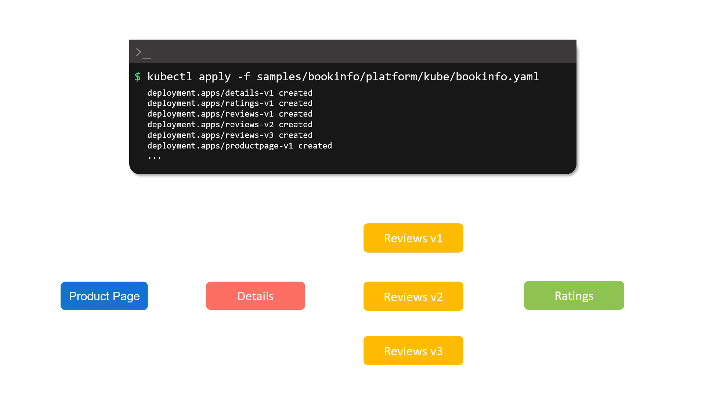
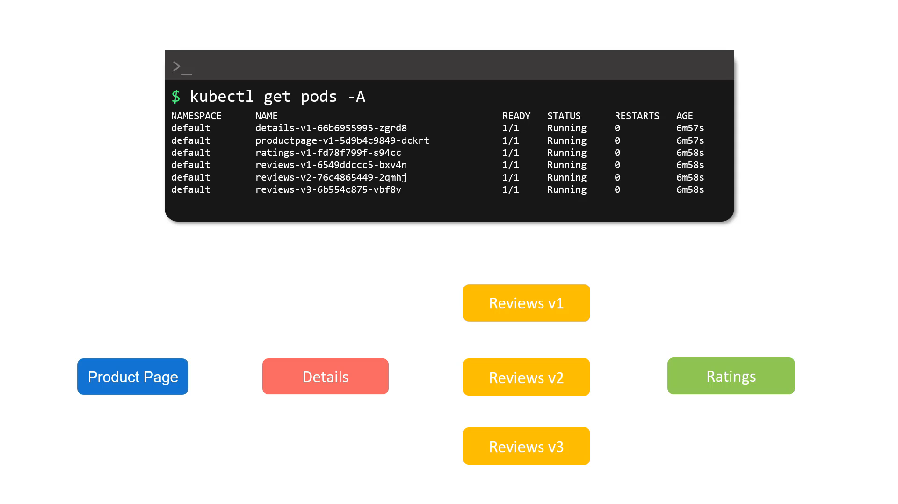
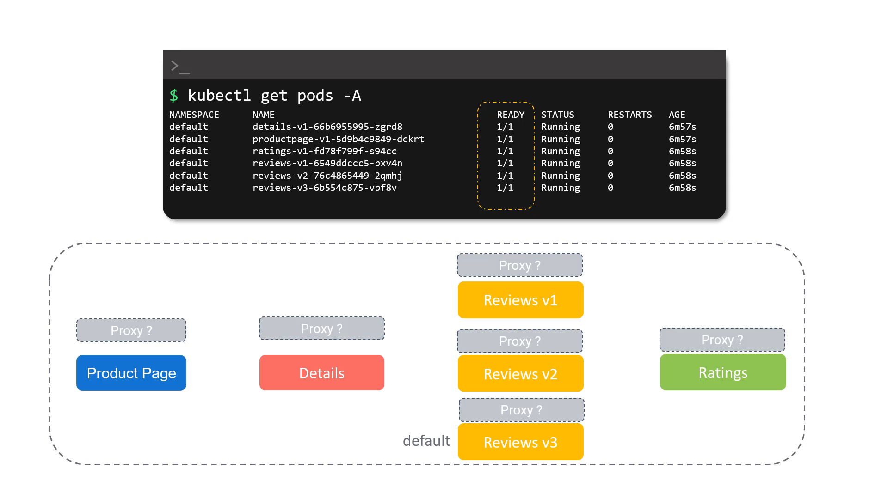
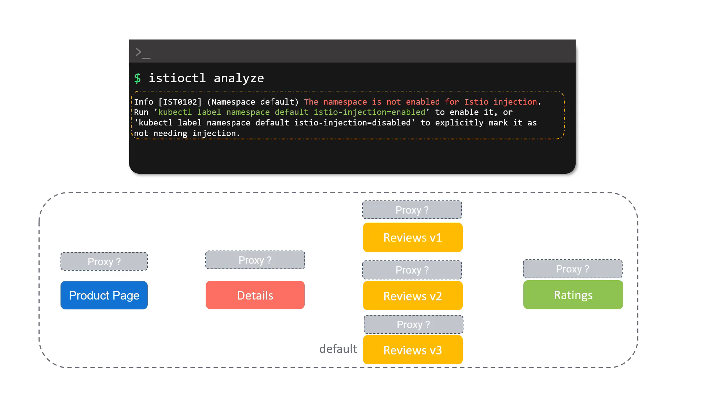
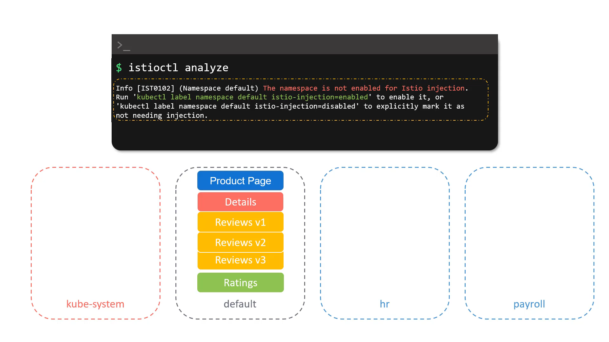
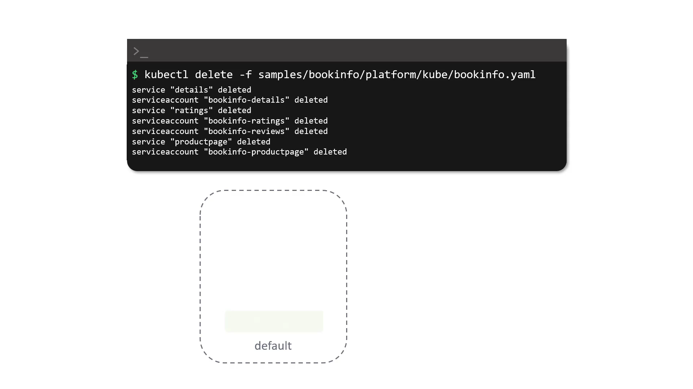
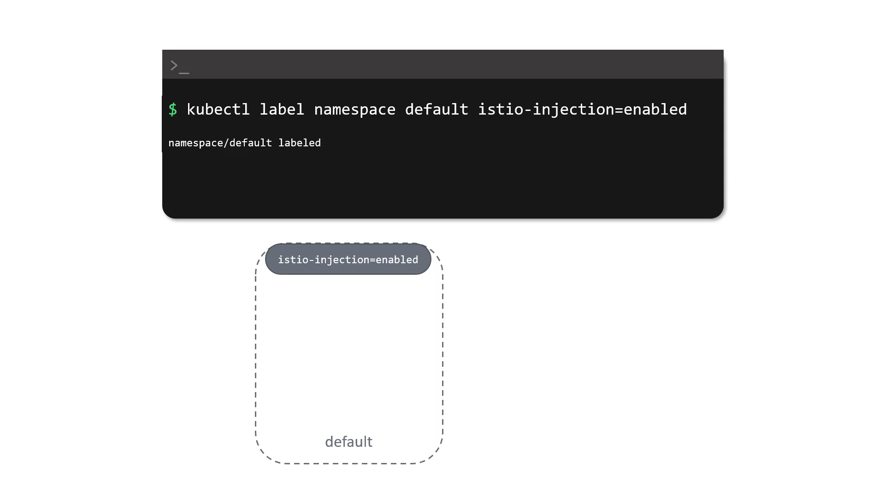
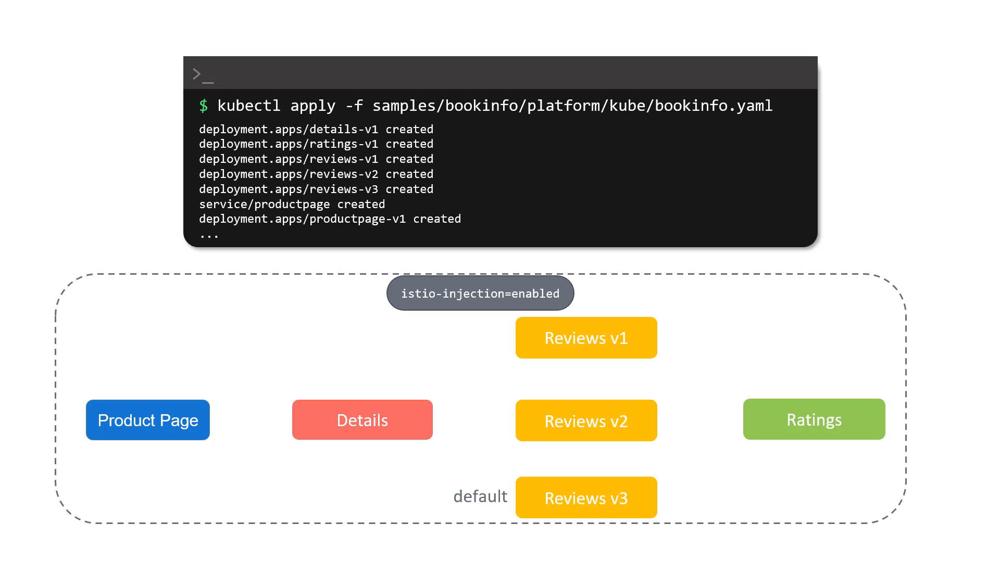
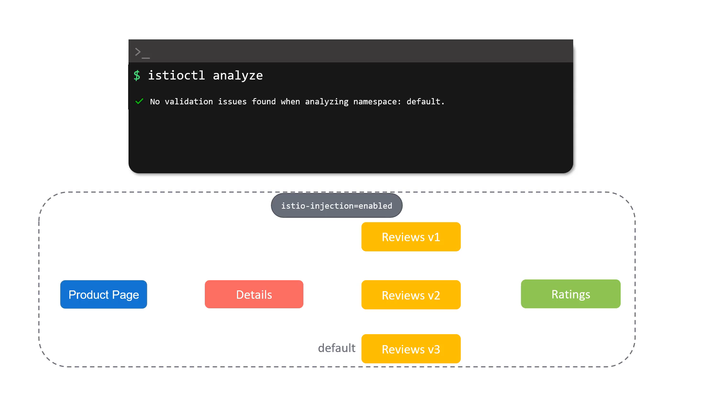
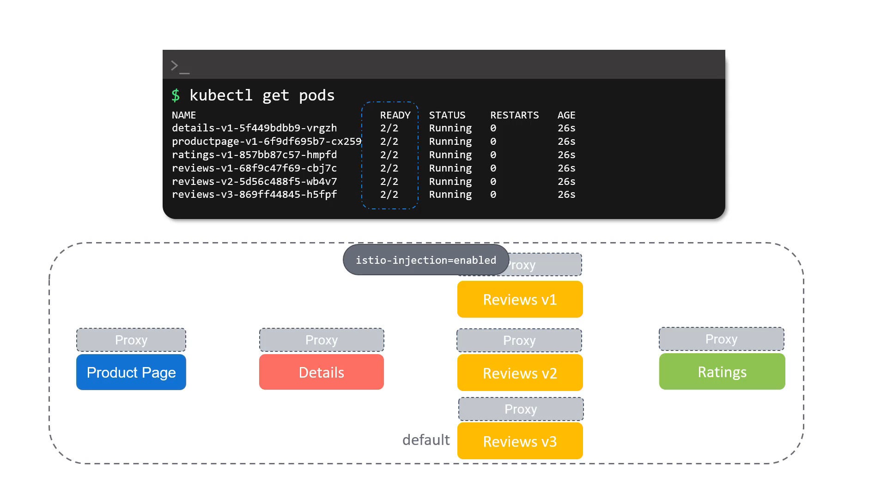

 ```
t](../020-065-deploying-our-first-application-on-istio/
t](../020-065-deploying-our-first-application-on-istio/../020-065-deploying-our-first-application-on-istio/
```

Here’s a **rewritten, structured, and detailed version** of your notes with explanations while keeping all screenshots (``) exactly as they are. This is ready to paste into your `.md` file:

---

# 020-065-deploying-our-first-application-on-istio

## 1. Introduction

Now that Istio is installed on our cluster, let’s deploy our first application to see Istio in action.
We will use the **Bookinfo sample application** provided by Istio. This app simulates a simple online bookstore and is a standard demo application to understand Istio features.

---

## 2. Deploying the Bookinfo Application

### Step 1: Apply the Bookinfo Manifest

In the **Istio Samples folder**, you’ll find the `bookinfo.yaml` manifest file.
Run the following command to deploy it:

```bash
kubectl apply -f samples/bookinfo/platform/kube/bookinfo.yaml
```

This will create multiple **Deployments** and **Services**:

* `details-v1`
* `ratings-v1`
* `reviews-v1`, `reviews-v2`, `reviews-v3` (three versions)
* `productpage-v1`

**Timestamp:** 00:13


---

### Step 2: Verify Pod Status

Check the status of the pods created:

```bash
kubectl get pods -A
```

Output shows:

* `productpage` microservice
* `details` microservice
* `ratings` microservice
* Three versions of the `reviews` service

```bash
NAMESPACE   NAME                                READY  STATUS   RESTARTS  AGE
default     productpage-v1-5d9b4c9849-dckrt     1/1    Running  0        6m57s
default     ratings-v1-fd78f799f-s94cc          1/1    Running  0        6m58s
default     details-v1-66b6955995-zgrd8         1/1    Running  0        6m57s
default     reviews-v1-6549ddccc5-bxv4n         1/1    Running  0        6m58s
default     reviews-v2-76c4865449-2qmhj         1/1    Running  0        6m58s
default     reviews-v3-6b554c875-vbf8v          1/1    Running  0        6m58s
```

**Timestamp:** 00:42


---

## 3. Issue: No Sidecar Injection

Although Istio is installed, we notice that **pods have only 1 container each** (see `READY` column → `1/1`).
We expected **2/2** containers (the application container + Envoy sidecar).

**Why?**
Sidecar injection is **not enabled** for the `default` namespace.

**Timestamp:** 01:16


---

## 4. Diagnose with `istioctl analyze`

Run:

```bash
istioctl analyze
```

Output:

```
Info [IST0102] (Namespace default) The namespace is not enabled for Istio injection.
Run 'kubectl label namespace default istio-injection=enabled' to enable it, 
or 'kubectl label namespace default istio-injection=disabled' to explicitly mark it as not needing injection
```

This confirms the **default namespace doesn’t allow Istio injection**.

**Timestamp:** 01:33


---

## 5. Understanding Namespace Injection

Kubernetes supports multiple namespaces:

* **kube-system** → Core Kubernetes services
* **default** → Default namespace for apps (ours is here)
* Other namespaces → e.g., `hr`, `payroll`

👉 For Istio to inject sidecars (Envoy proxies), **the namespace must be explicitly labeled**.

* To **enable injection**:

  ```bash
  kubectl label namespace <namespace> istio-injection=enabled
  ```
* To **disable injection**:

  ```bash
  kubectl label namespace <namespace> istio-injection=disabled
  ```

**Timestamp:** 02:14


---

## 6. Fix: Enable Sidecar Injection

### Step 1: Delete Existing Bookinfo Deployment

We need to delete the application before enabling injection.

```bash
kubectl delete -f samples/bookinfo/platform/kube/bookinfo.yaml
```

This deletes all related services, service accounts, and deployments.

**Timestamp:** 03:10


---

### Step 2: Label the Default Namespace

Enable Istio injection in the default namespace:

```bash
kubectl label namespace default istio-injection=enabled
```

**Timestamp:** 03:24


---

### Step 3: Redeploy the Application

Reapply the Bookinfo manifest:

```bash
kubectl apply -f samples/bookinfo/platform/kube/bookinfo.yaml
```

**Timestamp:** 03:33


---

## 7. Verification

### Run `istioctl analyze`

```bash
istioctl analyze
```

✅ Output confirms **no validation issues**.

**Timestamp:** 03:36


---

### Check Pods Again

```bash
kubectl get pods
```

Now each pod shows `2/2` containers → meaning the Envoy sidecar proxy has been injected alongside the application container.

```
NAME                              READY   STATUS    RESTARTS   AGE
details-v1-5f449bdbb9-vrgzh       2/2     Running   0          26s
productpage-v1-6f9df695b7-cx259   2/2     Running   0          26s
ratings-v1-857bb87c57-hmpfd       2/2     Running   0          26s
reviews-v1-68f9c47f69-cbj7c       2/2     Running   0          26s
reviews-v2-5d56c488f5-wb4v7       2/2     Running   0          26s
reviews-v3-869ff44845-h5fpf       2/2     Running   0          26s
```

**Timestamp:** 03:48


---

## 8. Summary

* We deployed the **Bookinfo sample app**.
* Initially, **no sidecars** were injected because **default namespace was not labeled**.
* After enabling injection (`istio-injection=enabled`), pods correctly had **2/2 containers** (app + Envoy proxy).
* This confirmed Istio’s sidecar mechanism is working.

You’ll explore Bookinfo traffic routing, observability, and Istio policies in upcoming labs.

---

Would you like me to also create a **flow diagram (with images) showing: App → Namespace → Istio Injection → Sidecar Added**, so that you get a visual representation along with these notes?
