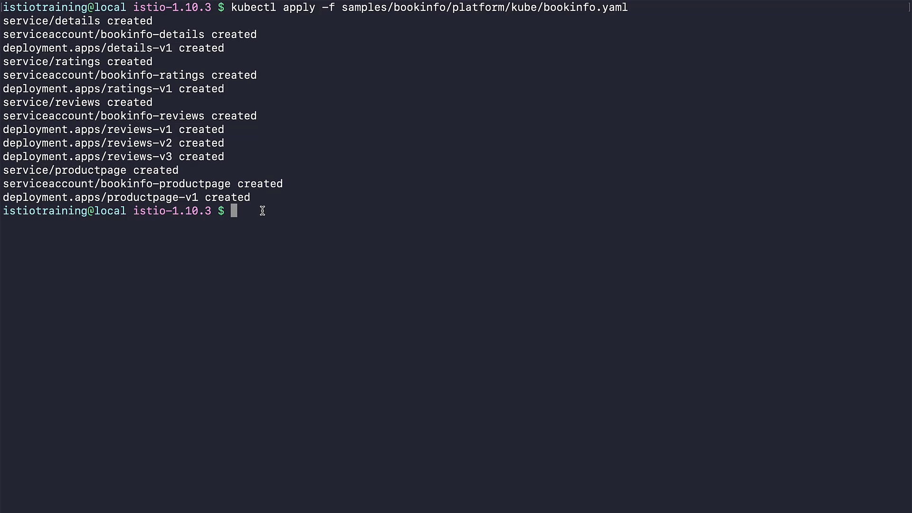
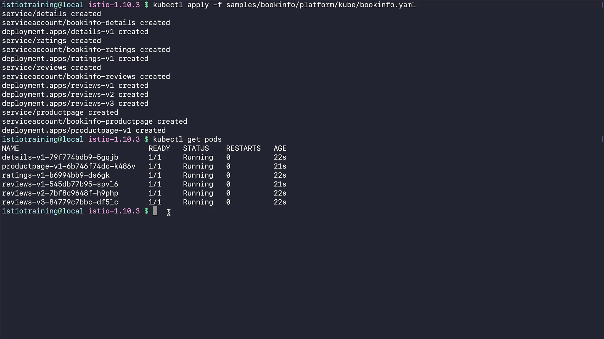
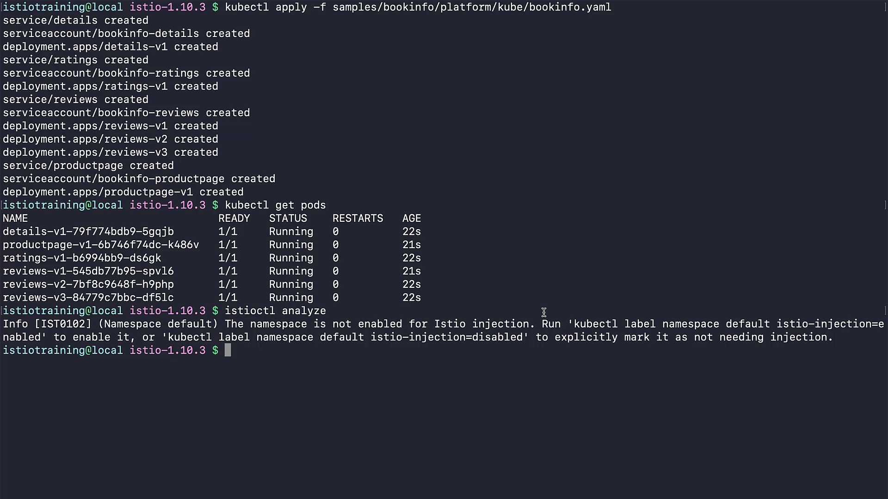
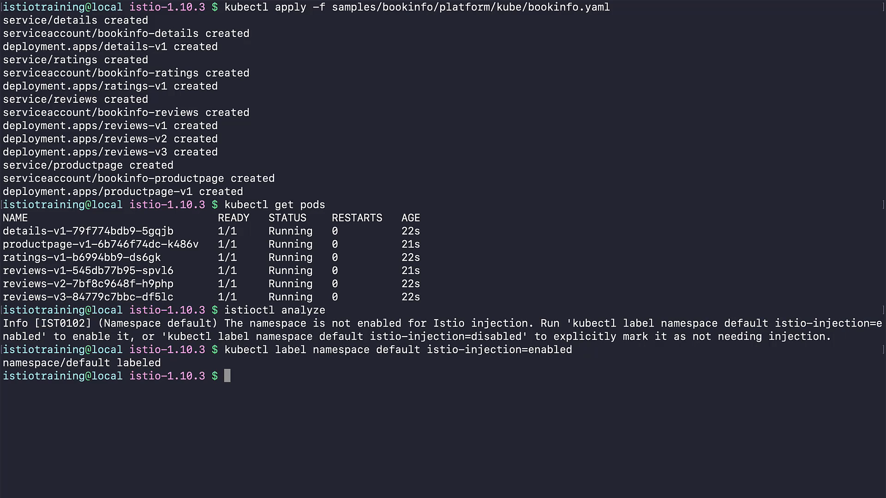
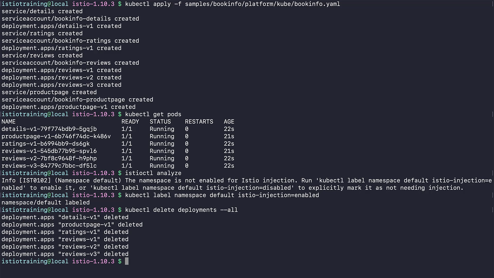
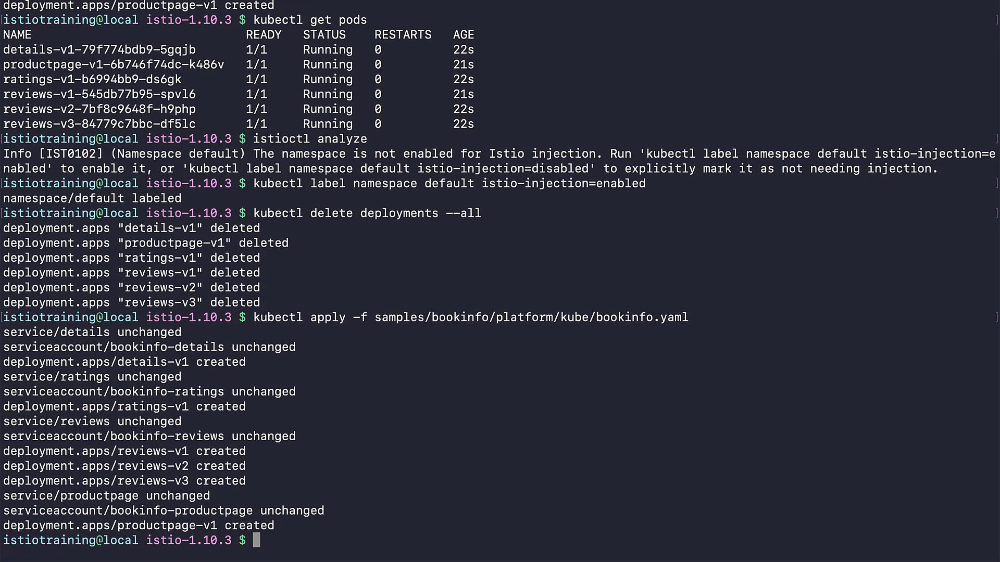
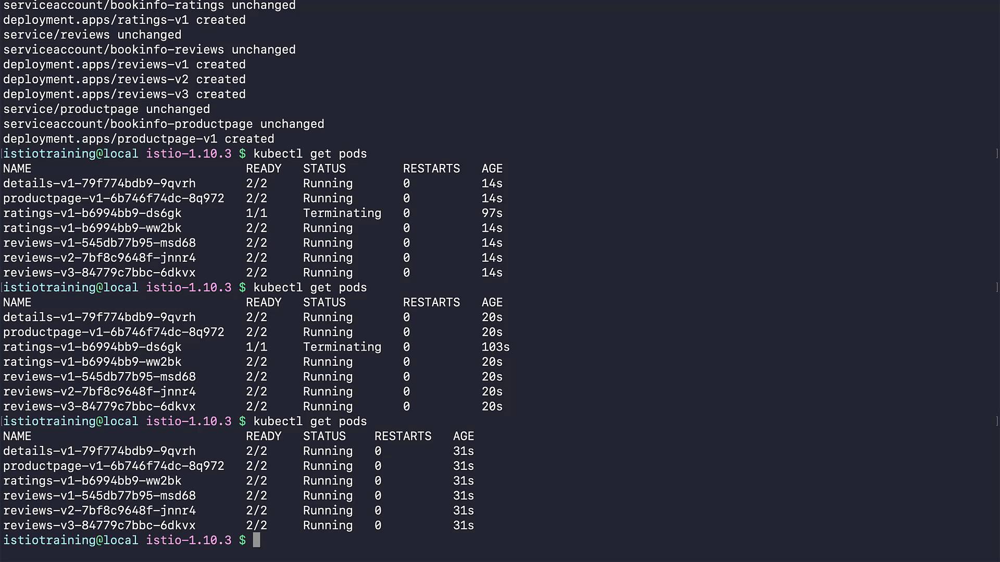
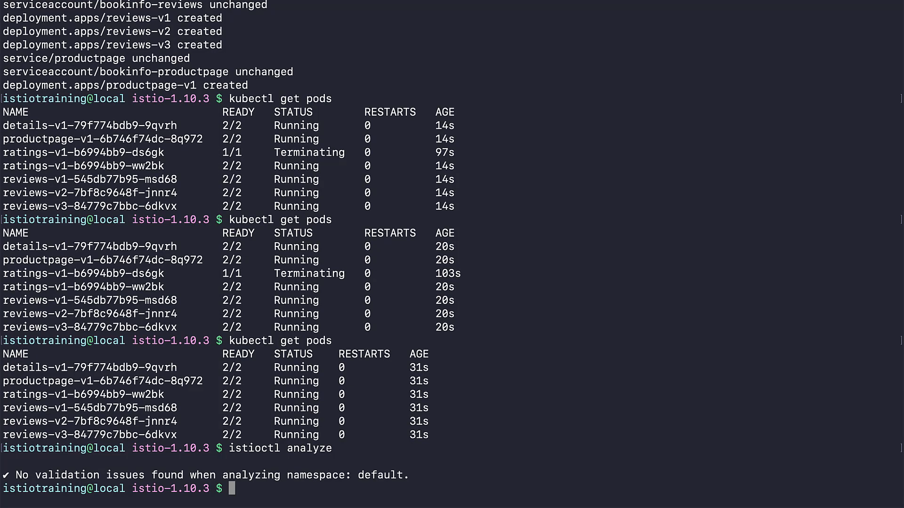

 ```
t](../020-070-deploying-our-first-application-on-istio/
t](../020-070-deploying-our-first-application-on-istio/../020-070-deploying-our-first-application-on-istio/
```

Got it ✅
Here’s a **rewritten, structured, and detailed version** of your notes with clear explanations while keeping all screenshots (``) intact. This is ready for your `.md` file:

---

# 020-070-deploying-our-first-application-on-istio

## 1. Introduction

In this demo, we will:

* Deploy the **Bookinfo sample application** on our Kubernetes cluster.
* **Enable Istio sidecar injection** so that Envoy proxies run alongside our application containers.
* Verify that our **service mesh is working** correctly.

The Bookinfo application is a well-known demo that simulates a simple online bookstore. It has multiple microservices (details, ratings, reviews, productpage) and multiple versions of some services.

---

## 2. Deploying the Bookinfo Application

We will use the `bookinfo.yaml` manifest located in the Istio samples folder.
This manifest describes:

* **Services** (to expose functionality internally in the cluster)
* **Service Accounts** (for identity & security)
* **Deployments** (pods for each microservice, including different versions)

### Command to Deploy:

```bash
kubectl apply -f samples/bookinfo/platform/kube/bookinfo.yaml
```

This creates the following resources:

* `details` (service, service account, deployment v1)
* `ratings` (service, service account, deployment v1)
* `reviews` (service, service account, deployments v1, v2, v3)
* `productpage` (service, service account, deployment v1)

**Timestamp:** 00:51


---

## 3. Checking Pod Status

Run:

```bash
kubectl get pods
```

Output:

```
NAME                             READY   STATUS    RESTARTS   AGE
details-v1-79f774bdb9-5gqjb      1/1     Running   0          22s
productpage-v1-6b746f74dc-k486v  1/1     Running   0          21s
ratings-v1-b6994bb9-ds6gk        1/1     Running   0          22s
reviews-v1-545db77b95-spv16      1/1     Running   0          21s
reviews-v2-7bf8c9648f-h9php      1/1     Running   0          22s
reviews-v3-84779c7bbc-df51c      1/1     Running   0          22s
```

✅ All pods are running.
❌ But notice that each pod has only **1/1 container** (application only).
We expected **2/2 containers** (application + Envoy sidecar).

This indicates that Istio sidecar injection is not working yet.

**Timestamp:** 01:19


---

## 4. Diagnosing the Issue with `istioctl analyze`

Let’s analyze the namespace configuration:

```bash
istioctl analyze
```

Output:

```
Info [IST0102] (Namespace default) The namespace is not enabled for Istio injection. 
Run 'kubectl label namespace default istio-injection=enabled' to enable it, 
or 'kubectl label namespace default istio-injection=disabled' to explicitly mark it as not needing injection.
```

🔎 **Root Cause:**
The `default` namespace is not labeled for Istio injection, so Envoy sidecars are not being added.

**Timestamp:** 01:52


---

## 5. Enabling Istio Sidecar Injection

### Step 1: Label the Namespace

Run:

```bash
kubectl label namespace default istio-injection=enabled
```

This ensures that any **newly created pods** in this namespace will automatically get an Envoy sidecar.

**Timestamp:** 02:06


---

### Step 2: Recreate the Deployments

Since already running pods do not get sidecars retroactively, we must recreate them.

The quickest way is to delete all deployments:

```bash
kubectl delete deployments --all
```

Output:

```
deployment.apps "details-v1" deleted
deployment.apps "productpage-v1" deleted
deployment.apps "ratings-v1" deleted
deployment.apps "reviews-v1" deleted
deployment.apps "reviews-v2" deleted
deployment.apps "reviews-v3" deleted
```

**Timestamp:** 02:18


---

### Step 3: Reapply the Manifest

Now, redeploy using the same manifest:

```bash
kubectl apply -f samples/bookinfo/platform/kube/bookinfo.yaml
```

Output shows services unchanged (already exist), but deployments are recreated:

```
service/details unchanged
serviceaccount/bookinfo-details unchanged
deployment.apps/details-v1 created
service/ratings unchanged
serviceaccount/bookinfo-ratings unchanged
deployment.apps/ratings-v1 created
service/reviews unchanged
serviceaccount/bookinfo-reviews unchanged
deployment.apps/reviews-v1 created
deployment.apps/reviews-v2 created
deployment.apps/reviews-v3 created
service/productpage unchanged
serviceaccount/bookinfo-productpage unchanged
deployment.apps/productpage-v1 created
```

**Timestamp:** 02:36


---

## 6. Verifying Sidecar Injection

Check pod status again:

```bash
kubectl get pods
```

Now each pod shows `2/2` containers → meaning the **application container + Envoy sidecar proxy**.

```
NAME                              READY   STATUS    RESTARTS   AGE
details-v1-79f774bdb9-9qvrh       2/2     Running   0          31s
productpage-v1-6b746f74dc-8q972   2/2     Running   0          31s
ratings-v1-b6994bb9-ww2bk         2/2     Running   0          31s
reviews-v1-545db77b95-msd68       2/2     Running   0          31s
reviews-v2-7bf8c9648f-jnnr4       2/2     Running   0          31s
reviews-v3-84779c7bbc-6dkvx       2/2     Running   0          31s
```

**Timestamp:** 02:56


---

## 7. Final Validation with `istioctl analyze`

Run:

```bash
istioctl analyze
```

Output:

```
✔ No validation issues found when analyzing namespace: default.
```

Everything is correctly configured now.

**Timestamp:** 03:05


---

## 8. Summary

* We deployed the **Bookinfo application** into our cluster.
* Initially, pods had only 1 container each → Envoy sidecar missing.
* The issue was due to **namespace not being labeled for injection**.
* After enabling injection (`istio-injection=enabled`) and redeploying, each pod now has **2/2 containers**.
* Our **service mesh is now active** and ready for traffic management, observability, and security features in Istio.

🎉 Congratulations! You now have your **first application running on Istio with Envoy sidecars injected.**

---

Would you like me to also **add a comparison table (Before vs After Injection)** to make the difference between `1/1` and `2/2` pod states crystal clear in your notes?
