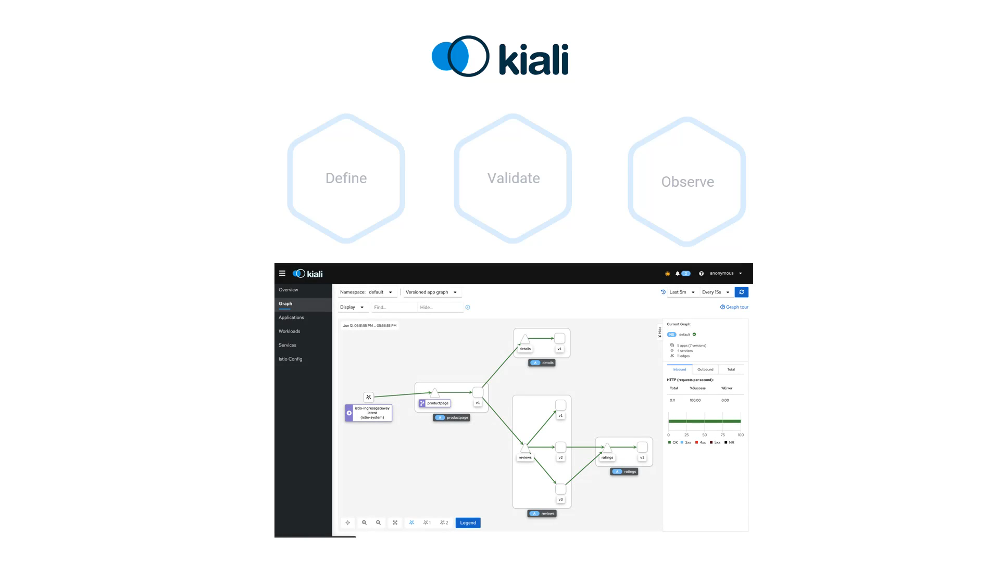

 ```
t](../020-080-visualizing-service-mesh-with-kiali/
t](../020-080-visualizing-service-mesh-with-kiali/../020-080-visualizing-service-mesh-with-kiali/
```

Perfect ✅
Here’s a **rewritten, structured, and detailed version** of your notes for **Kiali**, with clear explanations, examples, and screenshots preserved exactly as you asked. This is ready for your `.md` file:

---

# 020-080-visualizing-service-mesh-with-kiali

## 1. Introduction to Kiali

When running **microservices in a service mesh**, it’s not enough to just deploy and connect services—you also need **observability**.

* How do you know if services are communicating correctly?
* How do you detect latency, errors, or misconfigurations?
* How do you visualize the **topology of your service mesh**?

This is where **Kiali** comes in.

**Kiali** is a:

* **Web-based graphical interface** for Istio.
* Used to **visualize, manage, and troubleshoot** the service mesh.
* Helps both developers and operators ensure their microservices behave as expected.

**Timestamp:** 01:32


---

## 2. Why Do We Need Kiali?

As the number of microservices grows:

* Manual observation becomes impossible.
* Traditional monitoring tools are not enough since service meshes introduce **sidecar proxies, routing rules, and advanced traffic flows**.

Kiali addresses these needs by providing:

1. **Real-time topology visualization** – see which services are talking to each other.
2. **Traffic insights** – request rates, error rates, and latencies.
3. **Validation** – detects misconfigurations in Istio resources.
4. **Service health** – shows which services are healthy/unhealthy.
5. **Traffic management support** – apply advanced Istio features like circuit breaking, request routing, mirroring, etc.

---

## 3. Key Features of Kiali

### a) Service Mesh Topology

* Graphical representation of all microservices in your cluster.
* Shows how services interact with each other.
* Makes dependencies **easy to understand at a glance**.

---

### b) Observability & Metrics

Kiali integrates with **Prometheus** to gather metrics such as:

* **Request rates (RPS)**
* **Latency (p50, p90, p99)**
* **Error rates (HTTP 4xx/5xx codes)**

This makes it possible to identify **performance bottlenecks** and **unhealthy services**.

---

### c) Configuration Validation

Kiali validates Istio configurations such as:

* VirtualServices
* DestinationRules
* Gateways
* Sidecars

It highlights issues like **missing routes, conflicting rules, or unused configurations**.

---

### d) Traffic Management Wizards

Kiali includes **wizards** to simplify Istio’s complex traffic policies. With just a few clicks, you can:

* Split traffic between multiple versions of a service (A/B testing).
* Mirror requests to another service (shadow testing).
* Apply **circuit breakers** to improve resilience.

---

### e) Integration with Istio Ecosystem

Kiali works closely with other Istio add-ons like:

* **Jaeger** → for distributed tracing.
* **Grafana** → for advanced dashboards.
* **Prometheus** → for metrics collection.

Together, they provide a **complete observability stack** for Istio.

---

## 4. High-Level Usage

In this course:

1. We will first install **Kiali** as an Istio add-on.
2. Then, we will generate **test traffic** against our **Bookinfo application**.
3. Finally, we will visualize the traffic and service dependencies using the **Kiali Dashboard**.

At this stage, we are only taking a **high-level look** at Kiali to understand its purpose.
👉 Later in the **Observability Chapter**, we will explore Kiali in depth with advanced use cases.

---

## 5. Summary

* **Kiali = observability + visualization + validation for Istio service mesh.**
* It provides **real-time traffic insights** and a **graphical topology** of microservices.
* Helps troubleshoot misconfigurations, apply Istio traffic rules, and monitor service health.
* Works alongside **Prometheus, Grafana, and Jaeger** for a full observability stack.

🚀 Next, we will see **how to install Kiali** and start using its **web-based dashboard** to visualize our mesh.

---

Would you like me to also add a **Mermaid diagram of the Kiali ecosystem (Kiali + Istio + Prometheus + Jaeger + Grafana)** so your notes have both screenshots and a conceptual architecture diagram?
