 ```
t](../020-090-installing-kiali/
t](../020-090-installing-kiali/../020-090-installing-kiali/
```

Got it ✅
Here’s your rewritten, **structured, and detailed notes** for **Installing Kiali**, with explanations expanded step by step, while keeping your real screenshots (``) intact so you can paste directly into your `.md` file.

---

# 020-090-installing-kiali

## 1. Introduction

Kiali is an **observability add-on** for Istio that provides a **graphical dashboard** to visualize and monitor your service mesh. Before we can use it, we need to **install Kiali and related add-ons** (Grafana, Jaeger, and Prometheus) into our cluster.

In this section, we will:

1. Install Kiali (and other sample add-ons).
2. Verify that Kiali is running successfully.
3. Access the **Kiali Dashboard** to visualize the service mesh.

---

## 2. Installing Kiali and Add-ons

The Istio distribution provides a **`samples/addons`** directory, which contains YAML manifests for installing demo add-ons such as:

* **Grafana** → dashboards and metrics visualization.
* **Jaeger** → distributed tracing.
* **Prometheus** → metrics collection.
* **Kiali** → service mesh visualization and validation.

👉 These add-ons are **not production-ready** (not tuned for **performance** or **security**). They are intended for **demo and learning purposes only**.

Run the following command to install all add-ons:

```bash
kubectl apply -f samples/addons
```

This installs multiple Kubernetes objects including:

* **Service accounts** (e.g., for Grafana, Kiali, Prometheus).
* **ConfigMaps** (dashboards, settings).
* **Deployments & Services** (Grafana, Jaeger, Kiali, Prometheus).
* **Custom Resource Definitions (CRDs)** (for Kiali dashboards).
* **RBAC roles & role bindings** (access controls).

**Timestamp:** 00:16
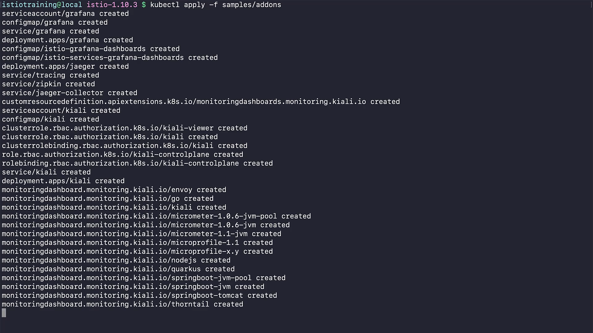

---

## 3. Verifying the Kiali Installation

Once applied, we must confirm that the **Kiali Deployment** is running properly.

```bash
kubectl rollout status deployment/kiali -n istio-system
```

✅ Expected output:

```
deployment "kiali" successfully rolled out
```

**Timestamp:** 01:08
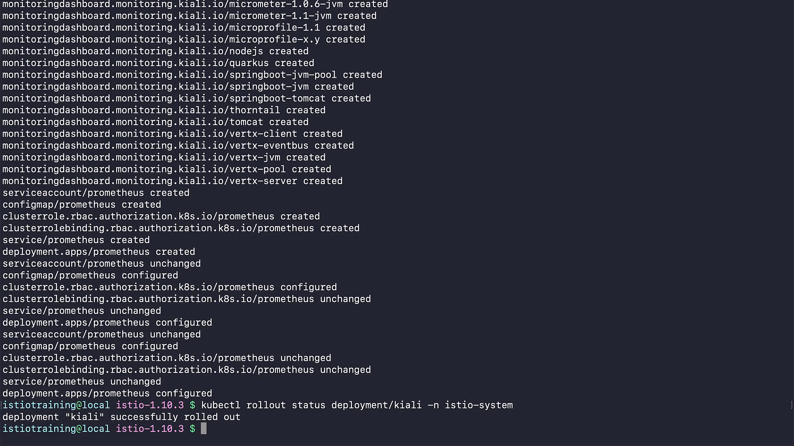

---

### 3.1 Checking the Kiali Service

To check if the **Kiali Service** is running:

```bash
kubectl -n istio-system get svc kiali
```

Example output:

```
NAME    TYPE        CLUSTER-IP     EXTERNAL-IP   PORT(S)                AGE
kiali   ClusterIP   10.102.20.34   <none>        20001/TCP, 9090/TCP    93s
```

* **Type:** `ClusterIP` (internal-only by default).
* **Ports:**

  * `20001/TCP` → for Kiali dashboard.
  * `9090/TCP` → for monitoring APIs.

**Timestamp:** 01:28
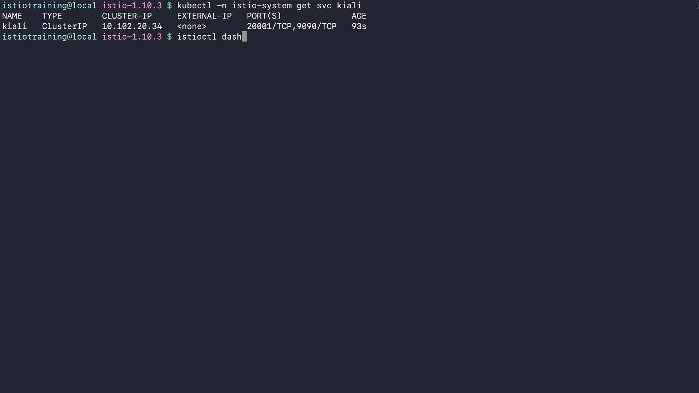

---

## 4. Accessing the Kiali Dashboard

Istio provides a shortcut to open the Kiali dashboard:

```bash
istioctl dashboard kiali
```

This will:

* Launch Kiali in your **default browser**.
* Forward traffic locally to the Kiali pod.
* By default, it is served on **port 20001**.

**Timestamp:** 01:31
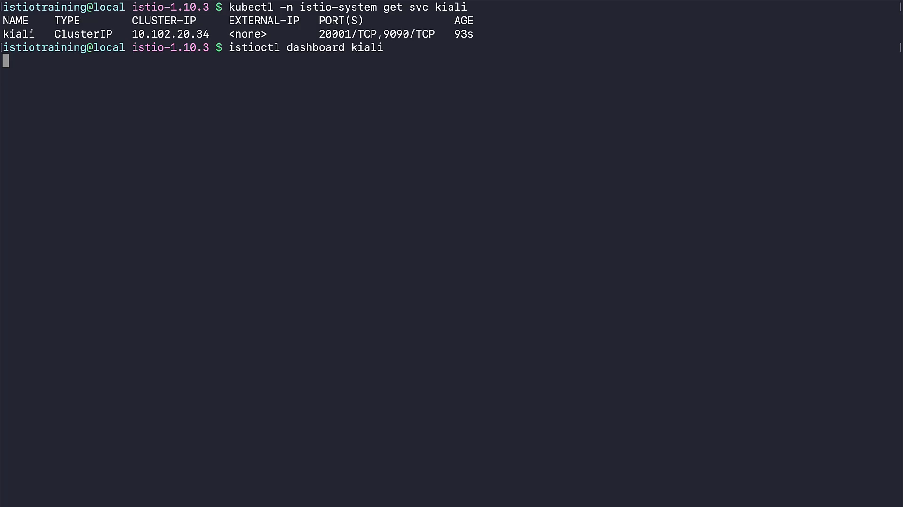

---

## 5. Exploring the Kiali Dashboard

When the dashboard opens:

* **Top Bar:**

  * Change filters (namespaces, applications, workloads).
  * Select **time intervals** for viewing traffic data.
  * Configure **auto-refresh frequency**.

* **Left Menu:**

  * Overview (namespaces, health summary).
  * Applications (list of all apps).
  * Workloads (deployments, pods).
  * Services (service objects).
  * Istio Config (VirtualServices, DestinationRules, Gateways, etc.).
  * Graph (visual service mesh topology).

**Timestamp:** 01:43
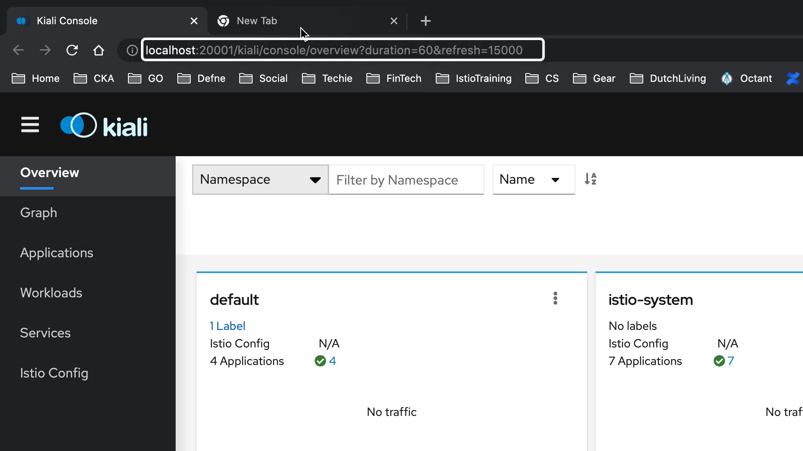

---

### 5.1 Namespace Overview

Shows all namespaces participating in the **service mesh**.

**Timestamp:** 02:13


---

### 5.2 Applications

* Clicking the application count displays all detected applications.
**Timestamp:** 02:18
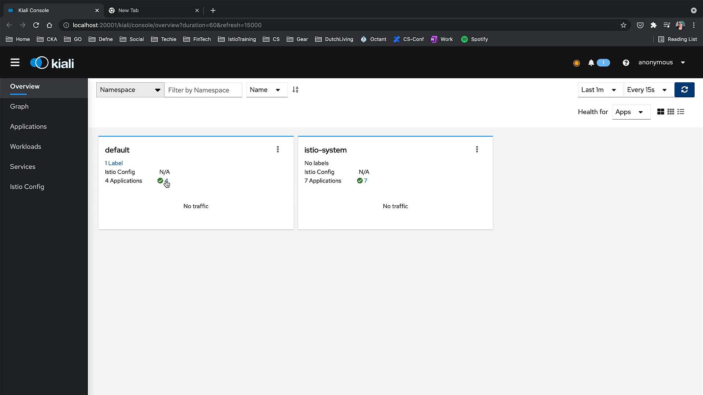

* In this example, we see the **Bookinfo application’s four components** (productpage, details, ratings, reviews).
**Timestamp:** 02:23
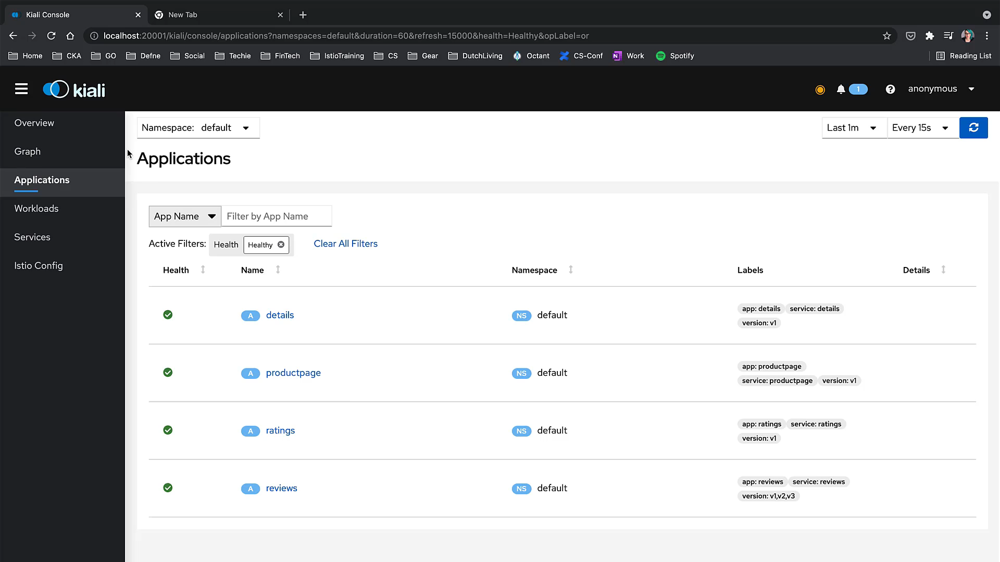

---

### 5.3 Workloads

Lists all **deployments/pods** (e.g., Bookinfo services).

**Timestamp:** 02:41
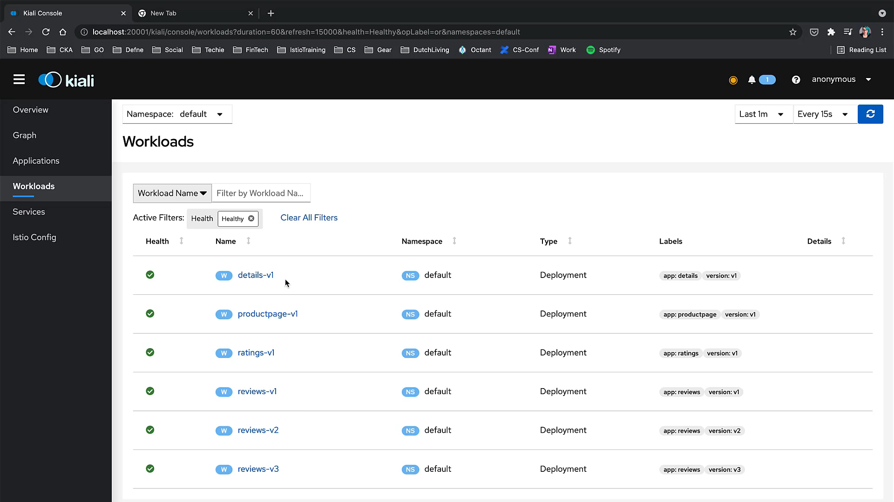

---

### 5.4 Services

Displays the services in the mesh. Sometimes there may be a short delay before services are visible.

**Timestamp:** 02:50
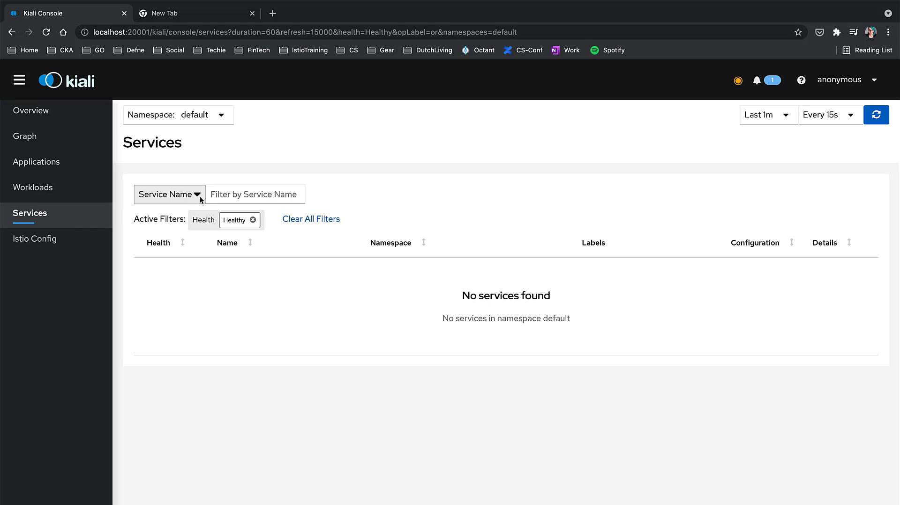
**Timestamp:** 03:00
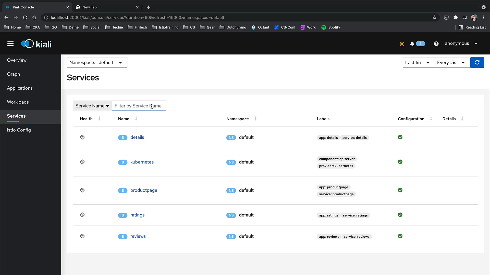

---

### 5.5 Istio Config

Shows Istio configuration objects (VirtualServices, DestinationRules, Gateways).
👉 In this case, it’s empty because no custom Istio configs were applied yet.

**Timestamp:** 03:07
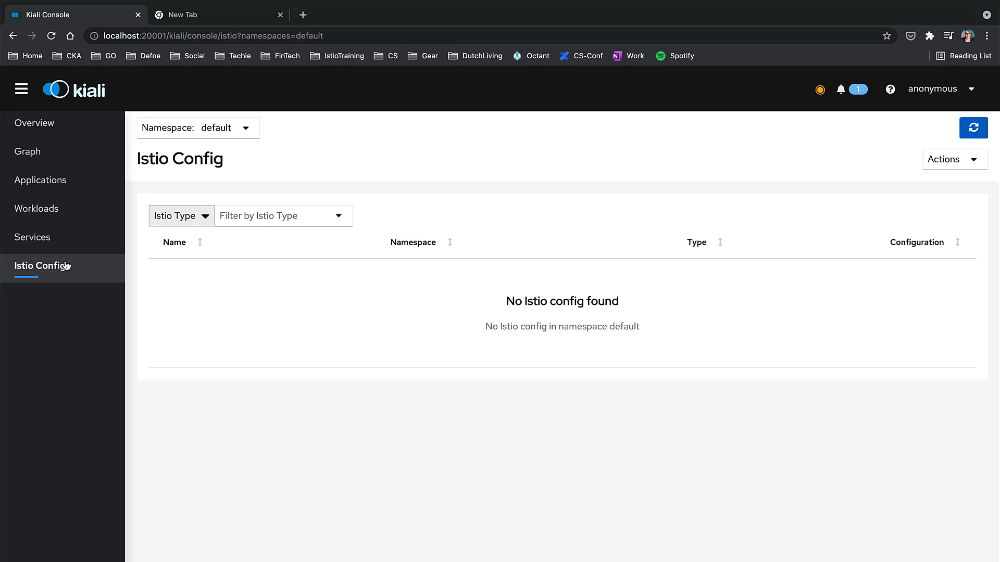

---

### 5.6 Graph View

* **Most powerful feature of Kiali**.
* Provides a **dynamic topology graph** of all microservices in the mesh.
* Shows **traffic flow, error rates, and latency** visually.
* Initially empty → becomes populated when real traffic flows through the mesh.

**Timestamp:** 03:17
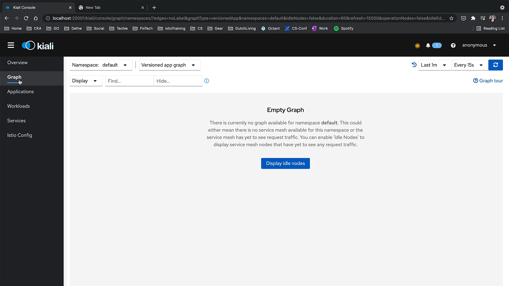

Once we **generate traffic** (e.g., by refreshing Bookinfo UI or running load tests), the graph will display:

* Services as nodes.
* Traffic flows as edges.
* Health indicators (colors, error rates).

---

## 6. Summary

* Installed **Kiali and other add-ons** (`Grafana`, `Jaeger`, `Prometheus`) from `samples/addons`.
* Verified that **Kiali is deployed and running** in the `istio-system` namespace.
* Accessed the **Kiali Dashboard** via `istioctl dashboard kiali`.
* Explored different sections: **Namespaces, Applications, Workloads, Services, Istio Config, Graph**.
* The **Graph View** is the key visualization tool, showing real-time **service mesh topology and traffic flow**.

---

👉 Next step: We will generate **test traffic** to fully explore how Kiali visualizes live service mesh activity.

---

Do you want me to also **add a Mermaid diagram** summarizing the relation between `Kiali`, `Istio`, `Prometheus`, `Grafana`, and `Jaeger` so your notes have both **screenshots + conceptual diagram**?
