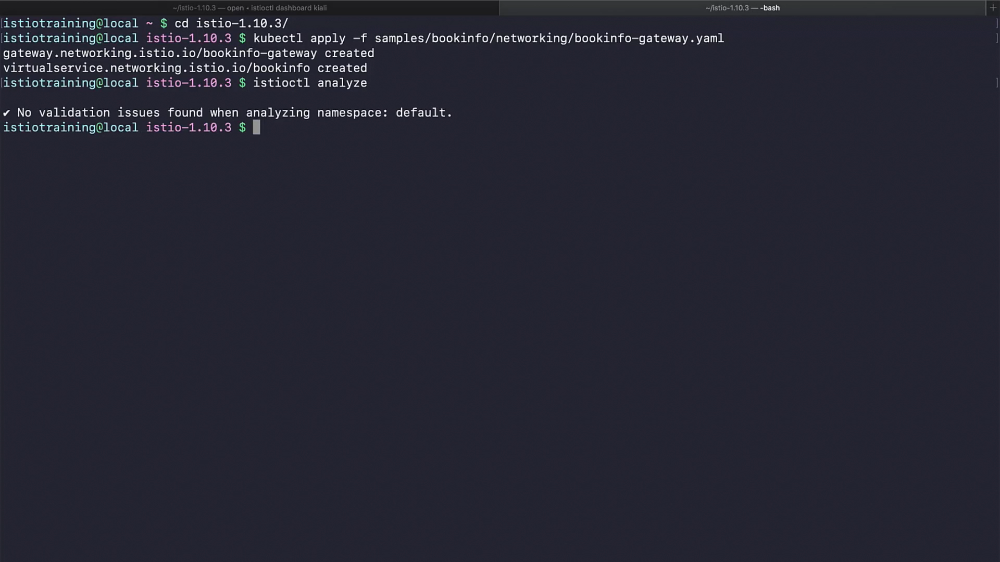
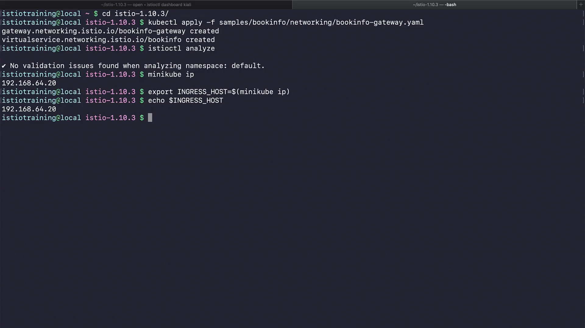
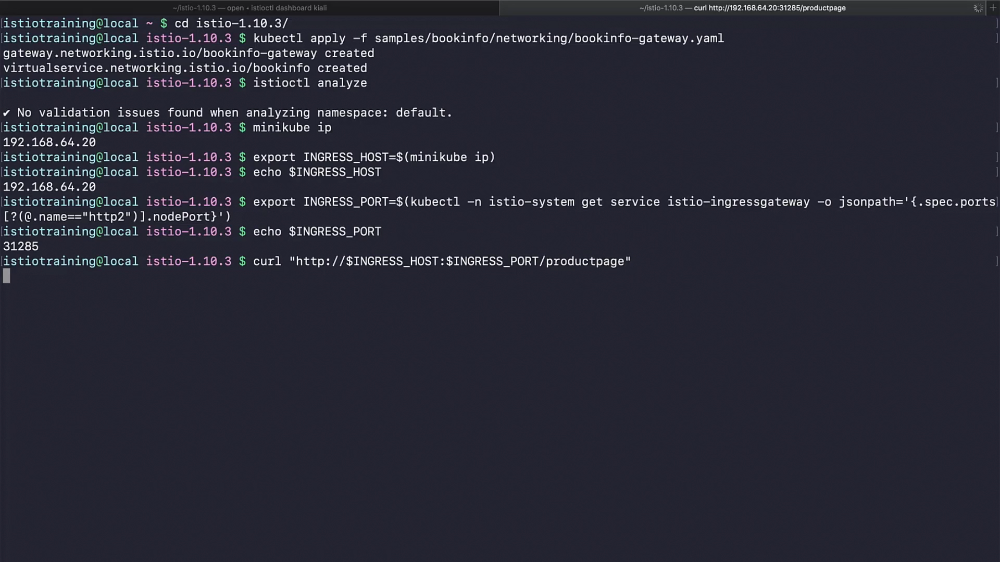
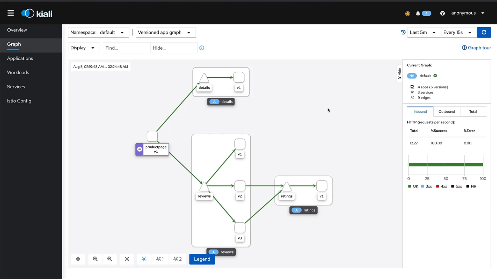
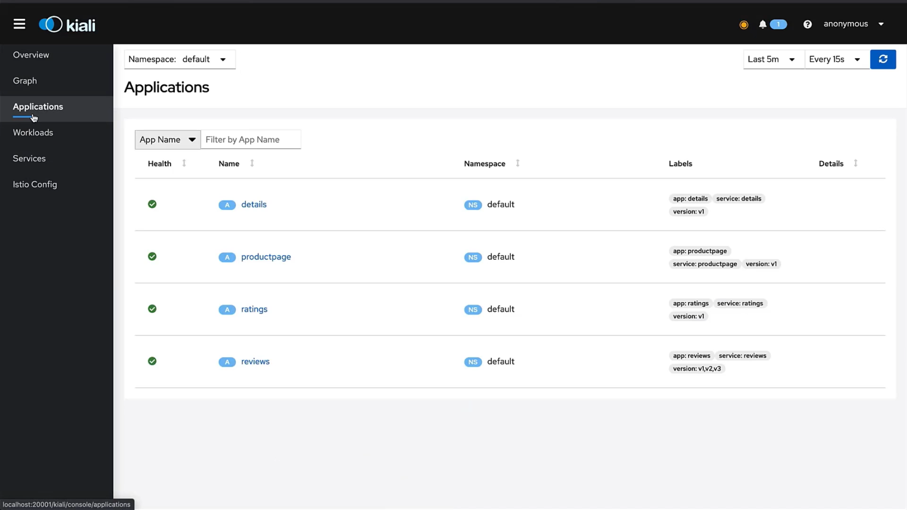
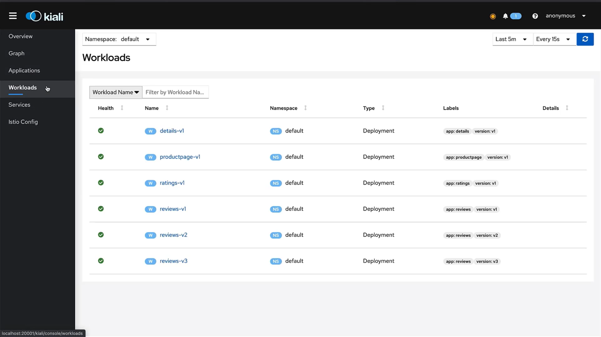
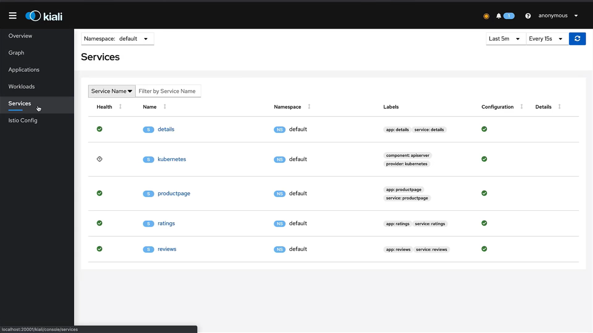
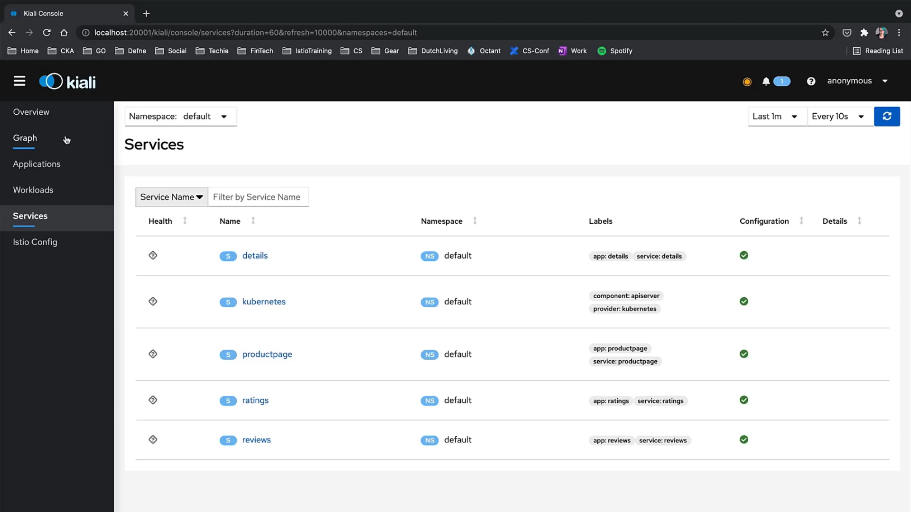

 ```
t](../020-100-create-traffic-into-your-mesh/
t](../020-100-create-traffic-into-your-mesh/../020-100-create-traffic-into-your-mesh/
```

Perfect 👍 Thanks for sharing the extracted subtitles!
I’ve rewritten them into **structured, detailed notes with clear explanations**, while keeping **all your screenshots** (``) in place so you can paste directly into your `.md` notes.

---

# 020-100-create-traffic-into-your-mesh

## 1. Introduction

Up until now, we installed **Istio**, deployed our **Bookinfo application**, and set up **Kiali** for visualization.
👉 But Kiali only becomes useful when there is **traffic flowing through the mesh**.

In this chapter, we will:

1. Configure a **Gateway** and **Virtual Service** to allow external traffic into the cluster.
2. Access the Bookinfo application from both **CLI (cURL)** and **browser**.
3. Generate **continuous traffic** using a loop script.
4. Visualize traffic in **Kiali Dashboard**.
5. Test how Kiali reflects **failures** when workloads are deleted.

---

## 2. Exposing the Application with Gateway and VirtualService

By default, Kubernetes services are only accessible inside the cluster. To allow external traffic:

* **Gateway** → Defines how traffic enters the service mesh.
* **VirtualService** → Defines routing rules inside the mesh.

For Bookinfo, Istio provides a ready YAML:

```bash
cd istio-1.10.3/
kubectl apply -f samples/bookinfo/networking/bookinfo-gateway.yaml
```

Expected output:

```
gateway.networking.istio.io/bookinfo-gateway created 
virtualservice.networking.istio.io/bookinfo created
```

**Timestamp:** 00:35


---

## 3. Validate Configuration

We can check if Istio detects any misconfigurations:

```bash
istioctl analyze
```

✅ No validation issues should be found.

**Timestamp:** 00:51


---

## 4. Find Ingress Host and Port

To reach our app externally, we need:

* **Ingress Host (IP)** → where the mesh is exposed.
* **Ingress Port** → port of Istio’s ingress gateway.

### 4.1 Get Cluster IP (for Minikube)

```bash
minikube ip
192.168.64.20

export INGRESS_HOST=$(minikube ip)
echo $INGRESS_HOST
192.168.64.20
```

**Timestamp:** 01:19


---

### 4.2 Get Ingress Port

```bash
export INGRESS_PORT=$(kubectl -n istio-system get service istio-ingressgateway \
   -o jsonpath='{.spec.ports[?(@.name=="http2")].nodePort}')

echo $INGRESS_PORT
31285
```

**Timestamp:** 01:35


---

## 5. Access Bookinfo Application

### 5.1 Using cURL

```bash
curl "http://$INGRESS_HOST:$INGRESS_PORT/productpage"
```

* The terminal will output the **entire HTML page** of Bookinfo’s product page.

**Timestamp:** 01:42

**Timestamp:** 01:47


---

### 5.2 Using Browser

Get the full URL by echoing it:

```bash
echo "http://$INGRESS_HOST:$INGRESS_PORT/productpage"
http://192.168.64.26:31950/productpage
```

Paste into a browser → You should see the **Bookinfo web app**.

* On refresh, the **stars under Reviews change color** (black, red, etc.)
* This demonstrates **traffic splitting across 3 versions of Reviews service**.

**Timestamp:** 02:04

**Timestamp:** 02:19


---

## 6. Generating Continuous Traffic

Manually refreshing or running cURL once is not enough to see useful data in Kiali.
👉 Let’s create a **traffic generator loop** using `while`.

```bash
while sleep 0.01; do 
  curl -sS "http://$INGRESS_HOST:$INGRESS_PORT/productpage" &> /dev/null 
done
```

* Sends continuous requests every `0.01s`.
* Suppresses output (`/dev/null`) to avoid flooding terminal.
* This ensures **steady traffic flow** in the mesh.

**Timestamp:** 03:15


---

## 7. Observing Traffic in Kiali

Now, go back to **Kiali Dashboard** → **Graph View**.

* Initially, graph may look empty.
* Adjust **time interval** and refresh.
* With continuous traffic, the graph **visualizes Bookinfo services and their interactions**.

**Timestamp:** 04:02


---

### 7.1 Applications View

Shows application health.
**Timestamp:** 04:18


### 7.2 Workloads View

Lists deployments/pods as workloads.
**Timestamp:** 04:22


### 7.3 Services View

Shows mesh services (e.g., productpage, reviews).
**Timestamp:** 04:25


### 7.4 Istio Config View

Currently only shows:

* **bookinfo-gateway**
* **bookinfo VirtualService**

**Timestamp:** 04:30


---

## 8. Simulating a Failure

To see how Kiali reacts to problems, delete the **productpage deployment**:

```bash
kubectl delete deployments/productpage-v1
deployment.apps "productpage-v1" deleted
```

**Timestamp:** 05:03


---

### 8.1 Impact in Kiali

* **Graph View** → productpage shows **half-available, half-unavailable** (yellow/red).
* Eventually, it turns **dark red** as traffic fully fails.

**Timestamp:** 05:18

**Timestamp:** 05:30

**Timestamp:** 05:40


---

### 8.2 Applications & Workloads

* **Applications tab** → Productpage shows **no health info**.
* **Workloads tab** → Productpage workload **disappears** completely (since we deleted it).

**Timestamp:** 05:46

**Timestamp:** 05:53


---

### 8.3 Services

Since productpage is gone:

* Other services stop receiving traffic.
* Kiali shows **question marks (?) in health columns**, meaning no live data.

**Timestamp:** 06:09


---

## 9. Summary

* Created **Gateway + VirtualService** to expose Bookinfo externally.
* Verified app works via **cURL** and **browser**.
* Generated **continuous traffic** to make mesh observable in Kiali.
* Explored **Kiali views** → Applications, Workloads, Services, Istio Config, Graph.
* Simulated a **failure** → deleted productpage deployment → Kiali showed degraded health, missing workloads, and failing requests.

👉 This demo shows how powerful Kiali is for **monitoring and debugging service mesh behavior** in real time.

---

Would you like me to also create a **Mermaid diagram of Bookinfo traffic flow (Gateway → Ingress → Productpage → Reviews → Ratings → Details)** so that your notes have both screenshots **and** a conceptual flow diagram?
