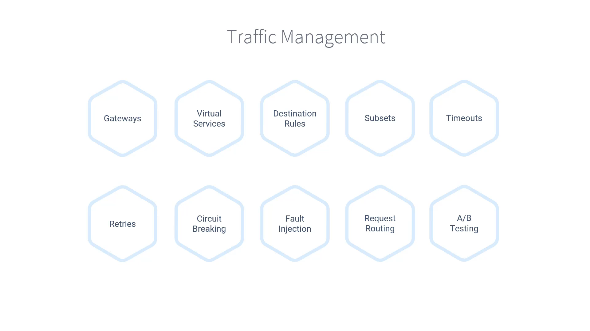

# 030-000-section-introduction

### 📌 Subtitles Extracted

In this section, you will learn **how to manage traffic in your Istio service mesh**.
The most powerful part is that you can achieve this **without modifying your application code**.

---

### 🧩 Core Components Covered

Before diving into traffic management, we will first understand the **key Istio resources**:

* **Gateways** – Control inbound/outbound traffic to the mesh.
* **Virtual Services** – Define how requests are routed within the mesh.
* **Destination Rules** – Specify policies for traffic after routing (load balancing, subsets, TLS, etc.).

---

### 🚦 Traffic Management Concepts

Once we know the components, we will explore advanced **traffic management strategies**:

* **Subsets** – Version-based traffic separation (e.g., v1, v2).
* **Timeouts** – Define max wait time for a request before failing.
* **Retries** – Configure automatic request retries on failure.
* **Circuit Breaking** – Prevent overloading unhealthy services.
* **Fault Injection** – Simulate errors/latency for testing resilience.
* **Request Routing** – Control flow of requests (e.g., canary, weighted routing).
* **A/B Testing** – Gradually shift traffic between different versions.

**Timestamp:** 00:33

---

