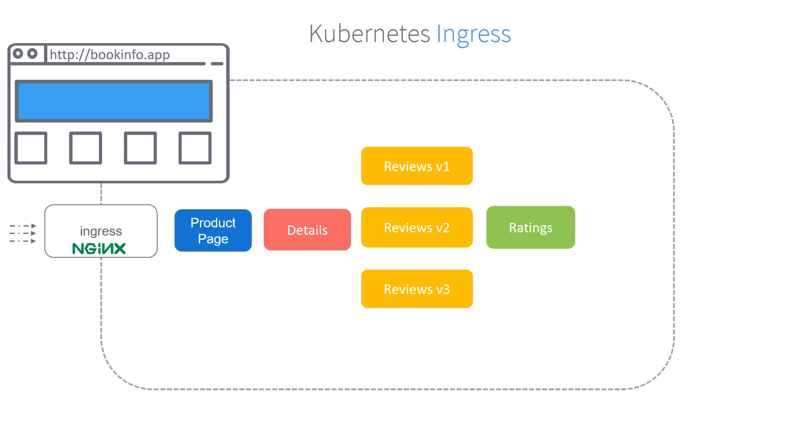
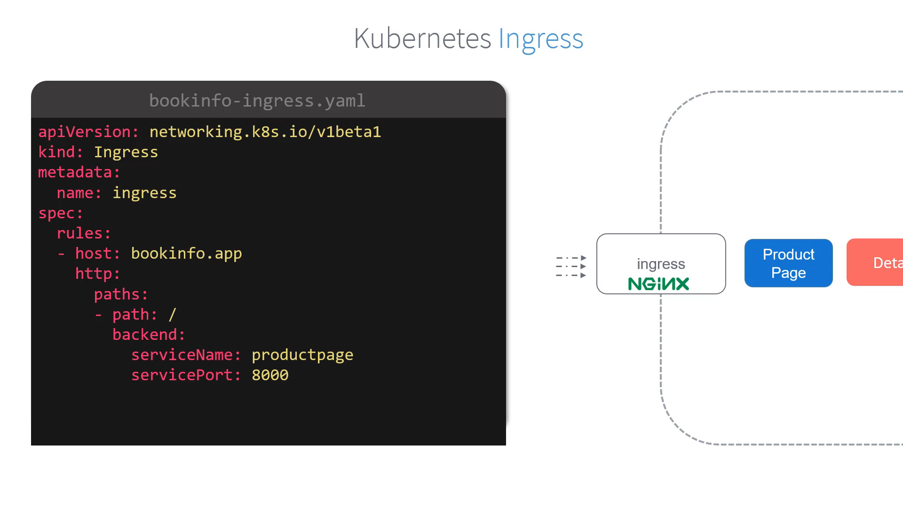
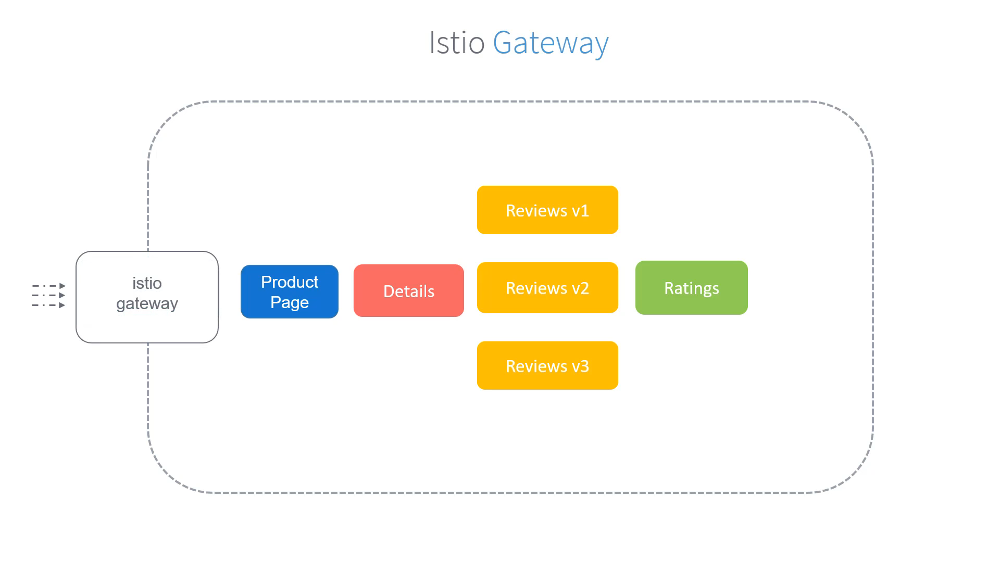
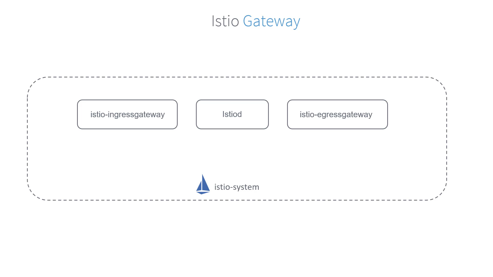
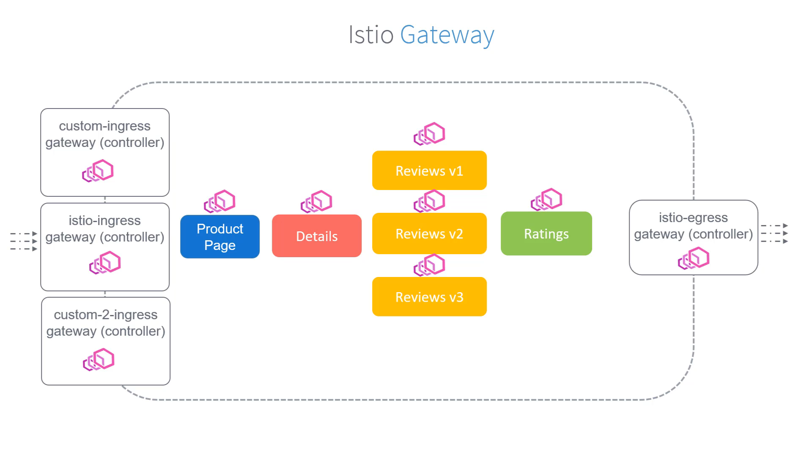
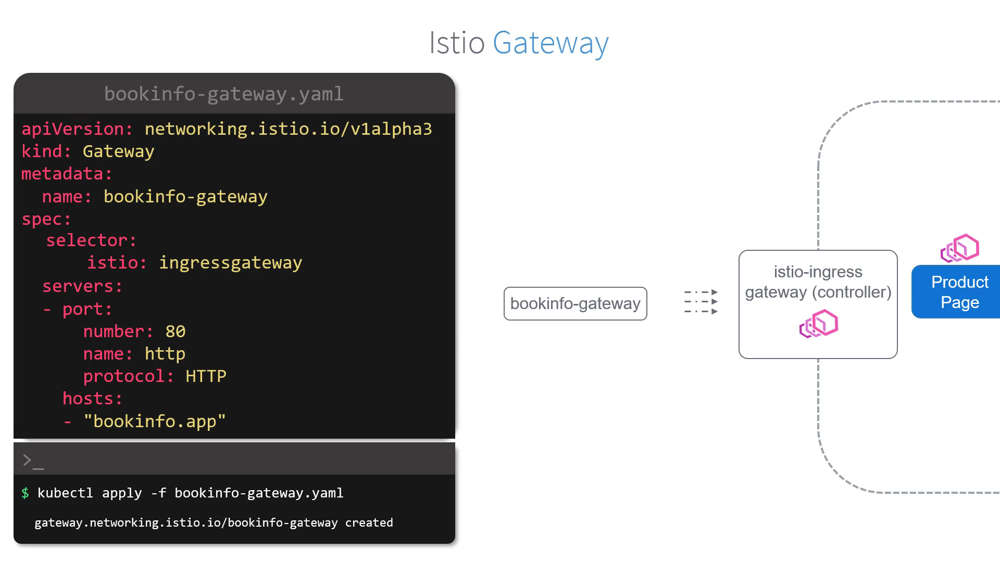
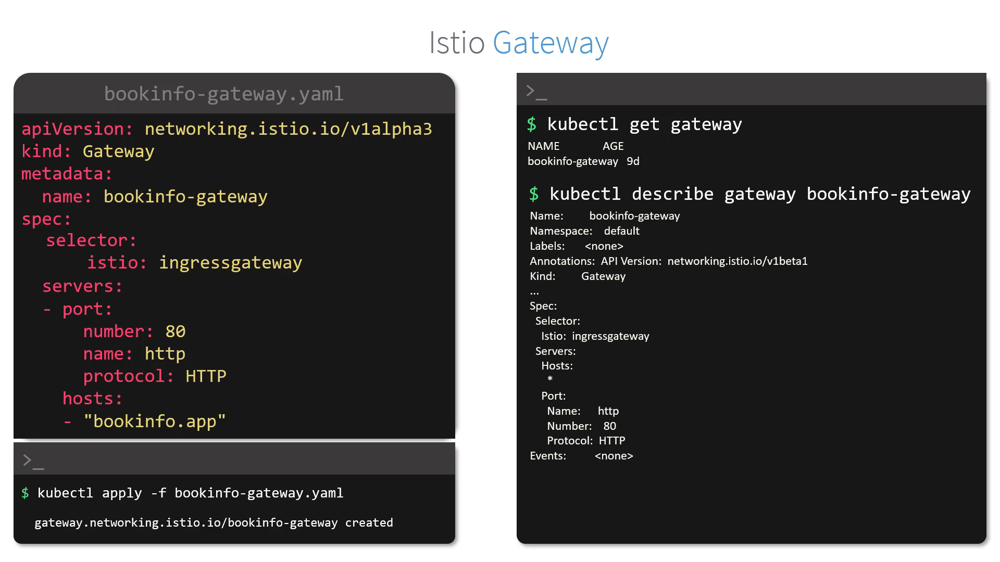

---

# 030-010-gateways

## 1. Introduction: Why Gateways in Istio?

Now that we have deployed our **Bookinfo application** inside Istio’s service mesh, the question is:
👉 *How do we make these internal services accessible to external users (outside the cluster)?*

* Example requirement: A user visits **[http://bookinfo.app](http://bookinfo.app)** in their browser.
* Expected behavior: They should see the **Product Page** with all product details.

In Kubernetes, we normally achieve this using an **Ingress resource**. Let’s quickly recall how Kubernetes Ingress works before we compare it with Istio Gateways.

**Timestamp:** 01:17


---

## 2. Kubernetes Ingress (Traditional Approach)

* **Ingress** is a Kubernetes API object that manages **external access to services** inside a cluster.
* It requires an **Ingress Controller** (e.g., NGINX ingress controller) to function.
* With Ingress rules, you can define how traffic is routed to specific services.

📌 Example: Route traffic coming to `bookinfo.app` → forward to the `productpage` service on port `8000`.

### Example: Kubernetes Ingress (`bookinfo-ingress.yaml`)

```yaml
apiVersion: networking.k8s.io/v1beta1
kind: Ingress
metadata:
  name: ingress
spec:
  rules:
  - host: bookinfo.app
    http:
      paths:
      - path: /
        backend:
          serviceName: productpage
          servicePort: 8000
```

**Timestamp:** 01:35


---

## 3. Istio Gateway – The Recommended Approach

While Istio supports **Kubernetes Ingress**, it also introduces a more powerful alternative: the **Istio Gateway**.

### Why use Istio Gateway?

* It provides **more advanced routing, observability, and monitoring** compared to plain Kubernetes Ingress.
* Gateways are **load balancers at the edge of the service mesh**.
* They handle both:

  * **Inbound traffic** (from external → mesh services)
  * **Outbound traffic** (from services → outside world).

**Timestamp:** 01:57


---

## 4. Ingress & Egress Gateways in Istio

When Istio is installed, it automatically deploys two key components:

1. **Istio Ingress Gateway** → manages **all incoming requests** into the service mesh.
2. **Istio Egress Gateway** → manages **all outgoing requests** leaving the service mesh.

💡 Difference from Sidecars:

* Sidecars (Envoy proxies) sit **inside each pod**.
* Gateways are **standalone Envoy proxies** that sit at the **mesh boundary** (not tied to any one pod).

**Timestamp:** 02:35


👉 So, our goal here:

* Catch **all incoming traffic** through the **Istio Ingress Gateway**.
* Route requests for `bookinfo.app` → forward to the **Product Page service**.

**Timestamp:** 03:49


---

## 5. Creating a Gateway in Istio

We define a **Gateway resource** that specifies:

* Which **hostnames** it should listen for.
* Which **ports** and **protocols** it supports.
* Which **Istio Ingress Gateway controller** it should bind to.

📌 Example: `bookinfo-gateway.yaml`

```yaml
apiVersion: networking.istio.io/v1alpha3
kind: Gateway
metadata:
  name: bookinfo-gateway
spec:
  selector:
    istio: ingressgateway   # use Istio's default ingress gateway
  servers:
  - port:
      number: 80
      name: http
      protocol: HTTP
    hosts:
    - "bookinfo.app"
```

* The `selector` ensures we use the **default Istio ingressgateway**.
* The Gateway listens on **port 80 (HTTP)** for requests targeting **bookinfo.app**.

**Command to apply Gateway:**

```bash
$ kubectl apply -f bookinfo-gateway.yaml
gateway.networking.istio.io/bookinfo-gateway created
```

**Timestamp:** 04:44


---

## 6. Verifying Gateway Creation

We can confirm that the Gateway is created and check its details using:

```bash
$ kubectl get gateway
NAME                AGE
bookinfo-gateway    9d
```

```bash
$ kubectl describe gateway bookinfo-gateway
Name:         bookinfo-gateway
Namespace:    default
Labels:       <none>
Annotations:  
API Version:  networking.istio.io/v1beta1
Kind:         Gateway
...
Spec:
  Selector:
    istio: ingressgateway
  Servers:
  - Port:
      Name:     http
      Number:   80
      Protocol: HTTP
    Hosts:
    - "bookinfo.app"
Events: <none>
```

**Timestamp:** 04:59


---

## 7. Summary

✅ Kubernetes Ingress allows routing rules via Ingress controllers like NGINX.
✅ Istio introduces **Gateways** as a **better alternative** that integrates tightly with Istio features (telemetry, routing, monitoring).
✅ Istio Gateways are implemented using **standalone Envoy proxies** at the mesh boundary.
✅ We created a **bookinfo-gateway** that captures requests to `bookinfo.app` and forwards them into the mesh.

👉 Next step: Once traffic is captured by the Gateway, **how does it get routed to the Product Page service?**
That’s where **Virtual Services** come in, which we’ll discuss next.

---

